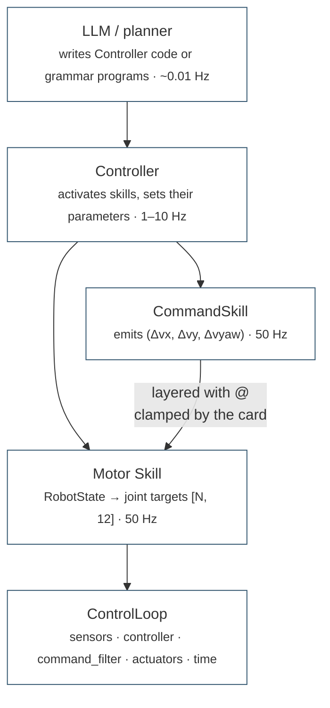
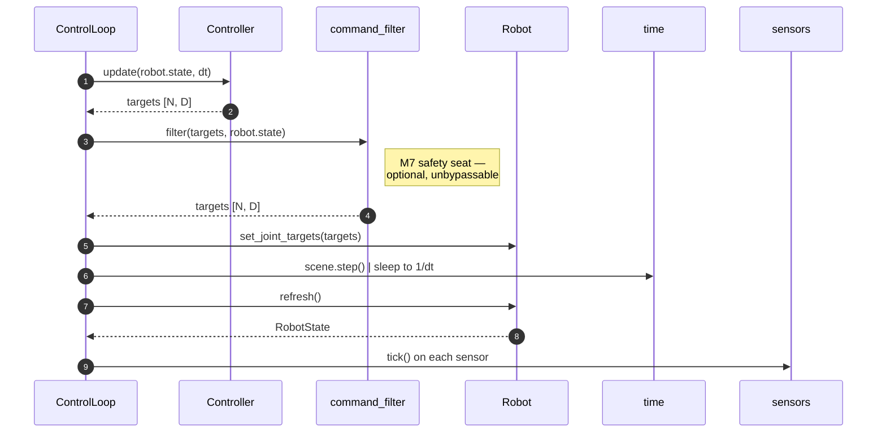

# domo.control

`domo.control` is the engine-free control hierarchy: the primitives that turn
a [`RobotState`](robot.md#robotstate) into joint targets (`Skill`), the
orchestration layer that decides which primitive runs and with what
parameters (`Controller`), and the metronome that ticks everything at a fixed
rate (`ControlLoop`). The one rule it enforces is that **nothing here imports
a physics engine** — every class reads `RobotState` tensors and calls
[`Robot`](robot.md#robot) methods, so it runs unchanged on a machine without
Genesis and, later, on the real robot.

The package also holds the locomotion machinery those primitives are built
from (the CPG, analytic leg IK), a passive SLAM layer and the legacy waypoint
driver. It sits above [`domo.robot`](robot.md) and below
[`domo.skills`](skills.md) (which composes these primitives through the
grammar) and [`domo.world`](world-and-services.md#domoworld) (which builds
the loop). All batched tensors are `[n_envs, ...]` on the robot's device;
shapes below follow [conventions](../concepts/conventions.md), and the
layering is argued in
[the control hierarchy](../concepts/control-hierarchy.md).



A command skill never reaches the actuators on its own: it writes into the
`command` channel of the motor skill beneath it, and the motor skill's card
constraints clamp whatever the stack above produced.

## Module map

| Module | Public names | Role |
|--------|--------------|------|
| `skill.py` | `Skill`, `StandSkill`, `CPGLocomotionSkill`, `LearnedJointSkill`, `CommandSkill`, `LidarAvoidanceSkill`, `NavGains`, `TrajectoryTrackingSkill`, `all_envs`, `planar_pose` | motor and command primitives |
| `controller.py` | `Controller`, `SingleSkillController` | orchestration: one active skill, a `decide()` cadence |
| `loop.py` | `SimControlLoop`, `RealControlLoop` | the metronome; `command_filter` is the M7 safety seat |
| `cpg.py` | `CPG_OBS_DIM`, `CPG_OBS_SCALES`, `build_cpg_observation`, `CPGConfig`, `CPGOscillators`, `CPGLegController` | Bellegarda & Ijspeert CPG-RL oscillators and the 76-dim observation |
| `kinematics.py` | `LegKinematics`, `leg_fk`, `leg_ik` | closed-form 3-DOF leg FK/IK |
| `slam.py` | `SlamConfig`, `SlamSkill` | log-odds occupancy grid + point cloud as a zero-velocity command skill |
| `navigation.py` | `NavConfig`, `PositionController` | legacy blocking waypoint driver (kept for `examples/navigation/evaluate_nav.py`) |

Everything listed is re-exported from `domo.control`.

## Helpers

### `all_envs(robot) -> torch.Tensor`

Index tensor `[n_envs]` selecting every environment, on `robot.device`. It
is the usual argument to `reset_idx` and what `Controller.activate` passes
when it resets the incoming skill.

### `planar_pose(state) -> (xy [N, 2], yaw [N])`

World-frame planar base pose read straight from a `RobotState`:
`state.base_pos[:, :2]` and `state.base_euler[:, 2]`. Both are views, not
copies. Used by the navigation and SLAM skills.

## Skills

### `Skill` (ABC)

```python
class Skill(ABC):
    name: str = "skill"
    def setup(self, robot) -> None: ...                     # binds self.robot
    def reset_idx(self, envs_idx: torch.Tensor) -> None: ...  # default: no-op
    @abstractmethod
    def update(self, state, dt: float) -> torch.Tensor: ...   # [N, D] joint targets
```

One motor primitive. Lifecycle: `setup(robot)` once after `robot.bind()`
(allocate per-env state on `robot.device`), `reset_idx(envs_idx)` for the
envs being (re)started (also called on activation), then `update` every
control cycle. Attributes written by a controller, such as `command`, are
the skill's parameters.

| Attribute the skill may rely on | Provided by |
|--------------------------------|-------------|
| `robot.n_envs`, `robot.device` | the `Robot` facade |
| `robot.default_dof_pos` `[D]` | the stance the spec defines |
| `robot.spec.geometry`, `robot.spec.num_dofs` | `RobotSpec` |

### `StandSkill`

```python
StandSkill()          # name = "stand"
```

Holds the spec's default stance: `update` returns the same `[N, 12]` tensor
of `default_dof_pos` every tick. The trivial and safest primitive; the idle
skill of `PlanningController` and the usual terminal or recovery state.

### `CPGLocomotionSkill`

```python
CPGLocomotionSkill(policy_fn: Callable[[Tensor], Tensor], cpg: CPGConfig | None = None)
```

Velocity-tracking locomotion: frozen CPG policy + oscillators + leg IK, the
locomotion stack of the avoidance experiments as a reusable primitive. It is
the deployment-time twin of [`Go2CPGWalkTask`](tasks.md#go2cpgwalktask): the
same oscillators, the same 76-dim observation, the same IK.

| Member | Type / shape | Meaning |
|--------|--------------|---------|
| `policy_fn` | `obs [N, 76] -> raw [N, 12]` | evaluated under `no_grad`; see `domo.checkpoints.load_locomotion_policy`, or a zero lambda for a standing robot |
| `command` | `[N, 3]` float, allocated in `setup` | body-frame `(vx, vy, vyaw)`; the parameter controllers and layered command skills write |
| `oscillators` | `CPGOscillators` | the phase bank (`r`, `rdot`, `theta`, `phi`, each `[N, 4]`) |
| `stance_mask()` | `[N, 4]` float | 1 where `sin(theta) < 0` (phase-proxy foot contact) |
| `update(state, dt)` | `[N, 12]` | `build_cpg_observation` → policy → `CPGLegController.joint_targets` |

!!! warning "`reset_idx` zeroes `command` — write it afterwards"

    Restarting the oscillators in the trot pattern also zeroes `command` and
    the last action for those envs. `Controller.activate` resets the
    incoming skill, and so does every `LayerNode.enter()` in a compiled
    program, so a command written before activation is thrown away. Set the
    command after `activate()` / `reset_idx()`, never before.

```python
from domo.control import CPGLocomotionSkill, all_envs

walk = CPGLocomotionSkill(policy_fn)
walk.setup(robot)
walk.reset_idx(all_envs(robot))
walk.command[:, 0] = 0.5                 # 0.5 m/s forward, every env
targets = walk.update(robot.state, 0.02) # [N, 12]
```

### `LearnedJointSkill`

```python
LearnedJointSkill(policy_fn, obs_builder, action_scale: float = 0.35, name: str = "learned")
```

Generic wrapper turning an Eureka/RL joint-space policy into a library
skill; this is how M3 outputs (for instance an [Eureka](eureka.md) get-up
policy) enter the M5 library.

| Argument | Contract |
|----------|----------|
| `policy_fn` | `obs -> action [N, D]`, evaluated under `no_grad` |
| `obs_builder` | `(state, default_dof_pos [D], last_action [N, D]) -> obs`; must reproduce the layout the policy was trained on |
| `action_scale` | radians per unit action, the task's training value |
| `name` | the instance's `name` attribute |

`update` returns `default_dof_pos + action_scale * action` and keeps the
raw action as `last_action` for the next observation. `reset_idx` zeroes
`last_action` for the given envs.

### `CommandSkill` (ABC)

```python
class CommandSkill(Skill):
    channel: str = "velocity"
    additive: bool = True
    def configure(self, **params) -> None: ...             # default: TypeError if any params
    def success_flags(self, state) -> torch.Tensor | None: ...  # default None
    @abstractmethod
    def update_command(self, state, dt: float) -> torch.Tensor: ...  # e.g. [N, 3]
    def update(self, state, dt: float) -> torch.Tensor: ...  # always raises TypeError
```

A skill that emits *commands for another skill* instead of joint targets:
the upper half of a layered composition (`avoid @ walk`). Its output is
either added to the motor skill's command channel (`additive=True`) or
replaces it (`additive=False`); either way the motor skill's card
constraints clamp the combined command, so no layer can exceed them.

* `configure(**params)` receives the grammar parameters
  (`goto(x=2, y=1)`) at compile time, as floats. The default raises
  `TypeError("... takes no parameters (got {...})")`.
* `success_flags(state)` optionally returns a bool `[N]`; when every env is
  `True` the hosting `LayerNode` reports `SUCCESS`. `None` means "never
  succeeds on its own" and the composition must be bounded by a modifier.
* `update()` raises `TypeError("... emits 'velocity' commands, not joint
  targets — layer it on a motor skill (e.g. 'this @ walk')")`: a command
  skill is never run alone.

### `LidarAvoidanceSkill`

```python
LidarAvoidanceSkill(policy_fn, lidar, deltas=(0.8, 0.5, 1.5), obs_max_range: float = 4.0)
# name = "lidar_avoidance", channel = "velocity", additive = True
```

Obstacle avoidance as a bounded velocity correction. Each tick:

```
obs   = clamp(lidar.read() / obs_max_range, 0, 1)        # [N, n_sectors]
delta = tanh(policy_fn(obs)) * deltas                    # [N, 3]
```

| Argument | Meaning |
|----------|---------|
| `policy_fn` | `obs [N, n_sectors] in [0, 1] -> raw [N, 3]` |
| `lidar` | anything with `read() -> [N, n_sectors]` distances (`SimulatedLidar` in sim, the driver on hardware) |
| `deltas` | max `|Δvx|, |Δvy|, |Δvyaw|` the skill may command |
| `obs_max_range` | distance normalised to 1.0, keeps the observation independent of the device's range |

`min_distance()` returns the closest return per env `[N]` in metres.

### `NavGains`

P gains, floors and caps of `TrajectoryTrackingSkill`. Gains map metres to
m/s (`kp_par`, `kp_perp`) and radians to rad/s (`kp_ang`).

| Field | Default | Meaning |
|-------|---------|---------|
| `kp_par` | 1.0 | remaining distance → forward speed |
| `kp_perp` | 1.2 | lateral deviation → sideways speed |
| `kp_ang` | 1.5 | heading error → yaw rate |
| `min_speed` | 0.3 | along-track floor while en route (keeps the command above the locomotion policy's deadband) |
| `max_vy` | 0.4 | cap on the lateral correction (m/s) |
| `max_vyaw` | 1.0 | cap on the yaw rate (rad/s) |
| `tol_pos` | 0.2 | arrival tolerance (m) |

### `TrajectoryTrackingSkill`

```python
TrajectoryTrackingSkill(mode: str = "forward", distance: float = 1.0,
                        target: tuple[float, float] = (0.0, 0.0),
                        speed: float = 0.5, cfg: NavGains | None = None)
# name = "navigate", channel = "velocity", additive = False
```

Straight-line navigation as a velocity-command *author*. Layered on a
velocity-tracking motor skill (`forward(distance=2) @ walk`) it drives the
robot along the line from its start pose to the goal, closing the loop on
the base pose every tick so lateral error is corrected rather than
accumulated. It is an override skill: it emits the full body-frame
`(vx, vy, vyaw)`, and the motor skill still clamps it to its own limits.

| Mode | Goal | Heading held |
|------|------|--------------|
| `"forward"` | `distance` m along the heading at activation | the activation yaw |
| `"backward"` | `distance` m opposite that heading (walks in reverse, does not turn) | the activation yaw |
| `"goto"` | absolute world `(x, y)` from `target` | faces the target |

An unknown mode raises `ValueError("unknown nav mode '...'")`.

`configure(**params)` accepts `distance`, `speed`, `x`, `y` (the card
validates names and ranges at compile time; the method itself ignores
keys it does not know).

!!! warning "The path is latched lazily, and `arrived` never un-latches"

    `reset_idx` receives no state, so it only marks the envs as needing
    initialisation; the start pose, unit path direction `u`, path length and
    heading are latched on the **first `update_command` after the reset**,
    per env. That is what makes `forward` mean "from wherever the robot is
    when this leg starts" — and it means `success_flags` is `False` until
    that first tick, and stays `True` once the goal is reached even if the
    robot is pushed away afterwards.

**Control law**, per tick, with `rel = pos - start`, `perp = rot90(u)`:

```
along     = rel · u                    remaining = len - along
cross     = rel · perp
v_par     = clamp(kp_par * remaining, min(speed, min_speed), speed)
v_perp    = clamp(-kp_perp * cross, ±max_vy)
v_world   = v_par * u + v_perp * perp
(vx, vy)  = rotate v_world into the body frame by -yaw
vyaw      = clamp(kp_ang * wrap(face - yaw), ±max_vyaw)
arrived  |= remaining <= tol_pos       # latched; command is zero once arrived
```

`success_flags(state)` returns the `arrived` latch `[N]`. Because the
along-track speed is floored, the robot never stalls short of the goal; the
floor is capped by the leg's cruise `speed` so `speed=0.1` still means
0.1 m/s.

```python
nav = TrajectoryTrackingSkill("goto")
nav.configure(x=2.0, y=1.0, speed=0.6)
nav.setup(robot); nav.reset_idx(all_envs(robot))
cmd = nav.update_command(robot.state, 0.02)   # [N, 3] body-frame velocity
done = nav.success_flags(robot.state)         # [N] bool
```

## SLAM

### `SlamConfig`

Occupancy-grid and cloud parameters. Log-odds model: each cell starts at 0
(P = 0.5, unknown); hits add `l_occ`, free-space samples add `l_free`,
`|value|` is clamped to `l_clamp`, `P(occupied) = sigmoid(log-odds)`.

| Field | Default | Meaning |
|-------|---------|---------|
| `resolution` | 0.15 | metres per cell |
| `half_extent` | 8.0 | the map spans `origin ± half_extent` (m) |
| `origin` | `(0.0, 0.0)` | world centre of the grid |
| `update_interval` | 5 | control ticks between scan integrations |
| `l_occ` | 0.85 | log-odds added to a hit cell |
| `l_free` | -0.4 | log-odds added to a free (ray) cell |
| `l_clamp` | 6.0 | bound on `|log-odds|` |
| `sticky_occ` | 0.5 | a cell already this confident is never carved free (stops beams skimming over short walls from erasing them) |
| `occ_first` | `True` | **never read**: hits are always applied before free carving |
| `occ_threshold` | 0.65 | P above which `render_ascii` prints `#` |
| `free_threshold` | 0.35 | P below which a cell counts as free (documentation value; the renderer uses the sign of the max-pooled log-odds) |
| `use_points` | `True` | use `lidar.read_points()` when the sensor has it |
| `z_band` | `(0.15, 1.5)` | height slice of 3D points that feeds the 2D grid (m) |
| `map_max_range` | 10.0 | mapping range cap in point mode (m) |
| `cloud_max_points` | 150000 | cap on the accumulated cloud (random subsample beyond it) |
| `cloud_stride` | 2 | keep 1/stride of each scan before deduplication |
| `cloud_voxel` | 0.05 | voxel size of the uniform-density deduplication (m) |

### `SlamSkill`

```python
SlamSkill(lidar, cfg: SlamConfig | None = None)
# name = "slam", channel = "velocity", additive = True
```

Passive SLAM as a perception *layer*: a command skill whose velocity
contribution is always zero, so `slam @ avoid @ goto(x=8, y=5) @ walk`
maps while the stack below drives, without ever steering. It reads the
lidar and the base pose each tick and folds them into a world-frame
occupancy grid with the standard log-odds inverse-sensor model.

| Argument | Contract |
|----------|----------|
| `lidar` | `read() -> [N, n_sectors]` plus `n_sectors` and `max_range` attributes; optionally `read_points() -> (points [N, P, 3] world, valid [N, P])` |
| `cfg` | `SlamConfig` |

State allocated in `setup`:

| Member | Shape | Meaning |
|--------|-------|---------|
| `grid` | `[N, rows(y), cols(x)]` | per-env log-odds; `n_cells = round(2 * half_extent / resolution)` per side; `x` indexes columns, `y` rows |
| `n_cells` | int | side length of the grid |

Two integration modes, chosen in `setup`: **point mode** when
`cfg.use_points` and the lidar has a `read_points` attribute, else
**sector mode** (one beam per sector at its centre bearing, using
`read()`). If `read_points()` raises `NotImplementedError` the skill drops
to sector mode for good. In point mode only returns inside `z_band` and
farther than 5 cm planar from the base drive the grid; every valid return
feeds the cloud. Hits are marked first, then free space is carved along
each beam up to one cell short of the hit, skipping cells already at or
above `sticky_occ`.

Methods:

| Method | Returns | Notes |
|--------|---------|-------|
| `update_command(state, dt)` | zeros `[N, 3]` | dead-reckons odometry every tick; integrates a scan every `update_interval` ticks |
| `occupancy_prob()` | `[N, H, W]` | `sigmoid(grid)`; 0.5 = unknown |
| `coverage()` | `[N]` | fraction of cells with `|log-odds| > 0.5` |
| `render_ascii(env=0, step=None)` | `str` | `#` occupied, `.` free, space unknown; MAX-pools log-odds over `step × step` blocks so a one-cell wall survives; default `step` fits about 48 columns |
| `point_cloud()` | `[M, 3]` | accumulated world-frame hits of **env 0** only; empty `[0, 3]` before any scan |
| `odometry_drift(state)` | `[N]` | `‖odometry − state.base_pos[:, :2]‖`, the localisation seam (a real system would fuse scan matching here) |

The cloud is voxel-deduplicated after each scan, keeping **one original
point per voxel** (the last occurrence, at its true sensor position) rather
than snapping to voxel centres, so density is uniform without a visible
lattice.

!!! danger "`SlamSkill.reset_idx` wipes the map"

    It zeroes those envs' grids, re-seeds their odometry on the next tick
    and drops the cloud if env 0 is in `envs_idx`. Every
    [`LayerNode.enter()`](skills.md#node-semantics) resets its top skill, so
    `slam @ leg @ walk` starts a **fresh map on every leg** of a mission.
    When the map must survive, own the `SlamSkill` in a `Controller`
    attribute and call `update_command` from `update()` each tick
    ([the persistent-SLAM pattern](skills.md#write-a-planningcontroller));
    use the `slam` card only for per-leg maps. The tick counter behind
    `update_interval` is not reset.

```python
from domo.control import SlamConfig, SlamSkill

slam = SlamSkill(world.lidar, SlamConfig(resolution=0.1, half_extent=8.0,
                                         origin=(4.0, 4.0), z_band=(0.25, 1.3)))
slam.setup(robot)
slam.reset_idx(all_envs(robot))
...
slam.update_command(robot.state, dt)     # every tick, from a Controller
print(slam.render_ascii())
cloud = slam.point_cloud()               # [M, 3]
```

## Controllers

### `Controller` (ABC)

```python
Controller(skills: dict[str, Skill], initial: str, decision_interval: int = 5)
```

Programmable skill orchestrator: owns a named set of skills, one active at
a time for all envs. Subclass and implement `decide()`; the base class
handles the cadence and delegates the 50 Hz motor work to the active skill.
`ValueError` if `initial` is not in `skills`; `decision_interval` is
floored at 1.

| Member | Behaviour |
|--------|-----------|
| `setup(robot)` | binds `self.robot` and calls `setup` on every skill |
| `reset_idx(envs_idx)` | resets every skill for those envs and restarts the tick counter |
| `activate(name)` | switches the active skill; the newcomer is `reset_idx(all_envs)` first. No-op if already active; `KeyError` for an unknown name |
| `decide(state)` | abstract: inspect state (and any sensors the subclass holds), activate skills, set parameters. Called on ticks `0, k, 2k, ...` with `k = decision_interval` |
| `update(state, dt)` | maybe `decide`, then `skills[active].update(state, dt)` → `[N, D]` |
| `ticks` | control steps since the last reset (`time = ticks * dt`) |
| `skills`, `active` | the dict and the active name |

The values of `skills` may be
[`CompositeSkill`](skills.md#compositeskill)s from `domo.skills`: a compiled
program is duck-typed as a skill.

### `SingleSkillController`

```python
SingleSkillController(skill: Skill, name: str | None = None)
```

Runs exactly one skill forever (`decision_interval=1`, `decide` does
nothing). The usual host for a compiled program when no re-planning is
needed:

```python
program = library.compile("(avoid @ walk(vx=0.6)).for(8) >> stand.for(2)", device=device)
controller = SingleSkillController(program)
```

## Control loops

Both loops share one cycle; only "how time advances" differs.



The order is the contract: the command is computed from the state of the
*previous* tick, and the state the caller receives from `step()` is the one
measured after time advanced. Sensors are duck-typed — anything with
`tick()` is refreshed after time advances, anything with `reset_idx()` is
reset with the robot.

| Method | Behaviour |
|--------|-----------|
| `reset()` | `robot.reset_idx(all_envs)`, `controller.reset_idx(all_envs)`, sensors' `reset_idx`, `robot.refresh()`; returns the fresh `RobotState` |
| `step()` | one full cycle; returns the new `RobotState` |
| `run(n_steps, callback=None)` | `n_steps` cycles, `callback(i, state)` after each; returns the last state |

`command_filter(command [N, D], state) -> [N, D]` is the reserved seat for
the non-learned safety layer: every command from every layer above passes
through it, unbypassably, before reaching the actuators. Today it is
optional and `None` by default.

### `SimControlLoop`

```python
SimControlLoop(scene, robot, controller, dt: float, sensors: Sequence = (),
               command_filter: CommandFilter | None = None)
```

Time advances by `scene.step()`; the scene's own dt must equal `dt`.
[`World.make_loop(controller, command_filter=None)`](world-and-services.md#domoworld)
builds one with the world's scene, robot and lidar.

```python
loop = SimControlLoop(scene, robot, controller, dt=0.02, sensors=[lidar],
                      command_filter=lambda cmd, state: cmd.clamp(-2.0, 2.0))
loop.reset()
loop.run(500, callback=lambda i, state: print(i, state.base_pos[0]))
```

### `RealControlLoop`

```python
RealControlLoop(robot, controller, dt: float, sensors: Sequence = (),
                command_filter: CommandFilter | None = None)
```

Time advances on the wall clock, paced to `1/dt` Hz with
`time.monotonic()`; an overrun is printed, not raised (a late cycle beats a
dead loop; the M7 layer decides what to do with it). `robot` must be a
real-robot implementation of the `Robot` facade. This is the structural
skeleton of the M4 deployment path and is untested on hardware.

## CPG

The oscillator model of Bellegarda & Ijspeert, *CPG-RL* (RA-L 2022). A
policy modulates `(mu, omega, psi)`; the oscillator states are integrated
at 1 kHz and mapped to foot targets, then to joint angles through the
analytic IK. Defaults are the values the bundled checkpoints were trained
with; change them only together with a retrained policy.

### `CPG_OBS_DIM`, `CPG_OBS_SCALES`, `build_cpg_observation`

```python
CPG_OBS_DIM = 76
CPG_OBS_SCALES = {"lin_vel": 2.0, "ang_vel": 0.25, "dof_pos": 1.0, "dof_vel": 0.05}

build_cpg_observation(state, commands [N, 3], commands_scale [3],
                      default_dof_pos [12], last_actions [N, 12],
                      foot_contacts [N, 4], oscillators) -> obs [N, 76]
```

The one observation layout every CPG locomotion checkpoint expects; the
training task, `CPGLocomotionSkill` and the real robot all build it with
this function so it cannot drift.

| Slice | Dims | Content |
|-------|------|---------|
| 0–2 | 3 | `base_lin_vel * 2.0` |
| 3–5 | 3 | `base_ang_vel * 0.25` |
| 6–8 | 3 | `projected_gravity` |
| 9–11 | 3 | `commands * commands_scale` |
| 12–23 | 12 | `dof_pos - default_dof_pos` |
| 24–35 | 12 | `dof_vel * 0.05` |
| 36–47 | 12 | `last_actions` |
| 48–51 | 4 | `foot_contacts` |
| 52–75 | 24 | `oscillators.observation()` |

### `CPGConfig`

| Field | Default | Meaning |
|-------|---------|---------|
| `a_conv` | 150.0 | amplitude convergence factor (critically damped) |
| `integration_dt` | 0.001 | internal Euler step (s) |
| `coupling_weight` | 2.0 | Kuramoto coupling toward a trot (0 = free oscillators) |
| `mu_range` | `(1.0, 2.0)` | amplitude target range the policy's tanh maps into |
| `omega_range_hz` | `(1.5, 3.5)` | frequency range (Hz) |
| `psi_max` | 1.5 | direction-phase rate limit (rad/s) |
| `d_step` | 0.2 | max step length scale (m) |
| `h_nom` | 0.30 | nominal foot depth below the hip (m) |
| `g_clear` | 0.08 | max swing clearance (m) |
| `g_pen` | 0.02 | max stance ground penetration (m) |

### `CPGOscillators`

```python
CPGOscillators(cfg: CPGConfig, n_envs: int, device)
```

Bank of four coupled oscillators per env: `r`, `rdot`, `theta`, `phi`,
each `[N, 4]` in the canonical leg order `[FR, FL, RR, RL]`.

| Method | Behaviour |
|--------|-----------|
| `map_action(raw [N, 12])` | `tanh`, then `(mu, omega_hz, psi)` each `[N, 4]` from the three 4-blocks into their configured ranges |
| `step(mu, omega_hz, psi, control_dt)` | Euler sub-steps: `r̈ = a(a/4 (μ − r) − ṙ)`, `θ̇ = ω + coupling`, `φ̇ = ψ`; phases wrapped to `[0, 2π)` |
| `stance_mask()` | `[N, 4]` float, 1 where `sin(theta) < 0` |
| `reset_idx(envs_idx)` | unit amplitude, trot phases `(0, π, π, 0)`, `phi = 0.1 * trot` |
| `observation()` | `[N, 24]`: `r, rdot, cos θ, sin θ, cos φ, sin φ` |

### `CPGLegController`

```python
CPGLegController(cfg: CPGConfig, kinematics: LegKinematics, n_envs: int, device)
joint_targets(raw_action [N, 12], control_dt) -> [N, 12]
reset_idx(envs_idx)
```

The full raw action → oscillators → hip-frame foot targets → IK pipeline.
Step amplitude `d_step (r − 1)` swings the foot along the direction phase
`φ`; the vertical profile lifts by `g_clear sin θ` in swing and presses
`g_pen sin θ` in stance around `−h_nom`; the lateral offset `±l_hip` keeps
the foot under the abduction joint. Output is in the canonical joint order
(`targets[:, 0::3]` hips, `1::3` thighs, `2::3` calves).

## Kinematics

Analytic kinematics for 3-DOF legs (hip abduction about +x, thigh and calf
about +y), hip frame at the abduction joint with x forward, y left, z up.
Angles are the URDF joint values with no sign flips; the round trip is exact
to machine epsilon (`tests/test_kinematics.py`).

```python
leg_fk(qh, qt, qc, side_sign [4], l1, l2, l3) -> (px, py, pz)   # each [N, 4]
leg_ik(px, py, pz, side_sign [4], l1, l2, l3) -> (qh, qt, qc)   # each [N, 4]
```

`leg_ik` always picks the backward-knee solution (negative `qc`), as on the
Go2, and clamps unreachable targets to the workspace boundary.

### `LegKinematics`

```python
LegKinematics(geometry: QuadrupedGeometry, device)
fk(qh, qt, qc) -> (px, py, pz)
ik(px, py, pz) -> (qh, qt, qc)
self_test(default_dof_pos [12]) -> float     # IK(FK(q)) max error in radians
```

Binds `leg_fk`/`leg_ik` to a spec's geometry (`l_hip`, `l_thigh`, `l_calf`,
`side_sign`). `CPGLocomotionSkill` builds one from `robot.spec.geometry`.

## Legacy navigation

### `NavConfig`

| Field | Default | Meaning |
|-------|---------|---------|
| `dt` | 0.02 | control step (s) |
| `max_vx` | 0.8 | cruise cap (m/s) |
| `max_vyaw` | 0.8 | yaw-rate cap (rad/s) |
| `kp_lin` | 0.8 | distance → speed |
| `kp_ang` | 1.5 | heading error → yaw rate |
| `tol_pos` | 0.15 | arrival tolerance (m) |
| `tol_ang` | 0.05 | turn tolerance (rad) |
| `min_vx` | 0.15 | keep moving while far from the goal |
| `drive_timeout_s` | 60.0 | `go_*` timeout |
| `turn_timeout_s` | 15.0 | `turn` timeout |
| `verbose` | `True` | print progress |

### `PositionController`

```python
PositionController(step_fn, pose_fn, cfg: NavConfig | None = None,
                   intervention=None, device: str = "cpu")
```

The blocking, single-env predecessor of `TrajectoryTrackingSkill`, ported
from `scripts/house_scene/evaluate_nav.py`. It owns the loop while it
drives: `step_fn(commands [1, 3])` advances one control step,
`pose_fn() -> (x, y, yaw)` returns the planar pose estimate. An optional
`intervention` object exposes `paused`/`stopped`/`aborted`, `poll()` and
`pop_speed_delta()`.

| Method | Returns |
|--------|---------|
| `go_forward(distance, speed=None)` | `'done' | 'aborted' | 'stopped' | 'timeout'` |
| `go_backward(distance, speed=None)` | same; reverses without turning |
| `turn(angle_deg)` | same; positive = left |
| `go_to(x, y, speed=None, final_yaw_deg=None)` | same; optional final rotation |
| `stop(settle_steps=20)` | zero command, steps a few cycles |

The speed scales with heading alignment (`cos(yaw_err)` floored at 0) so the
robot turns before it advances. Kept for `examples/navigation/evaluate_nav.py`
and its tests; new code composes `goto(x=.., y=..) @ walk` through the
library instead.

## How to

### Write a Skill

Allocate per-env state in `setup`, reset the envs you are given in
`reset_idx`, return `[N, D]` joint targets from `update`. Never loop over
envs on the hot path.

```python
import torch
from domo.control import Skill

class CrouchSkill(Skill):
    """Lower the stance by bending thighs and calves a fixed amount."""
    name = "crouch"

    def __init__(self, depth: float = 0.3):
        self.depth = depth

    def setup(self, robot) -> None:
        super().setup(robot)
        offset = torch.zeros(robot.spec.num_dofs, device=robot.device)
        offset[1::3] = self.depth          # thighs
        offset[2::3] = -2.0 * self.depth   # calves
        self._targets = (robot.default_dof_pos + offset).unsqueeze(0).repeat(robot.n_envs, 1)

    def update(self, state, dt: float) -> torch.Tensor:
        return self._targets
```

A learned policy needs no new class: wrap it with `LearnedJointSkill` (joint
space) or `CPGLocomotionSkill` (velocity tracking).

### Write a CommandSkill

Implement `update_command`; add `configure` if the grammar should be able
to parametrise it and `success_flags` if it can finish a leg on its own.
Decide `additive` (correction on top of the base command) or override
(author the full command).

```python
import torch
from domo.control import CommandSkill, planar_pose

class FaceYawSkill(CommandSkill):
    """Turn in place to hold an absolute yaw; leaves vx/vy to the layers below."""
    name = "face"
    channel = "velocity"
    additive = True

    def __init__(self, yaw: float = 0.0, kp: float = 1.5, tol: float = 0.05):
        self.yaw, self.kp, self.tol = float(yaw), kp, tol

    def configure(self, **params) -> None:
        if "yaw" in params:
            self.yaw = float(params["yaw"])

    def setup(self, robot) -> None:
        super().setup(robot)
        self._err = torch.zeros(robot.n_envs, device=robot.device)

    def success_flags(self, state) -> torch.Tensor:
        return self._err.abs() < self.tol

    def update_command(self, state, dt: float) -> torch.Tensor:
        _, yaw = planar_pose(state)
        err = torch.atan2(torch.sin(self.yaw - yaw), torch.cos(self.yaw - yaw))
        self._err = err
        delta = torch.zeros(err.shape[0], 3, device=err.device)
        delta[:, 2] = self.kp * err
        return delta
```

To make it usable from programs, register it with a card
(see [skills.md](skills.md#add-a-card-to-the-library)).

### Write a Controller

`decide()` runs every `decision_interval` ticks and is where the behaviour
lives: read the state, activate a skill, set its parameters. `update()`
keeps running the active skill at control rate.

```python
from domo.control import Controller, CPGLocomotionSkill, StandSkill, SimControlLoop

class Patrol(Controller):
    """Walk forward; turn every 4 s; stand when about to tip."""

    def __init__(self, walk_policy):
        super().__init__({"walk": CPGLocomotionSkill(walk_policy),
                          "stand": StandSkill()},
                         initial="walk", decision_interval=5)

    def decide(self, state) -> None:
        if state.base_euler[:, :2].abs().max() > 0.5:
            self.activate("stand")                  # reflex
            return
        self.activate("walk")
        walk = self.skills["walk"]
        walk.command[:, 0] = 0.5
        t = self.ticks * 0.02
        walk.command[:, 2] = 0.8 if (t % 8.0) > 4.0 else 0.0

controller = Patrol(walk_policy)
controller.setup(robot)
loop = SimControlLoop(scene, robot, controller, dt=0.02, sensors=[lidar])
loop.reset()
loop.run(2000)
```

`activate` resets the incoming skill, which for `CPGLocomotionSkill`
zeroes `command`; write the command after activating. A controller that
must keep a perception skill alive across activations (SLAM, a state
estimator) owns it as an attribute and ticks it from an overridden
`update()`; see the persistent SLAM pattern in
[skills.md](skills.md#write-a-planningcontroller).

## Gotchas

* **`SlamSkill.reset_idx` wipes the map** ([above](#slamskill)).
* **`SlamSkill.point_cloud()` is env 0 only.** The grid is per env; the
  cloud is not.
* **`SlamConfig.occ_first` is never read.** Hits are always applied before
  free carving; the field exists for config compatibility.
* **`SlamConfig.free_threshold` is not used by `render_ascii`.** The
  renderer prints `.` when the block's max log-odds is negative.
* **Point mode is decided once, in `setup`.** `use_points and
  hasattr(lidar, "read_points")`; a `NotImplementedError` from
  `read_points()` demotes the skill to sector mode permanently.
* **`TrajectoryTrackingSkill` latches lazily**
  ([above](#trajectorytrackingskill)).
* **`TrajectoryTrackingSkill.configure` ignores unknown keys.** Parameter
  names are validated by the card at compile time, not by the skill.
* **`CPGLocomotionSkill.reset_idx` zeroes `command`**
  ([above](#cpglocomotionskill)).
* **One active skill for all envs.** `Controller` switches globally; per-env
  selection or blending means subclassing `update()`.
* **`decide()` runs on tick 0.** With `decision_interval=k` it runs on
  ticks `0, k, 2k, ...` after each `reset_idx`.
* **`RealControlLoop` is untested on hardware.** Overruns print instead of
  raising; that is deliberate.
* **`PositionController` blocks.** It owns the loop until the goal is
  reached, the intervention stops it, or the timeout expires; it is not a
  `Skill` and cannot be composed. Prefer `goto @ walk`.
