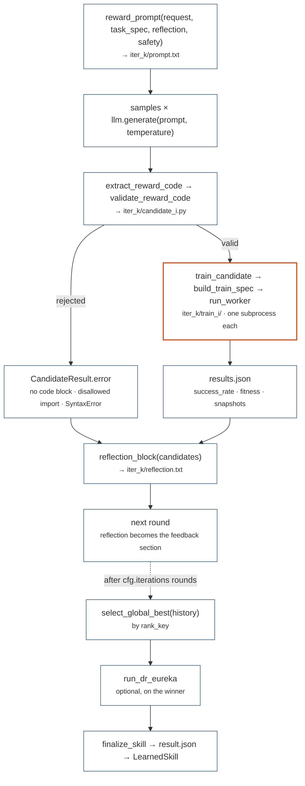
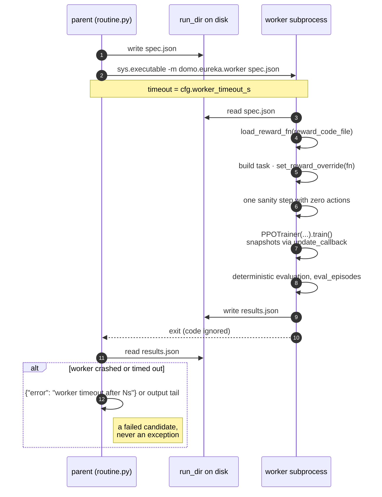

# domo.eureka

`domo.eureka` is the M2 + M3 routine: given a natural-language description of
a skill and a [`VecTask`](tasks.md#vectask) with a fixed success metric, an
LLM writes candidate reward functions, each candidate trains a PPO policy in
its own subprocess, and candidates are ranked on the metric they cannot game.
The one rule it enforces is that **the parent process never touches
physics** — only `worker.py` imports a task, a trainer or an engine, so the
routine can be driven from the digital twin, a CLI, or a supervisor running
next to the real robot.

A textual "reward reflection" feeds the next round. Optionally the winner is
hardened by DrEureka: single-parameter physics sweeps measure how far the
policy tolerates perturbation, the LLM proposes domain-randomisation ranges
inside those limits, every proposal is retrained and the best is kept.

The two methods are those of Ma et al. 2023, *Eureka: Human-Level Reward
Design via Coding Large Language Models* (arXiv 2310.12931) and Ma et al.
2024, *DrEureka: Language Model Guided Sim-To-Real Transfer* (arXiv
2406.01967). DOMO's implementation is faithful in structure (evolutionary
search over reward code, reward reflection from per-component training
statistics, reward-aware physics prior, train-all-select-best DR) and
smaller in default budget.

The package sits above [`domo.tasks`](tasks.md) and [`domo.rl`](rl.md) and
beside [`domo.llm`](llm-hri.md) (see
[architecture](../concepts/architecture.md)). It drives tasks through the
`VecTask` API plus two hooks: `set_reward_override` (inject the generated
reward) and `compute_success` / `compute_fitness` (the fixed metrics).
Everything except the worker runs, and is unit-tested, on a machine without
Genesis (`tests/test_eureka.py`, `tests/test_eureka_routine.py`).

## Module map

| Module | Public names | Role |
|--------|--------------|------|
| `spec.py` | `TaskSpec`, `TASK_REGISTRY`, `EurekaConfig`, `DrEurekaConfig`, `SkillLearningRequest`, `CandidateResult`, `IterationResult`, `LearnedSkill` | the contract: plain dataclasses, no engine / LLM / subprocess dependency |
| `routine.py` | `learn_skill`, `make_client`, `run_worker`; stage functions `build_train_spec`, `train_candidate`, `run_iteration`, `select_global_best`, `build_learned_skill`, `finalize_skill` | entry point, imperative driver, worker RPC |
| `graph.py` | `build_graph`, `run_graph`, `EurekaState` | LangGraph state machine over the same stage functions |
| `prompts.py` | `reward_prompt`, `reflection_block`, `dr_prompt`, `SAFETY_INSTRUCTION` | every string the LLM sees |
| `rewards.py` | `extract_reward_code`, `validate_reward_code`, `load_reward_fn`, `REWARD_FN_NAME`, `ALLOWED_IMPORTS` | generated-code extraction, static guard, exec loading |
| `dr.py` | `physics_prior`, `feasible_bounds`, `prior_table`, `propose_dr_configs`, `run_dr_eureka` | DrEureka stages |
| `worker.py` | CLI `python -m domo.eureka.worker <spec.json>` | the subprocess; the only module that imports physics |

`domo.eureka` re-exports `learn_skill`, `make_client`, `run_worker`,
`TASK_REGISTRY`, `TaskSpec`, `EurekaConfig`, `DrEurekaConfig`,
`SkillLearningRequest`, `CandidateResult`, `IterationResult` and
`LearnedSkill`. Stage functions, prompts, reward helpers and the DR
functions are imported from their modules.

## Quick start

=== "Offline (no API key)"

    A hand-written reward replayed by a scripted client — what
    `examples/eureka/eureka_getup.py --llm scripted` does.

    ```python
    from domo.eureka import EurekaConfig, SkillLearningRequest, learn_skill
    from domo.llm.client import ScriptedClient

    REWARD = '''```python
    def compute_reward(task):
        state = task.robot.state
        up = torch.clamp(-state.projected_gravity[:, 2], 0.0, 1.0)
        height = torch.clamp(state.base_pos[:, 2] / 0.30, 0.0, 1.0)
        energy = -0.0005 * (task.actions - task.last_actions).pow(2).sum(-1)
        return up * height + energy, {"up": up, "height": height, "energy": energy}
    ```'''

    request = SkillLearningRequest(
        skill_name="getup",
        description="Right itself from a fall and hold a standing posture.",
        task="go2_getup",
        eureka=EurekaConfig(iterations=1, samples=1, n_envs=8,
                            train_steps=2_000, device="cpu"),
        run_root="runs/eureka")
    skill = learn_skill(request, llm=ScriptedClient([REWARD]))
    print(skill.checkpoint, skill.success_rate)
    ```

    ```bash
    python examples/eureka/eureka_getup.py --llm scripted --device cpu \
        --n-envs 8 --train-steps 2000 --samples 1 --iterations 1
    ```

=== "Gemini (a real search)"

    The client is built from the request; the free tier needs
    `GEMINI_API_KEY`. Providers are listed in [llm-hri.md](llm-hri.md).

    ```python
    request = SkillLearningRequest(
        skill_name="getup",
        description="Right itself from a fall and hold a standing posture.",
        eureka=EurekaConfig(iterations=3, samples=4, train_steps=5_000_000),
        run_dr=True,
        llm="gemini")                       # or "vllm", llm_kwargs={"model": ...}
    skill = learn_skill(request)
    ```

    ```bash
    python examples/eureka/eureka_getup.py --samples 4 --iterations 3 \
        --train-steps 5000000 --device cuda --dr --dr-samples 8
    ```

Either way, watch the result in the twin:

```bash
python examples/eureka/eureka_getup.py --demo runs/eureka/getup/iter_2/train_1/checkpoint_final.pt
```

The example wraps `ScriptedClient` in an `OfflineClient` that answers a
reward request with the hand-written reward and a DR request with a canned
JSON block, so `--llm scripted --dr` exercises the whole pipeline offline.

## Pipeline

`learn_skill` validates the task key, builds a client if none was passed,
and then runs `cfg.iterations` rounds of this:



A rejected reply is never trained but **is** still reported in the
reflection, so the LLM learns from its own broken code. After the last
round, `select_global_best(history)` picks by `CandidateResult.rank_key`,
`build_learned_skill` wraps it (`RuntimeError` if nothing ever ran), the
optional DrEureka stage runs under `dr/`, and `finalize_skill` writes
`<run_root>/<skill>/result.json`.

Each box is one of the shared stage functions in `routine.py`. The LangGraph
driver (`graph.py`) and the imperative loop call exactly the same functions
in the same order; `tests/test_eureka_routine.py` asserts that both produce
identical prompts, worker specs, files and results.

## The request

### `SkillLearningRequest`

```python
@dataclass
class SkillLearningRequest:
    skill_name: str
    description: str
    task: str = "go2_getup"
    eureka: EurekaConfig = field(default_factory=EurekaConfig)
    run_dr: bool = False
    dr: DrEurekaConfig = field(default_factory=DrEurekaConfig)
    run_root: str = "runs/eureka"
    llm: str = "gemini"
    llm_kwargs: dict | None = None
    use_graph: bool = True
```

| Field | Default | Meaning |
|-------|---------|---------|
| `skill_name` | — | names the run directory `<run_root>/<skill_name>/` and the resulting `LearnedSkill` |
| `description` | — | natural language: what the skill must do. Becomes the "Skill to train" section of every reward prompt |
| `task` | `"go2_getup"` | key into `TASK_REGISTRY`; `learn_skill` raises `ValueError` for an unknown key |
| `eureka` | `EurekaConfig()` | search and per-candidate training budget |
| `run_dr` | `False` | append the DrEureka robustness stage to the winner |
| `dr` | `DrEurekaConfig()` | sweep grid, feasibility rule and retraining budget |
| `run_root` | `"runs/eureka"` | root of the run-directory layout below |
| `llm` | `"gemini"` | provider name understood by `domo.llm.make_llm`: `gemini`, `vllm`, `openai`, `gemini-lc`, `scripted` |
| `llm_kwargs` | `None` | forwarded verbatim to that provider's constructor (`model`, `base_url`, `api_key`, ...) |
| `use_graph` | `True` | drive with LangGraph when it imports; otherwise the imperative loop (a console note says which) |

An explicit client passed to `learn_skill(request, llm=...)` overrides
`llm` and `llm_kwargs`. `spec.request_to_dict(request)` returns the
`asdict` view for logging.

### `EurekaConfig`

```python
@dataclass
class EurekaConfig:
    iterations: int = 3
    samples: int = 4
    temperature: float = 1.0
    safety_reward: bool = True
    n_envs: int = 2048
    train_steps: int = 4_000_000
    rollout_steps: int = 24
    hidden_size: int = 256
    eval_episodes: int = 32
    device: str = "cuda"
    headless: bool = True
    worker_timeout_s: float = 3600.0
    snapshots: int = 4
```

| Field | Default | Meaning | Cost |
|-------|---------|---------|------|
| `iterations` | 3 | evolutionary rounds | multiplies everything below |
| `samples` | 4 | reward candidates asked per round | `iterations × samples` LLM calls and, for every candidate that validates, one training |
| `temperature` | 1.0 | LLM sampling temperature for reward candidates (diversity within a round) | — |
| `safety_reward` | `True` | append `SAFETY_INSTRUCTION` to the prompt (DrEureka's safety-regularised reward design) | prompt length only |
| `n_envs` | 2048 | parallel environments per training worker | GPU memory; also sets `minibatch_size` |
| `train_steps` | 4 000 000 | env-steps per candidate training (`PPOConfig.total_steps`) | the dominant cost: wall-clock per candidate |
| `rollout_steps` | 24 | PPO rollout length per update | updates = `train_steps // (rollout_steps × n_envs)` |
| `hidden_size` | 256 | actor-critic trunk width | small |
| `eval_episodes` | 32 | deterministic episodes evaluated after training to produce `success_rate` and `fitness` | seconds per candidate |
| `device` | `"cuda"` | task device passed to the worker | `cpu` only for smoke runs |
| `headless` | `True` | task override for Eureka trainings (DR retrainings are always headless) | a viewer slows training |
| `worker_timeout_s` | 3600 | wall-clock limit per worker subprocess; expiry becomes a failed candidate | bound this by `train_steps` |
| `snapshots` | 4 | reward-reflection sample points per training (component means at ~equal intervals) | negligible |

!!! warning "Every knob above multiplies wall-clock"

    The search costs `iterations × samples` trainings of `train_steps`
    env-steps each, run **sequentially** — a 3 × 4 search at 5 M steps is an
    hour-scale job on a workstation GPU, and DrEureka with 16 samples
    doubles it. A candidate that fails validation is not trained, so the
    real number is usually lower. Set `worker_timeout_s` above one
    training's wall-clock plus scene build time, or healthy candidates are
    killed and reported as failures. See
    [Budget guidance](#budget-guidance).

The PPO block derived from this config also fixes `minibatch_size =
max(n_envs × rollout_steps // 4, 64)`, `guard_nonfinite = True` and
`lr_schedule = "linear"`; everything else is
[`PPOConfig`'s defaults](rl.md#ppoconfig).

### `DrEurekaConfig`

```python
@dataclass
class DrEurekaConfig:
    # Mutable defaults are supplied through field(default_factory=...);
    # the values below are what each factory returns.
    friction_values:   list[float] = field(default_factory=lambda: [0.25, 0.5, 1.0, 1.5, 2.0, 4.0])
    base_mass_values:  list[float] = field(default_factory=lambda: [-1.0, 0.0, 1.0, 2.0, 3.0, 5.0])
    com_shift_values:  list[float] = field(default_factory=lambda: [0.0, 0.02, 0.05, 0.1, 0.15])
    kp_scale_values:   list[float] = field(default_factory=lambda: [0.5, 0.7, 0.85, 1.0, 1.15, 1.3, 1.5])
    obs_noise_values:  list[float] = field(default_factory=lambda: [0.0, 0.02, 0.05, 0.1])
    feasible_ratio: float = 0.5
    feasible_floor: float = 0.1
    eval_episodes: int = 32
    samples: int = 4
    retrain_steps: int = 4_000_000
```

| Field | Meaning | Cost |
|-------|---------|------|
| `*_values` | the reward-aware physics prior (RAPP) grid: one frozen-policy evaluation per listed value with that parameter alone fixed. Friction is swept at every value (1.0 included); mass, COM, Kp and noise skip their unperturbed value because the "nominal" entry already measures it. COM values are magnitudes and become symmetric ranges `[-v, v]` | one evaluation of `eval_episodes` per value, all inside a single worker |
| `feasible_ratio`, `feasible_floor` | a value is feasible when its success rate is at least `max(feasible_floor, feasible_ratio × nominal_success)` | — |
| `eval_episodes` | episodes per sweep value and per DR retraining evaluation | — |
| `samples` | independent DR configurations asked from the LLM; all are trained (the paper uses 16) | `samples` retrainings |
| `retrain_steps` | env-steps per DR retraining | as `train_steps`, once per sample |

### `TaskSpec` and `TASK_REGISTRY`

```python
@dataclass(frozen=True)
class TaskSpec:
    module: str
    task_class: str
    config_class: str
    success_description: str
    env_interface: str

TASK_REGISTRY: dict[str, TaskSpec]
```

!!! warning "The prompt and the task can drift apart — `go2_getup` already has"

    `TASK_REGISTRY["go2_getup"].success_description` tells the LLM the pose
    must be held "for 50 consecutive control steps (1 s), within a 5 s
    episode", while [`Go2GetUpConfig`](tasks.md#go2getupconfig) uses
    `success_hold_steps = 25` (0.5 s) and `max_episode_steps = 400` (8 s).
    Nothing checks the two against each other, and a mismatch between
    `env_interface` and the real task is the commonest cause of rewards
    that die in the worker's sanity step. Re-read both whenever the task
    changes.

A `TaskSpec` tells the worker how to build the task
(`importlib.import_module(module)`, then
`task_class(config_class(**task_overrides))`) and tells the prompt what the
LLM may rely on: `success_description` is the fixed metric it must improve
but cannot modify, `env_interface` the `task` fields generated code may
read. The registry ships one entry, `"go2_getup"` (`domo.tasks.go2_getup`,
`Go2GetUpTask`, `Go2GetUpConfig`); see "Adding a task" below.

## Results

### `CandidateResult`

```python
@dataclass
class CandidateResult:
    index: int
    code: str
    success_rate: float = -1.0
    fitness: float = 0.0
    peak_height: float = 0.0
    ever_upright_rate: float = 0.0
    max_hold: float = 0.0
    mean_ep_len: float = 0.0
    snapshots: list[dict] = field(default_factory=list)
    checkpoint: str | None = None
    error: str | None = None

    @property
    def ok(self) -> bool                         # error is None
    @property
    def rank_key(self) -> tuple[float, float, float]
```

One LLM reply and, if it ran, its training outcome. `code` is the extracted
reward source, or the first 2000 characters of the raw reply when no code
block was found. `error` is set by extraction ("no python code block
defining compute_reward"), validation (the validator's message), or the
worker (a traceback, a timeout note, or the output tail of a process that
left no `results.json`). A candidate with `error` set is never ranked but is
still reported in the reflection so the LLM learns from it.
`success_rate` is the task's fixed metric over the post-training
evaluation; `fitness` the task's dense progress proxy; `peak_height`,
`ever_upright_rate` and `max_hold` are diagnostics the reflection uses.
`rank_key` is defined in "Ranking" below.

### `IterationResult`

```python
@dataclass
class IterationResult:
    index: int
    candidates: list[CandidateResult]

    @property
    def best(self) -> CandidateResult | None     # lowest rank_key among ok candidates
```

### `LearnedSkill`

```python
@dataclass
class LearnedSkill:
    name: str
    task: str
    checkpoint: str
    reward_code: str
    success_rate: float
    dr_config: dict | None = None
    dr_success_rate: float | None = None
    history: list[IterationResult] = field(default_factory=list)

    def summary(self) -> str
```

The output of `learn_skill`. `checkpoint` is the policy to deploy. When
DrEureka ran and at least one DR retraining succeeded, `checkpoint` is the
best DR-retrained policy and `dr_config` / `dr_success_rate` describe it;
`success_rate` always refers to the Eureka-stage winner under nominal
physics. `history` holds every round. `summary()` is the multi-line report
printed at the end of a run (checkpoint, success, DR config, and per-round
success rates with `ERR` for failed candidates). To deploy, load the
checkpoint with [`ActorCritic.from_state_dict`](rl.md#actorcritic) and wrap
it in a [`LearnedJointSkill`](control.md#learnedjointskill) as
`examples/eureka/eureka_getup.py --demo` does — that is how an M3 output
enters the [M5 library](skills.md#add-a-card-to-the-library).

## Entry points and stage functions

### `learn_skill(request, llm=None) -> LearnedSkill`

```python
def learn_skill(request: SkillLearningRequest,
                llm: LLMClient | None = None) -> LearnedSkill
```

Runs the whole pipeline. Raises `ValueError` for an unknown `request.task`
and `RuntimeError("Eureka produced no runnable candidate ...")` when no
candidate in any round trained successfully. Worker failures, LLM replies
without code and validation rejections never raise; they become failed
candidates. LLM transport errors do propagate (after the client's own
retries).

### `make_client(request) -> LLMClient`

`make_llm(request.llm, **(request.llm_kwargs or {}))`.

### `run_worker(spec, timeout_s) -> dict`

```python
def run_worker(spec: dict, timeout_s: float) -> dict
```

Writes `spec["run_dir"]/spec.json`, runs
`sys.executable -m domo.eureka.worker spec.json` with the timeout, and
returns the parsed `spec["run_dir"]/results.json`. It never raises on a bad
worker: a timeout returns `{"error": "worker timeout after Ns"}`; a process
that left no `results.json` returns `{"error": "worker produced no
results.json; output tail: ..."}` with the last 2000 characters of stdout
and stderr. The exit code is ignored; `results.json` is the contract.

### Stage functions (`domo.eureka.routine`)

```python
def build_train_spec(request, *, reward_code_file: str, run_dir: str,
                     total_steps: int, eval_episodes: int, headless: bool,
                     dr: dict | None = None) -> dict
def train_candidate(request, cand: CandidateResult, it_dir: str) -> CandidateResult
def run_iteration(request, task_spec: TaskSpec, llm: LLMClient,
                  reflection: str, it_dir: str, it_index: int) -> IterationResult
def select_global_best(history: list[IterationResult]) -> CandidateResult | None
def build_learned_skill(request, history: list[IterationResult]) -> LearnedSkill
def finalize_skill(request, skill: LearnedSkill) -> LearnedSkill
```

* `build_train_spec` produces the "train" worker spec shared by Eureka and
  DrEureka, so robust and non-robust policies differ only by the `dr`
  override and the step budget.
* `train_candidate` builds the spec for `iter_k/candidate_i.py`, runs the
  worker in `iter_k/train_i/`, and copies the worker's metrics into the
  candidate (or sets `error`).
* `run_iteration` is one round: prompt, sample, validate, train, reflect;
  it creates `it_dir` and writes `prompt.txt`, `candidate_i.py` and
  `reflection.txt`. `reflection` is the previous round's block (`""` on the
  first round).
* `select_global_best` compares the per-round bests by `rank_key`;
  `build_learned_skill` wraps the result or raises; `finalize_skill` writes
  `result.json` and prints `summary()`.

Both drivers call these in the same order. Changes to what a stage does
belong here, never in a driver.

### The LangGraph driver (`domo.eureka.graph`)

```python
class EurekaState(TypedDict, total=False):
    request: SkillLearningRequest
    llm: LLMClient
    reflection: str
    iteration: int            # completed rounds
    history: list[IterationResult]
    skill: LearnedSkill | None

def build_graph()                                   # compiled StateGraph
def run_graph(request, llm: LLMClient) -> LearnedSkill
```

Topology: `START → iterate → (iteration < iterations ? iterate : select) →
(run_dr ? dr : finish) → finish → END`. `run_graph` invokes the graph with
`recursion_limit = 4 × iterations + 20` so long searches never hit
LangGraph's default cap. `build_graph` raises `ImportError` without
`langgraph` (`pip install -e '.[langchain]'`); `learn_skill` catches that
and falls back to the imperative loop. The graph adds inspectable
structure and a place for checkpointing or human-in-the-loop interrupts,
not a second implementation.

## Prompts (`domo.eureka.prompts`)

```python
SAFETY_INSTRUCTION: str
def reward_prompt(request, task_spec, reflection: str = "", safety: bool = True) -> str
def reflection_block(candidates: list[CandidateResult]) -> str
def dr_prompt(skill_name: str, nominal_success: float,
              feasible_bounds: str, prior_table: str) -> str
```

`reward_prompt` is assembled, in order, from: the system rules (one python
block, `def compute_reward(task) -> tuple[torch.Tensor, dict[str,
torch.Tensor]]`, batched over N envs, only `torch`/`math` and the documented
fields); `## Skill to train` with `request.description`, plus `### Safety &
transfer requirements` = `SAFETY_INSTRUCTION` when `safety`; `## Fixed
success metric` = `task_spec.success_description`; `## Environment
interface` = `task_spec.env_interface`; and either `## Feedback from the
previous round` followed by the reflection and an "improve it" instruction,
or "Write the reward function now." on the first round.

`reflection_block` and `dr_prompt` are described under "Reflection" and
"DrEureka" below. The wording is part of the method: change it
deliberately, with a run.

## Generated reward code (`domo.eureka.rewards`)

```python
REWARD_FN_NAME = "compute_reward"
ALLOWED_IMPORTS = {"torch", "math"}

def extract_reward_code(llm_response: str) -> str | None
def validate_reward_code(code: str) -> str | None       # error message or None
def load_reward_fn(code: str) -> Callable                # fn(task) -> (reward [N], components)
```

* `extract_reward_code` delegates to `domo.llm.extract_code_block`
  (tolerant of any or no language tag, CRLF, and a truncated block whose
  closing fence never arrived; unfenced text containing `def ` is accepted
  too) and returns the block only if it mentions `compute_reward`.
* `validate_reward_code` reports the first failure of, in order: a
  forbidden substring (`__`, `open(`, `exec(`, `eval(`, `subprocess`); an
  import whose root is not `torch` or `math` ("disallowed import 'os' — only
  math, torch are available"); a `SyntaxError`; a missing `compute_reward`.
  Importing `torch` and `math` is a harmless no-op and allowed because LLMs
  write it by habit.
* `load_reward_fn` validates, `exec`s the code in a namespace containing
  only `torch` and `math`, and returns a wrapper that checks every call:
  the result must be a 2-tuple, the reward must have shape `(task.n_envs,)`
  and be finite, and the components must be a dict. Outputs are cast to
  float and components detached. A malformed reward therefore fails loudly
  in the worker's sanity step and lands in the reflection instead of
  silently corrupting training.

The `exec` is deliberate; see
[the warning under the worker protocol](#the-worker-protocol) for what the
guard does and does not cover.

## The worker protocol

The parent writes a spec, spawns `python -m domo.eureka.worker
<run_dir>/spec.json` and reads `<run_dir>/results.json`. One process per job
because [Genesis initialises once per process](sim.md#the-genesis-backend).
Two JSON files on disk are the entire protocol — there is no pipe, no
shared memory and no return code.



The worker always tries to write `results.json`: on any exception it is
`{"error": "<traceback>"}`, and that traceback is the payload the reflection
shows the LLM (an undefined task field, a shape error). `results.json` is
the contract; the exit code is ignored.

!!! danger "Generated code is `exec`'d — the guard is against accidents, not adversaries"

    `load_reward_fn` rejects `__`, `open(`, `exec(`, `eval(` and
    `subprocess`, allows only `torch` and `math` as imports, and
    type-checks every call's output. Python builtins remain reachable, so
    this stops an LLM that writes `import os` out of habit, not a hostile
    one. The design relies on the generated code running **only inside the
    worker subprocess**, never in the caller's process. If you point the
    routine at an untrusted provider, run the worker in a container.

### Spec, mode `"train"` (from `build_train_spec`)

```json
{
  "mode": "train",
  "task": "go2_getup",
  "task_overrides": {"n_envs": 2048, "device": "cuda", "headless": true,
                     "dr": {"friction_range": [0.5, 1.5]}},
  "reward_code_file": "runs/eureka/getup/iter_0/candidate_1.py",
  "ppo": {"total_steps": 4000000, "rollout_steps": 24,
          "minibatch_size": 12288, "hidden_size": 256,
          "guard_nonfinite": true, "lr_schedule": "linear"},
  "run_dir": "runs/eureka/getup/iter_0/train_1",
  "eval_episodes": 32,
  "snapshots": 4
}
```

`task_overrides` are keyword arguments of the registered config class;
`"dr"` is present only for DR retrainings. `"ppo"` are `PPOConfig`
keyword arguments; the worker adds `run_dir`.

What the worker does in this mode: `load_reward_fn` on the file; build the
task; `task.set_reward_override(fn)`; one sanity step with zero actions
(so a broken reward fails before any training); `PPOTrainer(task, ppo,
extra_checkpoint_data={"task", "task_config", "reward_code"})` so every
checkpoint carries its provenance; an `update_callback` that records a
snapshot every `total_updates // snapshots` updates and at the last update;
`trainer.train()`; then a deterministic evaluation of `eval_episodes`
finished episodes (capped at `episodes × max_episode_length + 200` steps).

### Results, mode `"train"`

```json
{
  "error": null,
  "checkpoint": "runs/eureka/getup/iter_0/train_1/checkpoint_final.pt",
  "success_rate": 0.53,
  "fitness": 0.71,
  "peak_height": 0.31,
  "ever_upright_rate": 0.84,
  "max_hold": 19.2,
  "mean_ep_len": 400.0,
  "snapshots": [
    {"frac": 0.25, "components": {"up": 0.41, "energy": -0.02},
     "success_rate": 0.0, "fitness": 0.22, "peak_height": 0.19,
     "ever_upright_rate": 0.05, "mean_ep_len": 400.0},
    ...
  ]
}
```

The scalar metrics are means over the evaluated episodes' outcome records
(`{"success", "fitness", "peak_height", "ever_upright", "max_hold"}`; a
task that appends plain booleans is still accepted, with fitness mirroring
success). Snapshot `components` are the per-step means of the reward
components at that point of training; the other snapshot fields summarise
the last 200 training episodes and the last 50 episode lengths.

### Spec and results, mode `"dr_eval"` (from `physics_prior`)

```json
{
  "mode": "dr_eval",
  "task": "go2_getup",
  "task_overrides": {"n_envs": 256, "device": "cuda", "headless": true},
  "checkpoint": "runs/eureka/getup/iter_2/train_0/checkpoint_final.pt",
  "sweeps": [
    {"label": "nominal", "dr": {}},
    {"label": "friction=0.5", "dr": {"friction_range": [0.5, 0.5]}},
    {"label": "com_shift=0.05", "dr": {"com_shift_range": [-0.05, 0.05]}},
    {"label": "obs_noise=0.02", "dr": {"obs_noise_std": 0.02}}
  ],
  "eval_episodes": 32,
  "run_dir": "runs/eureka/getup/dr/prior"
}
```

```json
{
  "error": null,
  "sweeps": [
    {"label": "nominal", "dr": {}, "success_rate": 0.6, "fitness": 0.8, "mean_ep_len": 400.0},
    ...
  ]
}
```

The worker loads the checkpoint with `ActorCritic.from_state_dict`, builds
one task and swaps `task.dr` between sweeps (DR is applied per reset), and
evaluates each deterministically.

### `result.json` (from `finalize_skill`)

```json
{
  "name": "getup",
  "checkpoint": "runs/eureka/getup/dr/retrain_1/checkpoint_final.pt",
  "success_rate": 0.6,
  "dr_config": {"friction_range": [0.5, 1.5], "kp_scale_range": [0.85, 1.15]},
  "dr_success_rate": 0.55,
  "reward_code": "def compute_reward(task):\n    ..."
}
```

`dr_config` and `dr_success_rate` are `null` when DrEureka did not run or
produced no policy.

## Run-directory layout

```
<run_root>/<skill_name>/
├── iter_0/
│   ├── prompt.txt              full reward prompt of this round
│   ├── candidate_0.py          extracted code (also for validator-rejected replies)
│   ├── candidate_1.py
│   ├── reflection.txt          reflection_block of this round
│   ├── train_0/
│   │   ├── spec.json           worker input
│   │   ├── results.json        worker output (absent if the worker crashed hard)
│   │   ├── checkpoint_final.pt
│   │   └── events.out.tfevents.*   PPOTrainer's TensorBoard log
│   └── train_1/ ...
├── iter_1/ ...
├── dr/                         only with run_dr=True
│   ├── prior/{spec.json, results.json}
│   ├── retrain_0/{reward.py, spec.json, results.json, checkpoint_final.pt, tfevents}
│   └── retrain_1/ ...
└── result.json
```

A reply with no code block at all gets no `candidate_i.py`; a candidate the
validator rejected is written but has no `train_i/`. `reward.py` under
`dr/retrain_i/` is a copy of the winning reward.

## Ranking

```python
rank_key = (-success_rate, -fitness, mean_ep_len)      # lower is better
```

Binary success on the fixed metric dominates; the dense fitness (the
task's `compute_fitness`, time-averaged per episode, in `[0, 1]`) breaks
ties so the search still has a gradient when no candidate has succeeded
yet; mean episode length is the last tie-breaker. `IterationResult.best`
and `select_global_best` both use this key over candidates with
`ok == True`. `tests/test_eureka.py::test_dense_fitness_breaks_zero_success_ties`
pins the semantics: at 0% success the higher fitness wins; any success
beats any fitness.

## Reflection

`reflection_block(candidates)` produces the text that becomes the next
round's feedback section and `iter_k/reflection.txt`:

1. A header and one line per candidate, in index order: `#i: fitness x |
   success y% | ever-reached-goal z% | peak base height h m`, or `#i:
   FAILED to run — <last line of the error>`.
2. If no candidate ran: "All candidates failed. Common causes: undefined
   fields, wrong tensor shapes, python-level loops." and nothing else.
3. If the best candidate has 0% success, a targeted note. When it reached
   the goal pose in more than 5% of episodes but its longest upright streak
   stayed below 8 steps, the "REACHES the goal pose but does NOT HOLD it"
   diagnosis: the policy passes through the pose ballistically, so reward
   settling (upright, tall and still). Otherwise a generic note to judge
   progress by fitness, peak height and ever-reached-goal and to shape
   intermediate progress.
4. "Best candidate was #i (fitness f). Its code:" followed by the code in a
   fence.
5. If it has snapshots, each reward component's trajectory across the
   snapshots (`name: +0.4100 → +0.6200 → ...`) followed by fitness, peak
   height, ever-reached-goal, success rate and episode length over the
   same points.

The trajectories are the Eureka reward-reflection signal: a component that
stays flat carries no learning signal, one that dominates drowns the
others, and the next prompt says so explicitly.

## DrEureka (`domo.eureka.dr`)

```python
def physics_prior(request, skill: LearnedSkill, run_dir: str) -> list[dict]
def feasible_bounds(sweeps: list[dict], dr_cfg: DrEurekaConfig, nominal: float
                    ) -> tuple[dict[str, tuple[float, float]], str]
def prior_table(sweeps: list[dict], dr_cfg: DrEurekaConfig, nominal: float) -> str
def propose_dr_configs(llm, skill: LearnedSkill, sweeps: list[dict],
                       dr_cfg: DrEurekaConfig, n_samples: int
                       ) -> tuple[list[DomainRandomization], str]
def run_dr_eureka(request, skill: LearnedSkill, llm) -> LearnedSkill
```

`run_dr_eureka` runs on the Eureka winner, under `<run_root>/<skill>/dr/`,
and mutates and returns `skill`.

**Stage 1, reward-aware physics prior.** `physics_prior` evaluates the
frozen checkpoint under every single-parameter perturbation of the
`DrEurekaConfig` grid in one `"dr_eval"` worker with `n_envs = max(n_envs
// 8, 32)` and `dr.eval_episodes` episodes per sweep. The nominal
(unperturbed) entry is the reference. Unlike candidate training, a failed
prior is fatal (`RuntimeError("physics prior failed: ...")`): there is
nothing to rank against. `feasible_bounds` then derives, per parameter, the
`[min, max]` over the feasible values (success at least
`max(feasible_floor, feasible_ratio × nominal)`), always including the
default (friction 1.0, mass 0, COM 0, Kp 1.0, noise 0); COM becomes the
symmetric `[-max, max]`. It returns the bounds keyed by `DomainRandomization`
field and a text block marking each parameter "randomisable" or "no room".
`prior_table` renders every swept value with its success and a `FEASIBLE`
or `COLLAPSED` mark.

**Stage 2, LLM-proposed randomisation.** `propose_dr_configs` builds
`dr_prompt` (system rules, the policy's nominal success, the bounds block,
the table, and a JSON schema with `friction_range`, `base_mass_range`,
`com_shift_range`, `kp_scale_range`, `kd_scale_range`, `obs_noise_std`)
and samples it `dr.samples` times at temperature 0.8. Each reply goes
through `extract_json_block`, `json.loads`, clamping into the feasible
bounds (ranges clipped inward, `obs_noise_std` capped at its feasible
maximum, unswept keys such as `kd_scale_range` passed through) and
[`DomainRandomization.from_dict`](robot.md#domainrandomization). Unparseable replies are skipped. If
nothing parsed, the feasible bounds themselves become the single fallback
config (zero-width ranges dropped, `obs_noise_std` set to its maximum), with
a console note.

**Stage 3, train all, keep the best.** Each config is retrained from
scratch with the winning reward (`retrain_i/reward.py`) for
`dr.retrain_steps` steps, headless, with the same PPO settings as Eureka,
and evaluated under its own randomisation. The config with the highest
success wins: `skill.checkpoint`, `skill.dr_config` (the config's
`to_dict()`, so inactive parameters are omitted) and `skill.dr_success_rate`
are overwritten. If every retraining fails, the non-robust skill is
returned unchanged with a console note; a fragile policy is still a result.

## Adding a task

A new skill target is a `VecTask` subclass plus a registry entry. The task
must:

* accept a config with at least `n_envs`, `device`, `headless` and `dr`
  (a `DomainRandomization.to_dict()` dictionary or `None`) as keyword
  arguments, since that is what `task_overrides` carries;
* ship with no reward of its own and honour `set_reward_override` (the
  base-class machinery in `domo.tasks.base` does this; the task calls
  `compute_rewards()` in `step`);
* implement `compute_success() -> bool [N]` (instantaneous) and
  `compute_fitness() -> float [N]` in `[0, 1]`, both independent of the
  injected reward;
* append one record per finished episode to `self.episode_outcomes`:
  `{"success": bool, "fitness": float, "peak_height": float,
  "ever_upright": bool, "max_hold": int}`. The worker only reads
  `success` and `fitness` for ranking; the others are diagnostics the
  reflection quotes, and can be zero for a task where they mean nothing;
* expose `n_envs`, `num_actions`, `device`, `max_episode_length`,
  `reward_components` and `episode_outcomes` (all provided or expected by
  `VecTask`).

Then register it:

```python
from domo.eureka import TASK_REGISTRY, TaskSpec

TASK_REGISTRY["go2_jump"] = TaskSpec(
    module="domo.tasks.go2_jump",
    task_class="Go2JumpTask",
    config_class="Go2JumpConfig",
    success_description="Success (fixed metric, not modifiable): ...",
    env_interface="The reward function receives `task`. Available:\n  task.robot.state.base_pos [N,3] ...")
```

`success_description` must state the metric exactly as the task computes
it; `env_interface` lists every `task` attribute the generated code may
read, with shapes and units. Both are pasted verbatim into the prompt, and
a mismatch between them and the task is the most common cause of rewards
that fail in the sanity step. [`domo.tasks.go2_getup`](tasks.md#go2getuptask) is the reference
implementation.

## Known limitations

These are documented, not fixed:

* **Prompt / metric drift on the get-up task**
  ([above](#taskspec-and-task_registry)). The reflection's hold diagnosis
  ("needs ~25") and the console line use 25; the docstring of
  `examples/eureka/eureka_getup.py` still says "held 1 s".
* **The DR fallback is never empty.** `propose_dr_configs` always adds
  `obs_noise_std` to the fallback (its feasible maximum, possibly 0.0), so
  even when nothing is randomisable Stage 3 retrains once with an effective
  no-op configuration instead of skipping. Pinned in
  `tests/test_eureka_routine.py::test_propose_dr_falls_back_to_bounds_when_llm_unusable`.
* **Clamped proposals can keep zero-width ranges.** Clipping an LLM range
  into a "no room" bound yields e.g. `[1.0, 1.0]`, which trains with the
  parameter fixed at its default rather than dropping it.
* **`mean_ep_len` is a constant.** The worker reports the task's
  `max_episode_length` (400 for get-up), not the measured mean, so the third
  element of `rank_key` never breaks a tie. Snapshots do carry measured
  lengths.
* **The console "hold a/25" denominator is Go2-specific.**
  `_HOLD_STEPS_DISPLAY` in `routine.py` mirrors `Go2GetUpConfig` and is
  display only; another task with a different hold would print a misleading
  fraction.
* **`dr.py` credits DrEureka to "Yu et al. 2024".** The arXiv id it cites
  (2406.01967) is Ma et al. 2024.
* **Candidates train sequentially** even though the method is
  "parallel-in-principle"; the wall-clock is `iterations × samples ×`
  one training.

## Budget guidance

| Setting | CPU smoke (this Mac) | Real search (GPU) |
|---------|----------------------|-------------------|
| `device` | `cpu` | `cuda` |
| `n_envs` | 8 | 2048 |
| `train_steps` | 2 000 | 4–5 M (`EurekaConfig` default 4 M; the example uses 5 M) |
| `iterations × samples` | 1 × 1 | 3 × 4 (12 trainings) |
| `eval_episodes` | 3 | 32 |
| `worker_timeout_s` | default | at least one training's wall-clock plus build time |
| `llm` | `scripted` | `gemini` (free tier) or `vllm` |
| DR | `--dr --dr-samples 1`, `retrain_steps` tiny | `dr.samples` 4–16, `retrain_steps` = `train_steps` |

A smoke run only proves that the plumbing works: at 2 000 steps and 8 envs
PPO performs one update and every candidate scores 0% with a fitness near
the spawn pose. Use it to check prompts, run-dir layout and a new
`TaskSpec`. A meaningful candidate needs on the order of 5 M steps at
2048 envs (about 100 PPO updates of 24 × 2048 samples), which is minutes on
a workstation GPU; a 3 × 4 search is therefore an hour-scale job and
DrEureka with 16 samples doubles it. The LLM cost is `iterations × samples`
reward calls plus `dr.samples` DR calls, each with a 16 384-token output
budget; see [troubleshooting](../guides/troubleshooting.md#llm-providers) for
truncated Gemini replies.
