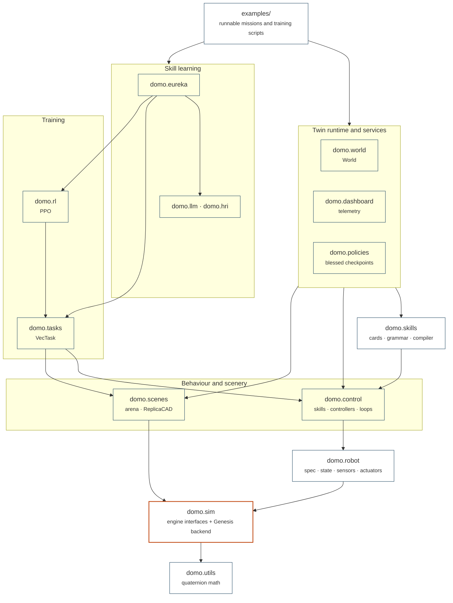

# API reference

Ten pages, one per package, covering every public class and function with
its tensor shapes, units and defaults. The concept pages own the *why* and
the guides own the *how*; these pages own the signatures and the semantics
that are easy to get wrong.

## The ten pages

Exactly one module in the library may import a physics engine. The last
column is the reason the rest of the stack is portable.

| Page | Owns | Imports a physics engine? |
|------|------|---------------------------|
| [domo.sim](sim.md) | engine ABCs (`Scene`, `Articulation`, `PhysicsEngine`, sensor handles), the configs, the backend registry, the Genesis backend | **`genesis_backend.py` only** |
| [domo.robot](robot.md) | `RobotSpec`, `RobotState`, `Robot`, sensors, actuators, lidar device models, `DomainRandomization` | no — reaches handles through `domo.sim` |
| [domo.control](control.md) | `Skill`, `CommandSkill`, `Controller`, `ControlLoop`, the CPG, leg IK, SLAM, legacy navigation | no |
| [domo.skills](skills.md) | `SkillCard`, the grammar and its compiler, `CompositeSkill`, `PlanningController` | no |
| [domo.tasks](tasks.md) | `VecTask` and the four Go2 tasks: rewards, resets, termination, success metrics | no |
| [domo.rl](rl.md) | `ActorCritic`, `RolloutBuffer`, `PPOConfig`, `PPOTrainer`, the checkpoint format | no |
| [domo.eureka](eureka.md) | the reward-search routine, the worker protocol, DrEureka | only in `worker.py`, which runs as a subprocess |
| [domo.llm & domo.hri](llm-hri.md) | `LLMClient` and its providers, the parsing helpers, the voice pipeline | no |
| [domo.world & services](world-and-services.md) | `World`, the scene builders, quaternion math, checkpoint I/O, the stable-policy registry | no |
| [domo.dashboard](dashboard.md) | live telemetry for the twin: hub, server, client, routes, payload | no — and never on the training path |

## How the packages depend on each other

Every arrow points downward in the stack; nothing points back up. This
mirrors [the layer stack](../concepts/architecture.md#the-layer-stack).

Two things are worth reading off the diagram. `domo.rl` sits *above*
`domo.tasks`, not beside it: training is an optional consumer of a task, not
the other way round. And `domo.control` and `domo.skills` never touch
`domo.sim` at all, which is what lets the same behaviour code run against
the simulator today and hardware drivers later.

## Reading order

-   __1 · The foundation__

    ---

    What a robot is and how it is driven. Read these four in order and you
    can write a skill and run it in the twin.

    [:octicons-arrow-right-24: domo.sim](sim.md) ·
    [domo.robot](robot.md) ·
    [domo.control](control.md) ·
    [domo.skills](skills.md)

-   __2 · Learning__

    ---

    Only once the foundation makes sense: a task is the same scene with a
    reward bolted on, and PPO is one consumer of it.

    [:octicons-arrow-right-24: domo.tasks](tasks.md) ·
    [domo.rl](rl.md)

-   __3 · The supervisor__

    ---

    The routine that writes rewards, trains candidates and ranks them on a
    metric they cannot game. It assumes both blocks above.

    [:octicons-arrow-right-24: domo.eureka](eureka.md)

-   __As needed__

    ---

    The services around the edges: assembling a twin, talking to a
    provider, watching a run in a browser.

    [:octicons-arrow-right-24: domo.world & services](world-and-services.md) ·
    [domo.llm & domo.hri](llm-hri.md) ·
    [domo.dashboard](dashboard.md)

If you have never seen the code base, [the first run](../start/first-run.md)
and [the glossary](../start/glossary.md) come before any of this.

## Conventions in one screen

These hold in every signature on every page. The full argument is in
[conventions](../concepts/conventions.md).

| Convention | What it means | Where it bites |
|------------|---------------|----------------|
| **Quaternions are `wxyz`** | scalar first, unit norm; Genesis agrees, so nothing converts | a backend using `xyzw` must convert *inside* the backend |
| **Batched tensors are `[n_envs, ...]`** | every public tensor, even with one env; on the engine's device | read `World.device` / `engine.device`, not the string you requested |
| **Go2 joint order is fixed** | `[FR, FL, RR, RL] × [hip, thigh, calf]`, from `RobotSpec.joint_names` | every DOF-indexed tensor and every checkpoint follows it |
| **SI units throughout** | metres, seconds, radians, newtons, kilograms | degrees appear only in fields named `*_deg` |
| **World frame unless named otherwise** | `base_lin_vel` is body frame, `base_lin_vel_world` is not | observations are body-frame so they transfer |
| **`base_euler` is intrinsic X-Y-Z** | `R = Rx · Ry · Rz`, the Genesis convention, yaw at index 2 | it is *not* aerospace roll-pitch-yaw; the two share a layout |
