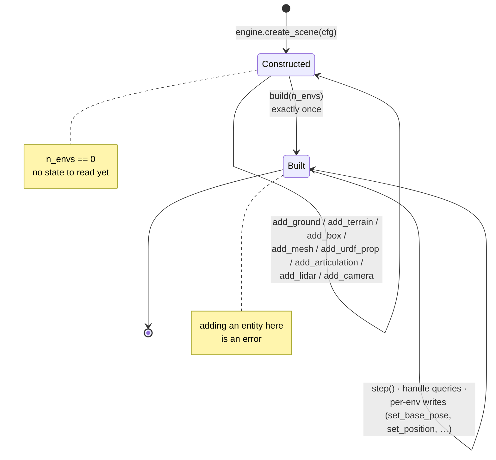

# domo.sim

`domo.sim` is the bottom of the physics stack: the abstract contract every
other layer codes against, plus the Genesis backend that implements it. The
one rule it enforces is that **`domo/sim/genesis_backend.py` is the only
module in the library that imports a physics engine.**

Everything a backend hands back is a `torch.Tensor` of shape `[n_envs, ...]`
on the simulation device, or one of the handle types defined in
`domo.sim.base`. Callers never see an engine object, so the engine can be
swapped — or replaced by the real robot — without touching behaviour code.
The package sits directly above `domo.utils` and below
[`domo.robot`](robot.md); see
[architecture](../concepts/architecture.md) for the whole stack.

Conventions in force throughout (from
[conventions](../concepts/conventions.md)): quaternions are `wxyz`; batched
quantities are `[N, ...]` torch tensors on the sim device; world frame unless
the name says otherwise; SI units, with degrees only in fields named `*_deg`.

## Module map

| Module | Contents | Imports an engine? |
|--------|----------|--------------------|
| `domo/sim/__init__.py` | `create_engine`, `register_backend`, re-exports of the ABCs and configs | no |
| `domo/sim/base.py` | configs (`SimConfig`, `ViewerConfig`, `TerrainConfig`, `LidarConfig`), handle ABCs (`RigidObject`, `Articulation`, `LidarSensorHandle`, `CameraHandle`), `Scene`, `PhysicsEngine`, `lidar_ranges_to_grid` | no |
| `domo/sim/genesis_backend.py` | `GenesisEngine`, `GenesisScene`, `GenesisArticulation`, `GenesisRigidObject`, `GenesisLidar`, `GenesisCamera` | **yes** (`genesis`) |

`from domo.sim import ...` exposes the ABCs, the configs and the two registry
functions. `lidar_ranges_to_grid` is imported from `domo.sim.base`. The
Genesis classes are never imported directly by library code; they are
reached through `create_engine("genesis")`.

## Backend registry

### `create_engine`

```python
def create_engine(name: str = "genesis", **kwargs) -> PhysicsEngine
```

Instantiates a registered backend. `kwargs` are forwarded verbatim to the
backend factory; for Genesis the only one is `device="cuda" | "cpu"`.

Raises `ValueError` if `name` is not registered (the message lists the
available names).

Backends are imported lazily *inside* their factory: importing `domo.sim`
does not import `genesis`, so the control, skills and RL layers work on a
machine without any physics engine installed. Only the call to
`create_engine("genesis")` triggers the import.

=== "Genesis"

    ```python
    from domo.sim import create_engine, SimConfig

    engine = create_engine("genesis", device="cuda")   # falls back to CPU silently if no GPU
    scene = engine.create_scene(SimConfig(dt=0.02, headless=True))
    ```

=== "A custom backend"

    ```python
    from domo.sim import create_engine, register_backend, SimConfig

    register_backend("fake", lambda **kw: FakeEngine(**kw))   # (1)!

    engine = create_engine("fake", device="cpu")
    scene = engine.create_scene(SimConfig(dt=0.02, headless=True))
    ```

    1.  `FakeEngine` is the in-memory template under
        [Adding a backend](#adding-a-backend); nothing above `domo.sim`
        changes.

### `register_backend`

```python
BackendFactory = Callable[..., PhysicsEngine]

def register_backend(name: str, factory: BackendFactory) -> None
```

Registers (or replaces) a factory `factory(**kwargs) -> PhysicsEngine` under
`name`. The Genesis factory is registered at import time; tests register
in-memory fakes the same way (see [Adding a backend](#adding-a-backend)).

## Configs

All four are plain `dataclass`es with defaults that reproduce the reference
runs; do not change a default silently.

### `SimConfig`

Physics-step configuration handed to `PhysicsEngine.create_scene`.

| Field | Default | Meaning |
|-------|---------|---------|
| `dt` | `0.02` | control/physics step (s); `substeps` subdivide it |
| `substeps` | `2` | physics substeps per `dt` |
| `device` | `"cuda"` | `"cuda"`, `"cpu"` or `"mps"` (Genesis honours cuda/cpu) |
| `headless` | `True` | no interactive viewer |
| `solver_iterations` | `None` | constraint-solver iterations; `None` → engine default |
| `viewer` | `ViewerConfig()` | viewer camera, used only when `headless` is `False` |

### `ViewerConfig`

| Field | Default | Meaning |
|-------|---------|---------|
| `camera_pos` | `(2.0, -2.0, 1.5)` | viewer camera position (m) |
| `camera_lookat` | `(0.0, 0.0, 0.3)` | look-at point (m) |
| `camera_fov` | `50.0` | field of view (deg) |
| `max_fps` | `None` | viewer frame cap; `None` → backend default (Genesis: `int(0.5 / dt)`, half the control rate) |

### `TerrainConfig`

Procedural rough-terrain grid; the backend maps it to its own heightfield
morph.

| Field | Default | Meaning |
|-------|---------|---------|
| `n_subterrains` | `(4, 4)` | grid of sub-terrains |
| `subterrain_size` | `(8.0, 8.0)` | metres per sub-terrain |
| `horizontal_scale` | `0.25` | heightfield cell size (m) |
| `vertical_scale` | `0.005` | heightfield unit (m) |
| `randomize` | `True` | randomise the heightfield |
| `position` | `(-16.0, -16.0, 0.0)` | grid corner (m) |
| `subterrain_types` | `"random_uniform_terrain"` | Genesis sub-terrain type name |

### `LidarConfig`

Raycast lidar *geometry* as seen by the backend. The device model that adds
noise, dropout and a blind zone lives in `domo.robot.lidar_models`
([robot.md](robot.md#lidarmodelconfig)); `LidarModelConfig.to_lidar_config()`
produces this object.

| Field | Default | Meaning |
|-------|---------|---------|
| `n_horizontal` | `36` | azimuth samples over `fov_deg[0]` |
| `n_vertical` | `5` | elevation channels over `fov_deg[1]` |
| `fov_deg` | `(360.0, 50.0)` | (horizontal, vertical) field of view (deg) |
| `max_range` | `4.0` | metres; no-returns are clamped to this |
| `pos_offset` | `(0.0, 0.0, 0.35)` | sensor origin relative to the base link (m) |
| `draw_debug` | `False` | draw the rays in the viewer |

## Handles

Handles are what a `Scene` returns for the things you add to it. They are
the only objects through which the physics state is read or written, and
only the sensor and actuator classes in `domo.robot` may call them.

### `RigidObject`

A (possibly fixed) rigid body: obstacle, prop, furniture piece.

```python
def set_position(self, pos: torch.Tensor, envs_idx: torch.Tensor | None = None) -> None
```

Teleports the body. `pos` is `[len(envs_idx), 3]` world positions (m);
`envs_idx=None` writes all envs. This is how
[`ObstacleArena.randomise`](world-and-services.md#obstaclearena)
re-scatters obstacles per env after build.

### `Articulation`

Handle to a robot articulation inside a built scene. Every query returns
`[N, ...]` tensors on the sim device. `dof_idx` arguments are engine-local
DOF indices previously resolved with `dof_indices()`; DOMO passes them in
the spec's canonical joint order, so every returned joint tensor follows
that order too.

**Structure**

| Method | Returns |
|--------|---------|
| `dof_indices(joint_names: Sequence[str]) -> Sequence[int]` | engine-local DOF indices for the named joints, in the given order |
| `link_indices(link_names: Sequence[str]) -> Sequence[int]` | engine-local link indices; may raise an engine-specific error when a link does not exist (URDF importers often merge fixed links) |

**State queries** (abstract)

| Method | Shape | Frame / unit |
|--------|-------|--------------|
| `get_base_position()` | `[N, 3]` | world, m |
| `get_base_quaternion()` | `[N, 4]` | `wxyz` |
| `get_base_linear_velocity()` | `[N, 3]` | world, m/s |
| `get_base_angular_velocity()` | `[N, 3]` | world, rad/s |
| `get_joint_positions(dof_idx)` | `[N, len(dof_idx)]` | rad |
| `get_joint_velocities(dof_idx)` | `[N, len(dof_idx)]` | rad/s |

**Optional capabilities** — non-abstract, default implementation raises
`NotImplementedError`. Callers probe them and degrade gracefully
([`SimContactSensor.available`](robot.md#simulated-proprioception),
[`DomainRandomization.apply`](robot.md#domainrandomization)) so the same
code runs on every backend.

| Method | Meaning |
|--------|---------|
| `get_link_contact_forces() -> Tensor` | `[N, n_links, 3]` net contact forces (N) |
| `set_friction_ratio(ratio [len(envs_idx)], envs_idx)` | multiplier applied to all links' friction |
| `set_base_mass_shift(shift_kg [len(envs_idx)], envs_idx)` | added payload mass on the base link |
| `set_base_com_shift(shift_m [len(envs_idx), 3], envs_idx)` | centre-of-mass offset on the base link (m) |
| `set_pd_gains_scaled(kp [n_dofs], kd [n_dofs], dof_idx, envs_idx)` | PD gains applied to the given envs — one draw per reset group, because engine gains are at most per-DOF and broadcast over envs |

**Actuation** (abstract)

```python
def set_pd_gains(self, kp: Sequence[float], kd: Sequence[float], dof_idx: Sequence[int]) -> None
def set_joint_position_targets(self, targets: torch.Tensor, dof_idx: Sequence[int]) -> None
```

`set_pd_gains` sets per-DOF gains shared by all envs (called once by
[`PDJointPositionActuator`](robot.md#actuators)). `targets` is
`[N, len(dof_idx)]` desired joint angles for the engine's PD loop.

**Resets** (abstract)

```python
def set_base_pose(self, pos: torch.Tensor, quat: torch.Tensor, envs_idx: torch.Tensor) -> None
def set_joint_positions(self, positions: torch.Tensor, dof_idx: Sequence[int],
                        envs_idx: torch.Tensor, zero_velocity: bool = True) -> None
def zero_all_velocities(self, envs_idx: torch.Tensor) -> None
```

* `set_base_pose` takes `pos [len(envs_idx), 3]` and `quat [len(envs_idx), 4]`
  wxyz and **does not zero velocities** — a pose write alone never hides a
  velocity reset (or the lack of one). Call `zero_all_velocities` explicitly;
  [`Robot.reset_idx`](robot.md#refresh-set_joint_targets-reset_idx) does.
* `set_joint_positions` writes `[len(envs_idx), len(dof_idx)]` angles and
  zeroes the joint velocities of those envs by default.
* `zero_all_velocities` zeroes base and joint velocities of the given envs.

### `LidarSensorHandle`

Raycasting range sensor rigidly attached to an articulation's base link.
Has a `config: LidarConfig` attribute.

| Method | Returns |
|--------|---------|
| `read_sector_distances() -> Tensor` | `[N, n_horizontal]`: minimum over the vertical rays of each azimuth, clamped to `config.max_range` |
| `read_ranges() -> Tensor` | `[N, n_vertical, n_horizontal]` raw beam ranges clamped to `max_range`; **channel 0 is the lowest-elevation beam**, azimuth 0 is the start of the horizontal FOV |
| `read_points() -> (Tensor, Tensor)` | optional: world-frame hit points `[N, n_beams, 3]` and their ranges `[N, n_beams]`, `n_beams = n_horizontal × n_vertical`, flattened in the **backend's native beam order**. Default raises `NotImplementedError` |

!!! danger "`read_ranges()` and `read_points()` are laid out differently"

    `read_ranges()` is the normalised grid `[N, n_vertical, n_horizontal]`.
    `read_points()` stays in the backend's native flattened beam order and
    returns *its own* ranges. Pair each point with the range that came back
    beside it; indexing the cloud with the grid silently mixes unrelated
    beams. Beams that hit nothing within `max_range` are still present —
    mask them with `ranges >= max_range`.

Backends whose engine returns another layout must normalise `read_ranges`
with `lidar_ranges_to_grid` — see [Lidar layout](#lidar-layout).

### `CameraHandle`

Offscreen RGB camera for visualisation. `render()` returns the latest frame
as a `uint8` array `[H, W, 3]`. Rendering costs frame time; it exists for
the dashboard and evaluation videos, never for training.

## `Scene`

A simulation scene with a **two-phase lifecycle**: entities and sensors are
added first, then `build(n_envs)` is called exactly once; afterwards only
`step()`, queries and per-env state writes are allowed. This mirrors
Genesis/Isaac build semantics, and every scene builder in `domo.scenes`
follows it (construct before build, randomise after).



Attribute `n_envs: int` is `0` until `build`.

**Phase 1 — before `build`**

| Method | Returns | Notes |
|--------|---------|-------|
| `add_ground(height: float = 0.0)` | — | infinite plane at `z = height` |
| `add_terrain(cfg: TerrainConfig)` | — | procedural heightfield |
| `add_mesh(file_path, pos, quat_wxyz, fixed=True, scale=1.0)` | `RigidObject` | `.glb` / `.obj` asset |
| `add_urdf_prop(file_path, pos, quat_wxyz, fixed=True)` | `RigidObject` | non-robot URDF (furniture, appliances) |
| `add_box(size, pos, fixed=True)` | `RigidObject` | `size` is the full extent (m), `pos` the centre |
| `add_cylinder(radius, height, pos, fixed=True)` | `RigidObject` | vertical; `pos` is the centre |
| `add_sphere(radius, pos, fixed=True)` | `RigidObject` | |
| `add_articulation(urdf_path, pos, quat_wxyz)` | `Articulation` | robot URDF; the handle is bound by `domo.robot.Robot` |
| `add_lidar(articulation, cfg: LidarConfig)` | `LidarSensorHandle` | raycast lidar attached to the articulation's base |
| `add_camera(res=(320, 240), pos=(3.0, -3.0, 2.0), lookat=(0.0, 0.0, 0.3), fov=50.0)` | `CameraHandle` | **optional**, default raises `NotImplementedError`; not part of the sim contract, twin/eval viz only |

All positions are world-frame metres, orientations `wxyz` tuples.

**Phase 2 — `build` and after**

```python
def build(self, n_envs: int) -> None   # compile the scene for n_envs parallel copies; exactly once
def step(self) -> None                 # advance physics by SimConfig.dt
```

## `PhysicsEngine`

Entry point of a backend: initialises the engine and creates scenes.

| Member | Meaning |
|--------|---------|
| `name: str` | backend name (`"genesis"`, `"abstract"` on the ABC) |
| `device -> torch.device` | property; the device simulation state tensors live on |
| `create_scene(cfg: SimConfig) -> Scene` | a new, un-built scene |

!!! warning "`device=\"cuda\"` can silently give you CPU"

    Genesis falls back to CPU without an error when no GPU is present, so
    the string you asked for is not necessarily the device your tensors
    live on. Read `engine.device` — that is what
    [`World`](world-and-services.md#domoworld) and
    [`Robot`](robot.md#robot) do, and it is the device every handle returns
    tensors on.

## `lidar_ranges_to_grid`

```python
def lidar_ranges_to_grid(raw: torch.Tensor, n_vertical: int, n_horizontal: int,
                         azimuth_major: bool = True) -> torch.Tensor
```

Helper for backend implementers (pure torch, engine-free). Normalises an
engine's raw lidar distance buffer to the contract layout
`[N, n_vertical, n_horizontal]`:

| Input | Handling |
|-------|----------|
| 3-D `[N, n_horizontal, n_vertical]` | transposed |
| 3-D `[N, n_vertical, n_horizontal]` | returned as is |
| 2-D `[N, n_beams]` | viewed according to `azimuth_major` (`True`: beams of one azimuth are contiguous) |
| square grid (`n_vertical == n_horizontal`) | ambiguous by shape, so interpreted according to `azimuth_major` |

Raises `RuntimeError` when the beam count is not `n_vertical × n_horizontal`.

```python
from domo.sim.base import lidar_ranges_to_grid

raw = sensor.read().distances                        # Genesis: [N, n_h, n_v]
grid = lidar_ranges_to_grid(raw, n_vertical=5, n_horizontal=36)   # [N, 5, 36]
sectors = grid.min(dim=1).values                     # [N, 36]
```

## The Genesis backend

`domo/sim/genesis_backend.py` wraps Genesis 1.0.0 behind the contract.
Genesis shares DOMO's `wxyz` quaternion convention, so quaternions pass
through unconverted.

| Class | Wraps | Notes |
|-------|-------|-------|
| `GenesisEngine(device: str = "cuda")` | `gs.init` | `name = "genesis"`; initialises Genesis once per process |
| `GenesisScene(cfg, device)` | `gs.Scene` | Newton constraint solver, collisions and joint limits on; `solver_iterations` → `RigidOptions.iterations` |
| `GenesisArticulation(entity)` | URDF entity | `.entity` property is an escape hatch for Genesis-specific experimentation; avoid in library code |
| `GenesisRigidObject(entity)` | box/cylinder/sphere/mesh/URDF prop | `set_position` → `entity.set_pos` |
| `GenesisLidar(sensor, cfg, device)` | `gs.sensors.Lidar` with `SphericalPattern` | normalises the azimuth-major buffer; `read_points` returns world-frame points (`return_world_frame=True`) |
| `GenesisCamera(cam)` | `scene.add_camera(..., GUI=False)` | `render()` unpacks the `(rgb, depth, seg, normal)` tuple when several outputs are enabled |

!!! warning "One Genesis per process, one `build()` per scene"

    `gs.init` may only run once per process, so a job that needs a second
    engine needs a second process — that is why
    [`domo.eureka`](eureka.md#the-worker-protocol) trains every candidate in
    its own subprocess. A scene likewise builds exactly once; adding
    entities afterwards is an error.

Domain-randomisation capabilities are implemented: friction ratio is
broadcast over all links, mass and COM shifts target link index 0 (the
base), and `set_pd_gains_scaled` calls `set_dofs_kp` / `set_dofs_kv` with
`envs_idx`.

`GenesisScene.add_lidar` raises `TypeError` unless the articulation is a
`GenesisArticulation` (it needs the entity index).

## Adding a backend

Implement the ABCs in `domo/sim/<name>_backend.py` — the only module allowed
to import the physics package — and register a factory. The template below
is the in-memory fake that `tests/test_foundation_world.py` uses to stand up
a complete `World` (engine → scene → arena → robot → lidar → build → bind →
device-model lidar) with no physics engine at all; it is the guarantee that
the engine stays swappable.

```python
import torch
from domo.sim import (LidarConfig, LidarSensorHandle, PhysicsEngine,
                      RigidObject, Scene, SimConfig, register_backend)
from domo.sim.base import Articulation


class FakeArticulation(Articulation):
    """DOF i of joint i, links unknown, no optional capabilities."""

    def __init__(self, n_envs, n_dofs):
        self.pos = torch.zeros(n_envs, 3)
        self.quat = torch.zeros(n_envs, 4); self.quat[:, 0] = 1.0
        self.lin_vel = torch.zeros(n_envs, 3)
        self.ang_vel = torch.zeros(n_envs, 3)
        self.dof_pos = torch.zeros(n_envs, n_dofs)
        self.dof_vel = torch.zeros(n_envs, n_dofs)

    def dof_indices(self, joint_names):  return list(range(len(joint_names)))
    def link_indices(self, link_names):  raise KeyError(link_names[0])  # merged feet
    def get_base_position(self):         return self.pos.clone()
    def get_base_quaternion(self):       return self.quat.clone()
    def get_base_linear_velocity(self):  return self.lin_vel.clone()
    def get_base_angular_velocity(self): return self.ang_vel.clone()
    def get_joint_positions(self, dof_idx):  return self.dof_pos[:, list(dof_idx)]
    def get_joint_velocities(self, dof_idx): return self.dof_vel[:, list(dof_idx)]
    def set_pd_gains(self, kp, kd, dof_idx): self.kp, self.kd = list(kp), list(kd)
    def set_joint_position_targets(self, targets, dof_idx): self.targets = targets.clone()

    def set_base_pose(self, pos, quat, envs_idx):
        self.pos[envs_idx] = pos; self.quat[envs_idx] = quat

    def set_joint_positions(self, positions, dof_idx, envs_idx, zero_velocity=True):
        self.dof_pos[envs_idx[:, None], torch.tensor(list(dof_idx))] = positions
        if zero_velocity:
            self.dof_vel[envs_idx] = 0.0

    def zero_all_velocities(self, envs_idx):
        self.lin_vel[envs_idx] = 0.0; self.ang_vel[envs_idx] = 0.0


class FakeRigidObject(RigidObject):
    def set_position(self, pos, envs_idx=None): self.pos = pos.clone()


class FakeLidarHandle(LidarSensorHandle):
    """Constant 2 m field, already in the contract layout [N, n_v, n_h]."""

    def __init__(self, cfg: LidarConfig, n_envs: int):
        self.config, self.n_envs = cfg, n_envs

    def read_ranges(self):
        return torch.full((self.n_envs, self.config.n_vertical, self.config.n_horizontal), 2.0)

    def read_sector_distances(self):
        return self.read_ranges().min(dim=1).values


class FakeScene(Scene):
    def __init__(self, cfg: SimConfig):
        self.cfg, self.n_envs, self.built = cfg, 0, False
        self.bodies, self.articulation, self.lidar = [], None, None

    def _body(self):
        if self.built:
            raise RuntimeError("entities must be added before build()")
        b = FakeRigidObject(); self.bodies.append(b); return b

    def add_ground(self, height=0.0): ...
    def add_terrain(self, cfg): ...
    def add_mesh(self, *a, **k):      return self._body()
    def add_urdf_prop(self, *a, **k): return self._body()
    def add_box(self, size, pos, fixed=True):              return self._body()
    def add_cylinder(self, radius, height, pos, fixed=True): return self._body()
    def add_sphere(self, radius, pos, fixed=True):         return self._body()

    def add_articulation(self, urdf_path, pos, quat_wxyz):
        self.articulation = FakeArticulation(0, 12)      # resized in build()
        return self.articulation

    def add_lidar(self, articulation, cfg):
        self.lidar = FakeLidarHandle(cfg, 0)
        return self.lidar

    def build(self, n_envs):
        self.built, self.n_envs = True, n_envs
        self.articulation.__init__(n_envs, 12)
        if self.lidar is not None:
            self.lidar.n_envs = n_envs

    def step(self): ...


class FakeEngine(PhysicsEngine):
    name = "fake"

    def __init__(self, device="cpu"):
        self._device = torch.device("cpu")

    @property
    def device(self):
        return self._device

    def create_scene(self, cfg):
        return FakeScene(cfg)


register_backend("fake", lambda **kw: FakeEngine(**kw))

# From here on the whole stack runs on the fake:
from domo.world import World, WorldConfig
world = World(WorldConfig(engine="fake", device="cpu", scene_kind="arena"), n_envs=2)
```

Checklist for a real backend:

1. Implement every abstract method of `Articulation`, `Scene` and
   `PhysicsEngine`; add the optional capabilities your engine supports
   (contact forces, DR setters, `read_points`, `add_camera`) and leave the
   rest to the `NotImplementedError` defaults.
2. Convert quaternions to `wxyz` *inside* the backend if the engine uses
   `xyzw`; the rest of the library never sees a non-`wxyz` quaternion.
3. Normalise lidar buffers with `lidar_ranges_to_grid` so `read_ranges()`
   returns `[N, n_vertical, n_horizontal]`.
4. Report the real `device` (after any fallback) from `PhysicsEngine.device`.
5. Keep engine knowledge (deprecated APIs, merged links, ...) in comments
   next to the code that depends on it, and in
   [troubleshooting](../guides/troubleshooting.md#genesis).

## Gotchas

### Lidar layout

Genesis' `SphericalPattern(n_points=(n_h, n_v))` returns distances as
`[N, n_horizontal, n_vertical]` — **azimuth-major**, one row per azimuth
with its vertical rays contiguous. The DOMO contract for `read_ranges()` is
`[N, n_vertical, n_horizontal]`.

An earlier `read_ranges` assumed Genesis returned `[N, n_v, n_h]` and
`view()`ed the buffer accordingly, which scrambled azimuth sectors: the
"sector minimum" was taken over a mix of unrelated beams. It is fixed by
routing every reader through `lidar_ranges_to_grid(raw, n_v, n_h,
azimuth_major=True)`; `read_sector_distances()` is then the minimum over
`dim=1` (the channels) of the normalised grid, which matches the pooling
the original avoidance scripts did on the contiguous Genesis buffer
(`tests/test_foundation_sim.py::test_sector_minimum_matches_script_pooling`).

`read_points()` deliberately stays in Genesis' native flattened order
(`[N, n_h * n_v, ...]`) and returns its own ranges so points and ranges
remain paired; never index it with the `read_ranges()` grid.

### Genesis quirks

* `gs.init` may only run once per process; `GenesisEngine` guards it with a
  module flag. Requesting `"cuda"` on a machine without a GPU **silently
  falls back to CPU** — read `engine.device` rather than assuming the
  requested string. Genesis is initialised with `precision="32"`,
  `logging_level="warning"` and `performance_mode=True`.
* `joint.dof_idx_local` is deprecated; `dofs_idx_local` returns a *list*
  even for 1-DOF joints, so `dof_indices` flattens per-joint lists.
* `VisOptions(n_rendered_envs=1)` is deprecated → `rendered_envs_idx=[0]`
  (only env 0 is rendered in the viewer).
* The go2 URDF bundled with Genesis merges the fixed foot links: `FR_foot`
  etc. do not exist, `link_indices` raises `gs.GenesisException`, and
  `Robot.bind` therefore leaves `contact_sensor` as `None`. It also prints
  a benign "qpos0 exceeds joint limits" warning.
* PD gains are per-DOF and broadcast over envs; `set_pd_gains_scaled` is
  scoped by `envs_idx`, so `DomainRandomization` draws **one** gain scale
  per reset group instead of one per env.
* `GenesisScene.add_lidar` needs a `GenesisArticulation` and raises
  `TypeError` otherwise.
* `GenesisArticulation.entity` exposes the raw Genesis entity for
  experiments. Library code must not use it — anything that needs it
  belongs in the backend as a new capability.
* `add_camera` renders offscreen (`GUI=False`) and costs frame time every
  `render()`; only the dashboard and evaluation scripts call it.

See also [troubleshooting](../guides/troubleshooting.md#genesis).
