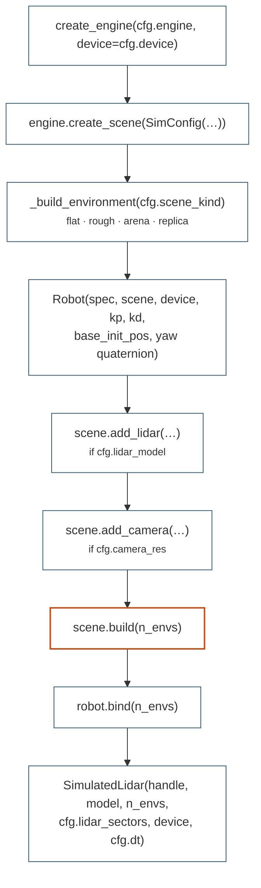

# domo.world & services

This page covers the packages that assemble the foundation into a running
twin and the small services around it. The one rule they enforce is that **a
scene is built the same way by every consumer**: the `World`, the vectorised
[training tasks](tasks.md) and any future LLM-generated layout call the same
builders through the [`domo.sim.Scene`](sim.md#scene) contract, so a skill
evaluated in the twin sees the world it was trained in (see
[architecture](../concepts/architecture.md)).

| Package | Owns | Sits |
|---------|------|------|
| `domo.utils` | pure-torch quaternion math (`wxyz`) | the bottom of the stack, below `domo.sim` |
| `domo.scenes` | engine-agnostic scene builders: obstacle arena, ReplicaCAD houses | between `domo.robot` and `domo.tasks` |
| `domo.world` | `World`: engine + scene + robot + sensors, goal-free | the top of the stack, the resident entry point |
| `domo.checkpoints` | checkpoint I/O and config reconstruction, both formats | beside `domo.rl`, engine-free |
| `domo.policies` | the stable-policy registry: blessed checkpoints by name | above `domo.checkpoints` |

`domo.dashboard` has its own page, [dashboard.md](dashboard.md).

## Module map

| Module | Contents |
|--------|----------|
| `domo/utils/rotations.py` | `identity_quat`, `normalize_quat`, `quat_conjugate`, `quat_inverse`, `quat_mul`, `quat_apply`, `quat_apply_inverse`, `quat_to_euler_xyz`, `quat_to_rpy` |
| `domo/scenes/arena.py` | `ObstacleArenaConfig`, `ObstacleArena` |
| `domo/scenes/replica.py` | `ReplicaSpawn`, `resolve_replica_assets`, `load_replica_scene` |
| `domo/world.py` | `WorldConfig`, `World`, `SCENE_KINDS` |
| `domo/checkpoints.py` | `pick_device`, `load_checkpoint`, `load_locomotion_policy`, `configs_from_checkpoint`, `cpg_walk_config_from_dict`, `avoid_config_from_dict`, `world_from_avoid_config` |
| `domo/policies.py` | `POLICY_DIR`, `STABLE`, `stable_policy`, `load_stable_locomotion`, `load_stable_avoid`, `stable_go2_library` |

## `domo.utils.rotations`

Pure-torch quaternion utilities, no physics-engine imports, so they run
identically in simulation, in training code and on the real robot.
Quaternions are **scalar-first `[w, x, y, z]`**, unit-norm, batched on the
leading dimensions; every function broadcasts on those dimensions. Genesis
uses the same convention, so the Genesis backend passes quaternions through
unconverted; a backend with `xyzw` must convert inside the backend.

| Function | Signature | Meaning |
|----------|-----------|---------|
| `identity_quat` | `(n: int, device=None, dtype=torch.float32) -> [n, 4]` | identity quaternions (`w = 1`) |
| `normalize_quat` | `(q, eps: float = 1e-12) -> Tensor` | unit-normalise along the last dim |
| `quat_conjugate` | `(q) -> Tensor` | `[w, -x, -y, -z]`; equals the inverse for unit quaternions |
| `quat_inverse` | `(q) -> Tensor` | inverse of a unit quaternion (== conjugate) |
| `quat_mul` | `(u, v) -> Tensor` | Hamilton product `u ⊗ v`; applying it rotates **first by `v`, then by `u`** (`R_u @ R_v`) |
| `quat_apply` | `(q [..., 4], v [..., 3]) -> [..., 3]` | rotate `v` by `q`: `v' = R(q) v` — **body → world** for a body-orientation `q` |
| `quat_apply_inverse` | `(q, v) -> [..., 3]` | rotate by the inverse — **world → body** |
| `quat_to_euler_xyz` | `(q) -> [..., 3]` | **intrinsic X-Y-Z** Euler angles `(roll, pitch, yaw)` (rad), `R = Rx · Ry · Rz`; matches Genesis `quat_to_xyz(rpy=False)` and fills [`RobotState.base_euler`](robot.md#robotstate) |
| `quat_to_rpy` | `(q) -> [..., 3]` | aerospace roll-pitch-yaw, intrinsic Z-Y-X, `R = Rz · Ry · Rx` |

The two Euler conventions agree for pure single-axis rotations and differ
in the cross terms. **Never mix them**: the locomotion tasks and
`base_euler` use `quat_to_euler_xyz`; use `quat_to_rpy` only where you need
physical roll/pitch/yaw and say so. `quat_to_euler_xyz` uses an `atan2`
form for pitch so it stays well-conditioned near ±90°. All of them are
verified against `genesis.utils.geom` in `tests/test_rotations.py`.

```python
from domo.utils.rotations import quat_apply, quat_apply_inverse, quat_mul

v_world = quat_apply(state.base_quat, v_body)
v_body = quat_apply_inverse(state.base_quat, v_world)
q_total = quat_mul(q_second, q_first)     # apply q_first, then q_second
```

## `domo.scenes`

Builders use only the `Scene` contract (`add_box`, `add_cylinder`,
`add_sphere`, `add_mesh`, `add_urdf_prop`) and follow the two-phase rule of
the sim layer: **construct before `scene.build()`, randomise or move things
after it.**

### `ObstacleArenaConfig`

Walled square arena with randomised household-like obstacles, metres. Size
ranges are **spread evenly over the `n` instances** (`_lerp`), not sampled:
one sofa takes the start of its range, three sofas take start / middle /
end.

| Field | Default | Meaning |
|-------|---------|---------|
| `half_size` | `4.0` | arena half-width; walls at `±half_size` |
| `wall_height` | `0.6` | |
| `wall_thickness` | `0.15` | |
| `ring_min` / `ring_max` | `2.0` / `3.5` | obstacle spawn ring around the robot spawn |
| `n_chairs` | `6` | each chair is 4 thin legs (sparse lidar returns, like real chairs) |
| `n_sofas` | `3` | boxes |
| `n_pillars` | `4` | cylinders |
| `n_steps` | `2` | low boxes |
| `n_balls` | `2` | spheres |
| `chair_leg_radius` / `chair_leg_height` / `chair_leg_spread` | `0.03` / `0.45` / `0.25` | leg cylinder and half-side of the leg square |
| `sofa_width_range` / `sofa_depth_range` / `sofa_height_range` | `(0.8, 1.6)` / `(0.3, 0.5)` / `(0.35, 0.50)` | |
| `pillar_radius_range` / `pillar_height_range` | `(0.04, 0.10)` / `(0.60, 1.20)` | |
| `step_size_range` / `step_height_range` | `(0.20, 0.50)` / `(0.04, 0.15)` | |
| `ball_radius_range` | `(0.06, 0.16)` | |

### `ObstacleArena`

```python
class ObstacleArena:
    def __init__(self, scene: Scene, cfg: ObstacleArenaConfig,
                 spawn_xy: tuple[float, float] = (0.0, 0.0))
    def randomise(self, envs_idx: torch.Tensor, device) -> None
```

The constructor adds four wall boxes and every obstacle body to the
un-built scene. All obstacles are **fixed** (the robot cannot push them)
and exist in every env.

!!! warning "A freshly built arena is empty until you randomise it"

    Entity counts are fixed at build time, so every obstacle is created
    **parked at `(99, 99)`**, far outside the arena, and per-env variety
    comes purely from teleporting them afterwards. Call
    `arena.randomise(...)` — or [`World.randomise_obstacles()`](#domoworld)
    — after `scene.build()`, or the robot walks through an empty room and
    the lidar sees nothing.

`randomise(envs_idx, device)` re-scatters every obstacle for the given envs:
an independent polar position per obstacle and env (uniform angle, uniform
radius in `[ring_min, ring_max]` around `spawn_xy`), and a random yaw for
chairs, whose four legs keep their rigid square. Uses torch's global RNG.
An empty `envs_idx` is a no-op.

Attributes: `cfg`, `spawn_xy`, and `termination_distance = half_size + 0.5`
— the distance from the origin beyond which a task should consider the
robot to have left the arena.

```python
arena = ObstacleArena(scene, ObstacleArenaConfig(n_chairs=2), spawn_xy=(0.0, 0.0))
scene.build(n_envs)
arena.randomise(torch.arange(n_envs, device=device), device)
```

### ReplicaCAD houses

Parses a Habitat `*.scene_instance.json`, resolves each template to an
asset on disk, converts Habitat's Y-up frame to Z-up and spawns everything
through `add_mesh` / `add_urdf_prop`. Split into a pure resolution step
(testable without an engine) and a spawn step.

```python
@dataclass
class ReplicaSpawn:
    template_name: str
    asset_path: str
    pos: tuple[float, float, float]                 # Z-up frame
    quat_wxyz: tuple[float, float, float, float]
    fixed: bool
    scale: float = 1.0

def resolve_replica_assets(scene_json: str, asset_root: str,
                           stage_z_nudge: float = -0.05) -> list[ReplicaSpawn]
def load_replica_scene(scene: Scene, scene_json: str, asset_root: str,
                       verbose: bool = True) -> int
```

`resolve_replica_assets` returns spawns in file order: the **stage** (room
shell) first if it resolved, lifted by `stage_z_nudge` (−5 cm by default to
prevent z-fighting with the ground plane); then **rigid objects**, `fixed`
iff `motion_type == "STATIC"`, with `uniform_scale`; then **articulated
objects**, spawned as fixed props for now (`fixed_base`, default `True`) —
their joints are not simulated.

Asset resolution: for a template `<dir>/<name>`, the matching Habitat
config is any `<name>*.json` under `<asset_root>/configs` (or `<asset_root>`
if there is no `configs/`); its `urdf_filepath` or `render_asset`, relative
to that JSON, is the spawnable file. **Unresolvable templates are skipped,
not fatal** — a partially furnished house is still a usable scene.
Malformed config JSON is skipped as well.

Frame conversion: Habitat is x right, y up, z towards the viewer; Z-up is
`(x, y, z) → (x, −z, y)`, and the same permutation applies to the
quaternion's vector part: `(w, x, y, z) → (w, x, −z, y)`.

`load_replica_scene` resolves and spawns before `build()`, returning the
number of entities added. `.urdf` goes through `add_urdf_prop`, `.glb` /
`.obj` through `add_mesh`; other extensions are skipped. Assets the engine
fails to import are reported (`[replica] FAIL <name>`) when `verbose` and
skipped rather than aborting the house.

## `domo.world`

A `World` is a robot spawned in an environment with its sensors — no goal,
no rewards, no episodes. The twin (and later the real robot) simply exists
here, running whatever `Controller` currently governs it. RL enters the
other way round: a training task is a temporary, reward-bearing lens over
the same scene builders, and control returns to the World afterwards.

### `WorldConfig`

Defaults are the twin/eval settings (viewer on, stiff 100/2 gains);
training tasks build their own `WorldConfig` from their task config.

| Field | Default | Meaning |
|-------|---------|---------|
| `engine` | `"genesis"` | backend name for `create_engine` |
| `device` | `"cuda"` | requested device (may fall back to CPU) |
| `dt` | `0.02` | control/physics step (s) |
| `substeps` | `2` | |
| `solver_iterations` | `100` | constraint-solver iterations |
| `headless` | `False` | viewer on by default |
| `viewer` | `ViewerConfig(camera_pos=(3, -3, 2.5), camera_lookat=(0, 0, 0.3), camera_fov=50)` | |
| `scene_kind` | `"flat"` | one of `SCENE_KINDS = ("flat", "rough", "arena", "replica")` |
| `ground_height` | `0.0` | ground plane height for flat / arena / replica |
| `arena` | `ObstacleArenaConfig()` | used when `scene_kind == "arena"` |
| `rough_terrain` | `TerrainConfig()` | used when `scene_kind == "rough"` |
| `replica_scene_json` / `replica_asset_root` | `""` | used when `scene_kind == "replica"` |
| `kp` / `kd` | `100.0` / `2.0` | joint PD gains passed to `Robot` |
| `base_init_pos` | `(0.0, 0.0, 0.35)` | spawn position (m); its xy is the arena ring centre |
| `base_init_yaw_deg` | `0.0` | spawn yaw, converted to a `wxyz` quaternion about z |
| `lidar_model` | `generic_sector_lidar()` | [`LidarModelConfig`](robot.md#lidarmodelconfig); **`None` → no lidar** |
| `lidar_sectors` | `36` | sectors exposed by `World.lidar.read()` |
| `camera_res` | `None` | `(w, h)` of an optional offscreen camera; `None` → none |
| `camera_pos` / `camera_lookat` | `(4, -4, 3)` / `(0, 0, 0.3)` | camera placement; FOV is `viewer.camera_fov` |

### `World`

```python
class World:
    def __init__(self, cfg: WorldConfig, n_envs: int = 1, spec: RobotSpec = GO2)
```

Construction order is fixed and mirrors engine build semantics — everything
before `build()` adds entities, everything after binds to them:



An unknown `scene_kind` raises `ValueError("unknown scene_kind ...")`.

| Attribute | Type | Meaning |
|-----------|------|---------|
| `cfg`, `n_envs`, `spec` | | as given |
| `engine` | `PhysicsEngine` | |
| `scene` | `Scene` | built |
| `device` | `torch.device` | **the engine's** device, after any fallback |
| `dt` | `float` | `cfg.dt` |
| `robot` | `Robot` | bound; `robot.state` is refreshed by the control loop |
| `arena` | `ObstacleArena \| None` | when `scene_kind == "arena"` |
| `lidar` | `SimulatedLidar \| None` | when a lidar model is configured |
| `camera` | `CameraHandle \| None` | when `camera_res` is set |
| `sensors` | `list[SimulatedLidar]` | property: exteroceptive sensors the control loop must tick (`[lidar]` or `[]`) |

!!! warning "Use `World.device`, not `cfg.device`"

    `cfg.device` is what you *asked* for; `World.device` is what the engine
    gave you, after Genesis' silent CPU fallback
    ([sim.md](sim.md#physicsengine)). Every tensor handed to the robot, a
    skill or a control loop must be built on `World.device`, or the first
    op that mixes them raises a device mismatch deep inside a skill.

Methods:

```python
def make_loop(self, controller, command_filter=None) -> SimControlLoop
def randomise_obstacles(self, envs_idx: torch.Tensor | None = None) -> None
def reset_robot(self) -> None
```

* `make_loop` wires a `Controller` to
  `SimControlLoop(scene, robot, controller, dt=self.dt, sensors=self.sensors,
  command_filter=command_filter)` — the standard twin loop
  ([control.md](control.md)). `command_filter` is the seat reserved for the
  M7 safety layer.
* `randomise_obstacles` re-scatters the arena obstacles for the given envs
  (`None` → all); a no-op for other scene kinds.
* `reset_robot` teleports every env's robot back to its spawn pose, resets
  the lidar caches and refreshes the state. A sim-only convenience for
  independent evaluation trials — a deployed robot recovers, it does not
  teleport.

```python
from domo.world import World, WorldConfig

world = World(WorldConfig(scene_kind="arena", headless=True), n_envs=1)
world.randomise_obstacles()
controller.setup(world.robot)
loop = world.make_loop(controller)
loop.reset()
loop.run(...)
```

## `domo.checkpoints`

Checkpoint I/O and config reconstruction, used by examples, evaluation and
the future orchestrator. Networks are always rebuilt from weight shapes
(`ActorCritic.from_state_dict`), so any locomotion checkpoint ever trained
with the 76-dim CPG observation loads regardless of provenance.

| Function | Signature | Meaning |
|----------|-----------|---------|
| `pick_device` | `(requested: str) -> str` | `"cpu"` when `"cuda"` is requested but unavailable |
| `load_checkpoint` | `(path: str, device: str) -> dict` | `torch.load(..., weights_only=False, map_location=device)` — checkpoints carry pickled dataclasses |
| `load_locomotion_policy` | `(path: str, device: str) -> (policy_fn, net)` | frozen CPG velocity-tracking policy from either format; `policy_fn(obs) -> action` is deterministic, `net` has `requires_grad=False` everywhere |
| `configs_from_checkpoint` | `(ckpt: dict, kind: str) -> (task_cfg, PPOConfig)` | `kind` is `"cpg_walk"` or `"avoid"`; see formats below, and [rl.md](rl.md#checkpoints) for what a checkpoint holds |
| `cpg_walk_config_from_dict` | `(d: dict) -> Go2CPGWalkConfig` | nested `cpg` dict → `CPGConfig`, lists → tuples |
| `avoid_config_from_dict` | `(d: dict) -> Go2AvoidConfig` | nested `arena` / `lidar_model` / `cpg` dicts rebuilt; legacy lidar keys migrated |
| `world_from_avoid_config` | `(task_cfg: Go2AvoidConfig, headless: bool = True) -> World` | the goal-free twin in the environment an avoidance checkpoint was trained in (arena or ReplicaCAD), `n_envs=1` |

Config dicts come from JSON-ish serialisation (`dataclasses.asdict` +
`json`), where tuples degrade to lists; the `*_from_dict` functions restore
them so the dataclasses compare equal to freshly constructed ones.

**Legacy lidar migration.** Pre-`lidar_model` avoid configs stored
`{"lidar": {...}, "lidar_interval": n}`. `avoid_config_from_dict` converts
them into a `LidarModelConfig` with `rate_hz = 1 / (interval · dt)`
(`interval` defaults to 5 control steps), unless the dict already carries a
`lidar_model`, which wins.

```python
from domo.checkpoints import load_checkpoint, configs_from_checkpoint, world_from_avoid_config

ckpt = load_checkpoint("runs/go2_cpg/checkpoint_final_avoid.pt", "cpu")
task_cfg, ppo_cfg = configs_from_checkpoint(ckpt, kind="avoid")
world = world_from_avoid_config(task_cfg, headless=True)
```

## `domo.policies`

The single place skills resolve their **blessed** checkpoints from.
Training scatters checkpoints across `runs/`; this module names the stable
ones and expects copies in `<repo>/policies/`, so skills and examples point
at a symbolic name instead of a brittle `runs/.../checkpoint_final_*.pt`
path. The heavy imports (torch, `domo.rl`, `domo.skills`) happen inside the
loaders, so `stable_policy` stays import-light.

| Member | Meaning |
|--------|---------|
| `POLICY_DIR` | `<repo>/policies`, derived from the module's own path |
| `STABLE` | `{"walk": "walk.pt", "avoid": "avoid.pt"}` — symbolic name → file under `POLICY_DIR` |
| `stable_policy(name: str) -> str` | absolute path; `KeyError` for an unknown name, `FileNotFoundError` when the file has not been copied in yet |
| `load_stable_locomotion(device: str = "cpu") -> (policy_fn, net)` | `load_locomotion_policy(stable_policy("walk"), device)` |
| `load_stable_avoid(device: str = "cpu") -> Callable` | `obs → Δv`, deterministic, from the avoidance net (`clean_state_dict` applied) |
| `stable_go2_library(lidar=None, device: str = "cpu", avoid_deltas=None) -> SkillLibrary` | [`make_go2_library`](skills.md#built-in-cards-and-make_go2_library)`(walk_fn, avoid_fn, lidar, ...)`: walk always, avoid (plus the blocked/clear conditions) when a `lidar` with `read() -> [N, n_sectors]` is given, e.g. `World.lidar` |

```python
from domo.policies import stable_go2_library

library = stable_go2_library(world.lidar, device=str(world.device))
```

The `*.pt` files are git-ignored (a curated local cache); the registry and
`policies/README.md` are versioned. Today both files are legacy script
checkpoints: `walk.pt` from `runs/go2_cpg/checkpoint_final_coupled.pt`, the
most stable gait; `avoid.pt` from `runs/go2_cpg/checkpoint_final_avoid.pt`.

## How to

### Add a scene kind

1. Write a builder in `domo/scenes/` that takes a `Scene` and a config
   dataclass, adds its entities with the `Scene` contract only, and does any
   per-env work in a method called **after** build (like
   `ObstacleArena.randomise`). Export it from `domo/scenes/__init__.py`.
2. Add the config as a field of `WorldConfig` and a branch in
   `World._build_environment` that calls the builder and returns whatever
   handle the World should keep (the arena branch returns the
   `ObstacleArena`; the others return `None`).
3. Add the name to `SCENE_KINDS` so the error message lists it.
4. If training tasks should use it too, add the same branch to the task's
   scene construction so both runtimes build the identical world.
5. Cover it with an engine-free test using a recording `Scene`
   (`tests/test_foundation_scenes.py::RecordingScene`).

### Promote a policy

Copy the checkpoint over the corresponding file in `policies/`:

```
cp runs/go2_cpg/checkpoint_final_newbest.pt policies/walk.pt
```

For a new skill, add an entry to `STABLE` in `domo/policies.py` and, if the
skill needs one, a loader next to `load_stable_avoid`. Never commit the
`.pt` file; the registry is versioned, the cache is not.

### Add a backend, add a sensor

See [sim.md — Adding a backend](sim.md#adding-a-backend) and
[robot.md — How to add a sensor](robot.md#how-to-add-a-sensor).

## Gotchas

### Checkpoint formats

Two formats coexist and `configs_from_checkpoint` detects them by key:

| Format | Layout | Detected by |
|--------|--------|-------------|
| library | `{"ppo_config": {...}, "extra": {"task_config": {...}}, "model_state": ...}` | `"ppo_config" in ckpt` |
| legacy script (`scripts/house_scene/*`, both current stable policies) | `{"config": <flat dict>, "model_state": ...}` | otherwise |

For the legacy format the flat dict is split in two: the task config keeps
only the shared fields (`n_envs`, `dt`, `max_episode_steps`, `headless`)
with `Go2CPGWalkConfig` / `Go2AvoidConfig` defaults for the rest, and the
`PPOConfig` is rebuilt with the original scripts' defaults
(`total_steps=80_000_000`, `rollout_steps=24`, `minibatch_size=8192`,
`hidden_size=512`, ...). `lr_schedule` is `"linear"` only when the flat dict
contains `lr_floor_frac`, `"constant"` otherwise; `run_dir` defaults to
`runs/legacy`.

!!! danger "`load_checkpoint` unpickles arbitrary objects"

    It calls `torch.load(..., weights_only=False)` because DOMO checkpoints
    store pickled dataclasses (`Go2AvoidConfig`, `CPGConfig`,
    `LidarModelConfig`) in `extra` and `config`. Loading a checkpoint is
    therefore equivalent to running its author's code. Load only files you
    produced or trust.

### World

* `World.device` is the engine's device, which may be CPU although
  `cfg.device == "cuda"` ([above](#world)).
* The default `WorldConfig` opens a viewer (`headless=False`) and adds a
  generic lidar; pass `headless=True` / `lidar_model=None` explicitly for
  headless or lidar-free runs.
* `base_init_pos` defaults to `z = 0.35` in `WorldConfig` but `0.42` in the
  `GO2` spec; `World` always passes its own.
* `scene_kind="replica"` also adds a ground plane at `ground_height` after
  the house; the stage mesh is nudged −5 cm to avoid z-fighting with it.
* `randomise_obstacles` must be called after construction to populate an
  arena ([above](#obstaclearena)).

### Scenes

* Obstacle counts are fixed at build time; only positions change per env.
* Both `ObstacleArena.randomise` and the lidar device model draw from
  torch's global RNG: `torch.manual_seed` before building for reproducible
  layouts and scans.
* `resolve_replica_assets` silently drops templates it cannot resolve and
  prints (not logs) the unresolved stage; check the returned count from
  `load_replica_scene` when a house looks empty.

### Rotations

* `quat_mul(u, v)` applies `v` first. Genesis' `transform_quat_by_quat(q, u)`
  equals `quat_mul(u, q)` (`tests/test_rotations.py`).
* `quat_to_euler_xyz` and `quat_to_rpy` are different conventions with the
  same output layout; the type system will not stop you from mixing them.
