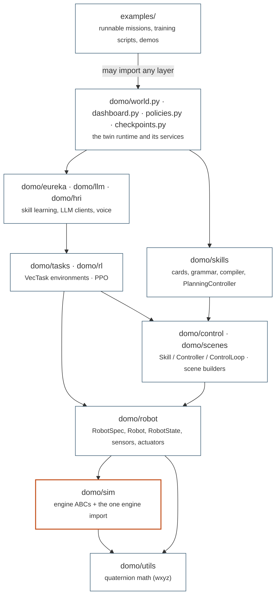
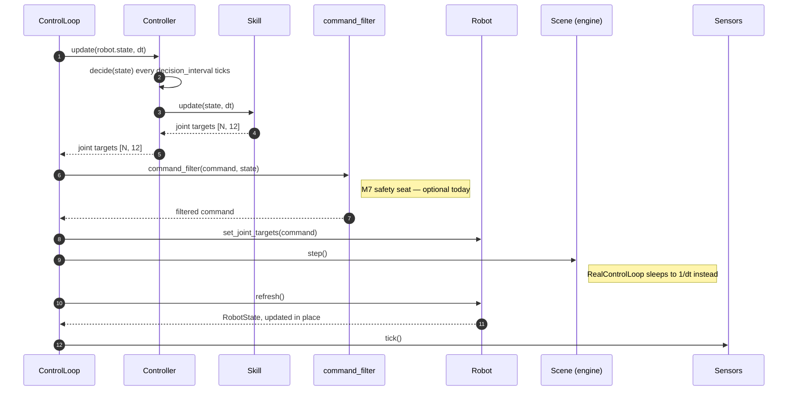

# Architecture

DOMO is a layered library. Each layer has one job, imports only from the
layers below it, and exposes an interface the layers above code against.
The discipline buys two things: the physics engine can be swapped (or
replaced by the real robot) without touching behaviour code, and the
supervisor can reason about skills without knowing how they are executed.

## The layer stack

Eight library layers, plus `examples/` on top as the only consumer that is
allowed to know about all of them. Arrows point the way imports are
allowed to go — downward, never up, never sideways across a boundary.

| Layer | What it owns | What it may import |
|-------|--------------|--------------------|
| `domo/utils` | quaternion and rotation math, `wxyz` throughout | nothing from `domo` |
| `domo/sim` | the abstract engine interfaces and the Genesis backend | `domo/utils` |
| `domo/robot` | `RobotSpec`, the `Robot` facade, `RobotState`, sensors, actuators, lidar device models, domain randomisation | `domo/sim`, `domo/utils` |
| `domo/control`, `domo/scenes` | `Skill`, `Controller`, `ControlLoop`, CPG, leg IK, SLAM, legacy waypoint driver; arena and ReplicaCAD builders | `domo/robot` (control), `domo/sim` (scenes) |
| `domo/tasks`, `domo/rl` | `VecTask` environments with rewards, resets and a fixed success metric; PPO, actor-critic, rollout buffer | tasks: `sim`, `robot`, `scenes`, `control`. rl: nothing from `domo` |
| `domo/skills` | cards, grammar, compiler, `CompositeSkill`, `PlanningController` (M5) | `domo/control` |
| `domo/eureka`, `domo/llm`, `domo/hri` | the Eureka + DrEureka skill-learning routine, provider-agnostic LLM clients, voice → commands | `domo/llm`, `domo/robot`, and `domo/rl` + `domo/tasks` inside worker subprocesses |
| `domo/world.py` and services | `World` (engine + scene + robot + sensors, goal-free), live dashboard, named policies, checkpoint I/O | everything below |

### Dependency rules

Each rule is one line because each one has a single reason behind it.

* **`domo/sim/genesis_backend.py` is the only module that imports `genesis`** — so a new engine is a new file, not a refactor. New engines implement the ABCs in `domo/sim/base.py` and register with `domo.sim.register_backend(name, factory)`.
* **Physics handles (`Articulation`, `LidarSensorHandle`, `CameraHandle`) are touched only by `domo/robot/`** — because on hardware those classes are the ones that get reimplemented, and nothing above them should notice.
* **`domo/control/` and `domo/skills/` never import an engine** — so they run unchanged on a laptop without Genesis, which is why the test suite is engine-free and runs in seconds.
* **`domo/rl/` knows only the `VecTask` API** (`step`, `reset`, buffers) — so the trainer can be replaced by an external one without touching the environments.
* **`domo/eureka/` drives tasks through that same API plus two hooks** — `set_reward_override` injects a generated reward, `compute_success` is the fixed metric a generated reward cannot game. Separating the two is what makes candidates rankable.
* **`examples/` imports the library; the library never imports `examples/`** — an example is a consumer, and anything two examples share belongs in `domo/`.

## Two runtimes on one robot

The same `Robot`, the same sensors and the same skills serve two loops that
look nothing alike. Keeping them apart is the central design decision of the
project.

### The digital twin: World + ControlLoop

`World(cfg)` builds the engine, the scene, the robot with its sensors and an
optional camera, in that fixed order, then `world.make_loop(controller)`
returns a `SimControlLoop`. One tick of that loop:

!!! note "The controller reads last cycle's state"

    Perception closes the cycle rather than opening it: `robot.refresh()`
    and `sensor.tick()` run *after* time advances, so the `RobotState` a
    controller sees at the top of a tick is the one measured at the end of
    the previous tick. `loop.reset()` primes it before the first step. The
    state object is updated in place, so holding a reference across ticks is
    safe and intended.

There is no reward and no episode here. A `Controller` decides what the
robot does; a `PlanningController` does so by writing a program in the
[skill grammar](grammar.md) and letting the library compile and run it.
Missions end because the controller says so, not because an environment
terminates.

### Skill learning: VecTask + PPO

A task is a temporary lens. It owns a scene built with the same builders the
World uses, adds rewards, resets and a success metric, and steps thousands
of environments in parallel. What comes out the far end is a `Skill` — and
from then on, only the twin runtime ever sees it.

```mermaid
flowchart LR
    CFG["Go2*Config<br/><small>scene, rewards, episode length</small>"] --> TASK["VecTask<br/><small>step / reset / compute_success</small>"]
    TASK --> PPO["PPOTrainer(env, cfg).train()<br/><small>thousands of envs in lockstep</small>"]
    PPO --> CKPT["runs/&lt;task&gt;/checkpoint_final.pt"]
    CKPT --> NET["ActorCritic.from_state_dict<br/><small>rebuilt from weight shapes</small>"]
    NET --> SK["Skill<br/><small>CPGLocomotionSkill · LearnedJointSkill</small>"]
    SK --> CARD["SkillCard<br/><small>what the planner reads</small>"]
    CARD --> LIB["SkillLibrary.register(card, factory)"]

    classDef box fill:none,stroke:#33566f,stroke-width:1px;
    classDef accent fill:none,stroke:#c4511d,stroke-width:2px;
    class CFG,TASK,PPO,CKPT,NET,SK,CARD box;
    class LIB accent;
```

The reference for the environment contract is [api/tasks.md](../api/tasks.md);
for the trainer, [api/rl.md](../api/rl.md).

## The learning loop (M2 + M3)

`domo.eureka.learn_skill(SkillLearningRequest)` runs Eureka: the LLM writes
candidate reward functions, each candidate trains in its own subprocess (one
Genesis per process), candidates are ranked on the task's fixed success
metric and a dense fitness, and a reflection prompt feeds the next
iteration. DrEureka follows: single-parameter sweeps find the feasible
domain-randomisation bounds, the LLM proposes several DR configurations
inside them, all are trained and the best is kept. The result is a
`LearnedSkill` ready to wrap as a joint skill. Details in
[api/eureka.md](../api/eureka.md).

## Sim ↔ real equivalence

The table below is the contract M4 has to honour. Every row is a
substitution that happens *below* `RobotState`, which is why nothing above
it has to change.

| Concern | Simulation | Real robot (planned) |
|---------|------------|----------------------|
| Engine | `GenesisEngine`, `GenesisScene` | none; the room is the scene |
| Joints | `Articulation` handle | DDS/ROS joint state and command topics |
| Lidar | `SimulatedLidar` over `LidarSensorHandle` | Hesai XT16 driver producing the same `[N, n_sectors]` ranges and point tensors |
| Actuation | `PDActuator.apply(targets)` | low-level joint command with the same gains |
| Time | `SimControlLoop`, `scene.step()` | `RealControlLoop`, `time.monotonic()` paced to 1/dt |
| State | `RobotState` filled from privileged sim queries | the identical dataclass filled from IMU, encoders and the estimator |
| Safety | `command_filter=None` | the M7 filter, mandatory |

Because tasks, skills and controllers only ever see `RobotState` and `Robot`
methods, they cannot tell which side of the table they are on.

!!! warning "`RealControlLoop` is a skeleton"

    It is the structural half of the deployment path and has never run on
    hardware. Overruns are printed, not raised — on a robot a late cycle
    beats a dead loop — and deciding what to do about them is M7's job.

## Where the LLM touches the system

Three seats, deliberately narrow. Everywhere else the system is ordinary
torch code.

| Seat | Where | What the model produces | Checked by |
|------|-------|-------------------------|------------|
| Composition | `PlanningController.plan(state, last)` | a program in the skill grammar | the compiler: a bad program is recorded as a `PlanOutcome` with `compile_error` and the loop keeps running |
| Reward generation | `domo/eureka/` (`reward_prompt`, `extract_reward_code`, `validate_reward_code`) | Python reward functions and DR configurations | the task's fixed `compute_success`, which the generated code cannot touch |
| Human interaction | `domo/hri/voice.py` | a parse of speech into `(vx, vy, vyaw)` | range clamps in the command state; it drives a running controller, not the library |

The first seat is described in [the skill grammar](grammar.md) and
[api/skills.md](../api/skills.md#planning); the second in
[api/eureka.md](../api/eureka.md); the third in
[api/llm-hri.md](../api/llm-hri.md). The clients themselves are
provider-agnostic — `GeminiClient`, `LangChainClient` and a `ScriptedClient`
for tests all satisfy one `generate(prompt, temperature)` interface.

## Where to go next

The vocabulary of the control layer, and why skills sit under controllers,
is in [control hierarchy](control-hierarchy.md). The language the planner
writes is in [skill grammar](grammar.md). The rules every module obeys are
in [conventions](conventions.md). The engine boundary this whole page rests
on is documented in [api/sim.md](../api/sim.md).
