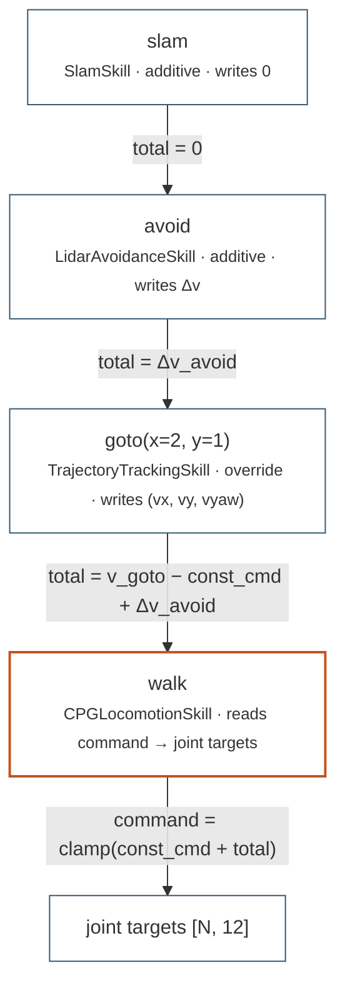

# Control hierarchy

In DOMO a **skill is lower level than a controller**. That is the opposite
of most robotics stacks, where "skill" names a whole behaviour and
"controller" names a PD loop. This page fixes the vocabulary, explains why
it runs this way round, and shows exactly how a layered composition turns
into one velocity command.

## Three levels

| Level | Class | Rate | Responsibility | Who writes it |
|-------|-------|------|----------------|---------------|
| primitive | `Skill` | 50 Hz | `RobotState` → joint targets `[N, 12]` | reinforcement learning (M3), or a researcher for the trivial ones |
| orchestration | `Controller` | 1–10 Hz | activate a skill, set its parameters, decide when a leg of a mission is done | a researcher today; the LLM through `PlanningController.plan()` |
| metronome | `ControlLoop` | every control step | tick the controller, the safety filter, the actuators and time, in that fixed order | nobody — it is the same code in sim and on hardware |

The rates are not decoration. A `Skill` runs on every tick of a 0.02 s loop
because that is the rate its policy was trained at. A `Controller` runs
`decide()` once every `decision_interval` ticks — five by default, ten for
`PlanningController` — because deciding is expensive and stability is not
improved by deciding faster. Nothing above the controller runs at a fixed
rate at all; the planner is consulted when there is something to decide.

### Why skills are the bottom

The unit the library stores has to be the unit training produces and the
unit the supervisor composes. Training produces a policy that maps a state
to joint targets. So that is what a `Skill` is, and everything else follows:

* a skill is **closed under composition** — `SkillLibrary.compile()` returns
  a `CompositeSkill`, which satisfies the same `setup` / `reset_idx` /
  `update` interface, so a program can be hosted by a controller or nested
  inside a larger program;
* a skill is **describable** — one `SkillCard` per skill is what the planner
  reads, and a card only makes sense for something with a fixed interface;
* a skill is **portable** — `domo/control/` imports no engine, so the same
  object runs in the simulator, in a test on a laptop, and on the robot.

A controller, by contrast, is code. It is the programmable seat. Calling it
a skill would be claiming it can be learned, stored and composed, and it
cannot.

!!! note "Words that are reserved"

    A `Skill` is never "a controller". A `Controller` is never "a skill" or
    "a policy" — a policy is the neural network *inside* a skill. A
    `ControlLoop` is never "an environment": environments have rewards and
    episodes, and live in `domo/tasks/`. See
    [conventions](conventions.md#naming).

## Motor skills and command skills

Two kinds of skill live at the primitive level, and they differ in what
they emit.

| | Motor skill | Command skill |
|---|---|---|
| Base class | `Skill` | `CommandSkill` |
| Emits | joint targets `[N, 12]` from `update()` | a channel value, `[N, 3]` body-frame `(vx, vy, vyaw)`, from `update_command()` |
| Card interface | `MOTOR`, optionally `accepts="velocity"` | `CMD_VELOCITY` |
| Can run alone | yes | no — `update()` raises `TypeError` |
| Examples | `StandSkill`, `CPGLocomotionSkill`, `LearnedJointSkill` | `LidarAvoidanceSkill`, `TrajectoryTrackingSkill`, `SlamSkill` |

A command skill is the upper half of a layered composition. It has no
opinion about legs; it has an opinion about where the body should go, and it
says so by writing into the command channel of the motor skill beneath it.
`avoid` nudges, `goto` steers, `slam` contributes nothing at all and just
watches. Every one of them needs a motor skill under it to mean anything,
which is why `avoid.for(3)` is a compile error.

Each command skill declares two things about itself:

`channel`
:   which command channel it drives. It must match the `accepts` of the
    motor skill at the bottom of the stack, or the program does not compile.
    Today the only channel is `"velocity"`.

`additive`
:   `True` for a correction added on top of whatever is already commanded,
    `False` for an override that authors the whole command.

## How layering composes

Layering is right-associative: `a @ b @ walk` parses as
`Layer(a, Layer(b, walk))`, so the rightmost element is always the motor
skill. Each layer computes its contribution, adds whatever the layer above
handed it, and passes the sum down. The motor leaf adds its own constant
command — the parameters written in the program text, such as `walk(vx=0.6)`
— and clamps the total to the card's constraints:

```text
leaf:   skill.command = clamp(const_cmd + extra_cmd, card.lo, card.hi)
layer:  delta = top.update_command(state, dt)
        if not top.additive: delta -= motor_leaf.const_cmd     # (1)!
        total = delta + extra_cmd
        base.update(state, dt, extra_cmd=total)
```

1.  The override subtracts the leaf's constant command *before* handing the
    sum down, so that when the leaf adds `const_cmd` back the two cancel and
    the effective command is exactly the override skill's output — plus any
    additive layer stacked above it. This is why `goto(x=1, y=0) @ walk(vx=0.9)`
    compiles but silently ignores `vx=0.9`.

The clamp is what bounds authority. No layer, however many are stacked, can
push the motor skill past the limits its own card declares — that is the
architectural reason constraints live on the motor card and not on the
command skills.

### A worked stack

`slam @ avoid @ goto(x=2, y=1) @ walk` — map the room while avoiding
obstacles on the way to a point:



`walk` is the only component that produces joint targets. `goto` decides
where the body goes, `avoid` bends that decision around obstacles, `slam`
only reads the lidar and the base pose and folds them into its occupancy
grid. The effective command reaching the legs is
`clamp(v_goto + Δv_avoid)` against `walk`'s constraints —
`vx ∈ [-1, 2]`, `vy ∈ [-0.5, 0.5]`, `vyaw ∈ [-1.5, 1.5]` m/s and rad/s.

The layer also decides when the leg is over: `LayerNode` reports `SUCCESS`
once `goto`'s `success_flags(state)` are true in every env, which is how a
goal-directed program advances without a timer. `avoid` and `slam` return
`None` from `success_flags` — they never finish on their own, so a program
built only from them must be bounded by a modifier.

## The metronome

`SimControlLoop` and `RealControlLoop` differ in exactly one line: how time
advances. Everything else — asking the controller for a command, passing it
through the filter, writing the actuators, refreshing the state, ticking the
sensors — is shared. That is deliberate: it means the M4 deployment path is
not a rewrite, and that a controller which works in the twin has no way of
behaving differently on hardware. The tick order is drawn in
[architecture](architecture.md#the-digital-twin-world-controlloop) and
specified in [api/control.md](../api/control.md#control-loops).

## The reserved safety seat

`ControlLoop` takes an optional `command_filter(command, state) -> command`
and applies it to every command from every layer before it reaches the
actuators:

```python
loop = world.make_loop(controller,
                       command_filter=lambda cmd, state: cmd.clamp(-2.0, 2.0))
```

!!! warning "M7 is a seat, not an implementation"

    Today the filter is `None` by default and nothing in the library fills
    it. The seat exists so that the safety layer, when it is written, is
    **unbypassable**: it sits below every controller, every program and
    every layer, on the one code path that reaches the actuators. It is
    intended to hold the non-learned guarantees — joint and torque limits,
    self-collision, a tip-over reflex, an overrun policy for
    `RealControlLoop` — and it is deliberately not learned, so no generated
    reward and no generated program can weaken it.

## Writing your own

Add a primitive by subclassing `Skill` (or `CommandSkill`) and giving it a
card; add behaviour by subclassing `Controller` and implementing `decide()`;
add *authored* behaviour by subclassing `PlanningController` and
implementing `plan()`. Worked examples of all three are in
[extending DOMO](../guides/extending.md), and the exact signatures,
lifecycle and gotchas are in [api/control.md](../api/control.md) and
[api/skills.md](../api/skills.md).

One trap worth naming here: `activate()` resets the incoming skill, and
`CPGLocomotionSkill.reset_idx` zeroes `command`. Set the command *after*
activating, never before.
