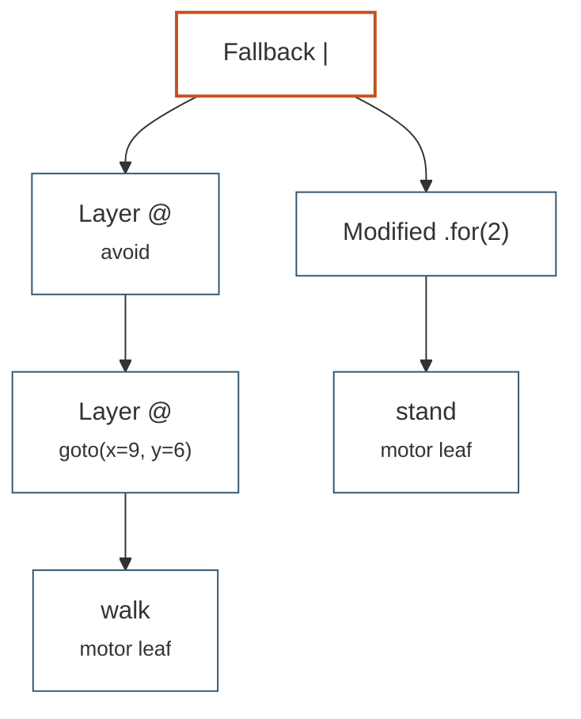

# The skill grammar

A small typed language for combining the skills a robot already has into a
behaviour it has never performed. This page explains what the operators
mean and why the language exists at all; the exhaustive reference — the full
EBNF, every compile error, the node-by-node execution semantics — is
[api/skills.md](../api/skills.md).

## Why a grammar

The supervisor has to choose what the robot does next, and whatever it
chooses has to be executable, safe and reviewable. Free-form Python fails
all three: it cannot be type-checked against the robot's current repertoire,
it can do anything, and when it goes wrong there is nothing to read back.

A grammar gives the planner a **typed, checkable action space with a legible
trace**:

* the action space is exactly `library.names()` — whatever the robot knows
  at this moment in its development, no more;
* every program is checked before a joint moves, and a rejected program
  comes back with a message specific enough to repair
  (`walk.vx=5.0 outside allowed range [-1.0, 2.0]`);
* every run leaves a timestamped trace of transitions, which is the evidence
  the supervisor uses to decide whether the mission failed because the plan
  was wrong or because a skill is missing.

That last point is the whole architecture in miniature. Gap detection (M1)
needs to distinguish "I composed badly" from "I cannot do this with what I
have", and only a structured execution log supports that judgement.

## Combining skills

Four ways to put skills together. All of them produce something that is
itself a program, so they nest freely.

**Parameterise** — a skill reference with named float arguments, validated
against the card at compile time:

```text
walk(vx=0.5, vyaw=0.3)
```

**Layer with `@`** — the command skill on the left drives the motor skill on
the right. Right-associative, so the rightmost element is always the motor
skill, and the channels must match all the way down:

```text
avoid @ walk(vx=0.6)
```

**Sequence with `>>`** — the next leg starts when the current one succeeds.
A failure anywhere fails the whole sequence:

```text
goto(x=2, y=0) @ walk >> goto(x=2, y=2) @ walk >> stand.for(2)
```

**Fall back with `|`** — the alternative runs only if the one before it
fails. This is how a program stays safe without the planner enumerating
every way a leg can go wrong:

```text
(avoid @ walk(vx=0.6)).for(8) | stand.for(2)
```

`>>` binds loosest, then `|`, then `@`, then modifiers. So
`avoid @ walk(vx=0.6) | stand >> walk.for(3)` means
`((avoid @ walk(vx=0.6)) | stand) >> (walk.for(3))`.

## Modifiers

Modifiers bound a node in time or repeat it. They are postfix, they bind
tighter than every operator, and they chain outward-in
(`x.for(2).repeat(3)` repeats the timed node three times).

| Modifier | Succeeds when |
|----------|---------------|
| `.for(T)` | `T` seconds have passed on the node's own clock |
| `.until(cond)` | `cond` is true in every env |
| `.repeat(n)` | the child has completed `int(n)` times |

Most skills never finish by themselves — `walk` tracks a velocity forever,
`avoid` corrects forever — so a program built from them without a modifier
never terminates. The card says so explicitly: `walk`'s `succeeds when`
line reads *"never by itself — bound its duration with .for(seconds) or
.until(condition)"*.

!!! warning "`.for` binds tighter than `@`"

    `avoid @ walk.for(4)` attaches the modifier to `walk`, not to the layer,
    and is then rejected at compile time. Write `(avoid @ walk).for(4)`.

## Conditions

A condition is a named predicate `cond(state, t_s) -> bool [N]`, where `t_s`
is seconds since the enclosing node was entered — node-local time, not
program time. Conditions appear in `.until(...)` and in a card's
`fail_when`.

The state-only ones are always available: `timeout(T)`, `tipped(rad)`,
`fallen(h)`, `still(v)`, `moved(d)`. Sensor-bound ones are closures the
library registers when it has the sensor: `make_go2_library` adds
`blocked(d)` and `clear(d)` when a lidar is present. `library.describe()`
lists whatever is registered, which is what the planner is allowed to use.

```text
(avoid @ walk(vx=0.5)).until(moved(3)) >> stand.for(2)
```

!!! danger "An unknown condition crashes the loop"

    `walk.until(flying)` raises the registry's `KeyError`, not a
    `CompileError`, and `PlanningController` only catches `CompileError` and
    `GrammarError`. Validate condition names against
    `library.conditions.names()` before returning a program from `plan()`.

## Cards, and the prompt they become

A `SkillCard` is the typed, natural-language description of one skill: what
it does, its parameters with units and ranges, its preconditions and
effects, when it fails, and the hard constraints on the command channel it
consumes. Cards are what makes the repertoire self-describing —
`library.describe()` concatenates every card's block and appends a grammar
cheat-sheet, and *that string is the planning prompt*. Nothing else is
maintained separately for the LLM.

```
SKILL walk  [motor, accepts 'velocity']
  Omnidirectional velocity-tracking locomotion (learned CPG policy). ...
  parameters:
    - vx=0.0 [m/s] range=[-1.0, 2.0]: forward velocity
    ...
  fails when: tipped(0.9); fallen(0.18)
  command constraints: vx∈[-1.0,2.0], vy∈[-0.5,0.5], vyaw∈[-1.5,1.5]
  safety: blind to obstacles; commands clamped to constraints
```

Registering a newly trained skill therefore does two jobs at once: it makes
the skill runnable and it makes the planner aware of it. That is the "grows
a compounding library" claim in concrete terms — one `library.register(card,
factory)` call and the action space is larger.

## The type system, in plain words

There are two types. A skill is either a **motor** skill, which produces
joint targets, or a **command** skill, which produces a value for one named
*channel*. A motor skill may declare that it `accepts` a channel.

Three rules follow, and they are the whole type check:

1. a program must end, on every branch, in a motor skill — something has to
   drive the legs;
2. the left of `@` must be a single command skill reference, the right must
   be a motor skill or another layer;
3. the command skill's `channel` must equal the `accepts` of the motor skill
   at the bottom of the stack.

Parameters are checked too: the name must exist on the card and the value
must lie in the card's range.

The errors say what is wrong and usually what to write instead:

```pycon
>>> library.compile("avoid.for(3)")
CompileError: 'avoid' is a command:velocity skill — it cannot run alone;
layer it: 'avoid @ <motor skill>'

>>> library.compile("avoid @ stand")
CompileError: cannot layer 'avoid' (drives 'velocity') on 'stand'
(accepts 'nothing')

>>> library.compile("walk(vx=5).for(1)")
CompileError: walk.vx=5.0 outside allowed range [-1.0, 2.0]
```

A `GrammarError` comes earlier, from the tokenizer or parser, and is about
shape rather than meaning: `walk(vx=.5)` fails because `NUM` is
`-?\d+\.?\d*` and does not admit a leading dot.

## A program is a skill

`library.compile(text, device=robot.device)` returns a `CompositeSkill`: a
tree of execution nodes that satisfies the ordinary `setup` / `reset_idx` /
`update` interface. Any `Controller` can host it, and it can be nested in a
larger composition later. This closure is what makes the library compound
rather than merely accumulate.



That is `(avoid @ goto(x=9, y=6) @ walk) | stand.for(2)`: drive to a point
while avoiding obstacles, and if the walk layer fails — tipped, fallen, or
blocked closer than 0.22 m — stand still for two seconds instead. Its
canonical text drops the parentheses, because `@` already binds tighter than
`|`: `avoid @ goto(x=9, y=6) @ walk | stand.for(2)`.

### The trace

Every transition is logged with the program clock. This is the object the
supervisor reads back:

```
[t=   0.00s] start: walk(vx=0.5).for(0.04) >> stand.for(0.04)
[t=   0.00s] enter walk
[t=   0.04s] walk → SUCCESS (.for 0.04s)
[t=   0.06s] sequence → step 2/2 (stand.for(0.04))
[t=   0.06s] enter stand
[t=   0.10s] stand → SUCCESS (.for 0.04s)
[t=   0.14s] program → SUCCESS
```

Trace lines are part of the contract — tests and planners match on them.
The full table of messages is in
[api/skills.md](../api/skills.md#trace-format).

### The semantic that surprises people

Look at the two timestamps above: `walk` succeeds at `t=0.04`, and the
sequence advances at `t=0.06`. A container acts on its child's status at the
**start of its next tick**, so a child's `SUCCESS` costs one control tick.
The tick on which the child succeeds still returns that child's output; the
following tick enters and runs the successor.

`FAILURE` is different: it propagates the same tick through sequences and
modifiers, so a fall is reacted to immediately, while a `FallbackNode`
ancestor still intercepts it on its next tick. The asymmetry is deliberate —
success can afford 20 ms, failure cannot. Tests that count ticks need one
extra `update` per success transition.

## Where programs come from

!!! danger "Programs are authored inside `plan()`"

    A program is never a command-line flag, a config field or a constant
    handed in from outside. `PlanningController.plan(state, last)` returns
    the next program text, from the robot's state and the previous
    `PlanOutcome` — program text, success flag, trace, and the compile error
    if it never ran. That is the seat the LLM occupies, and the repair loop
    it needs: a bad program is recorded, printed and retried at the next
    decision tick instead of crashing the robot.

Two things follow from this. First, the planner cannot be evaluated by
feeding it programs, only by putting it in the seat. Second, anything you
would be tempted to pass on the command line — a route, a target, a mission
— belongs in a `PlanningController` subclass; see the worked missions in
`examples/twin/twin_demo.py` and
[api/skills.md](../api/skills.md#write-a-planningcontroller).
