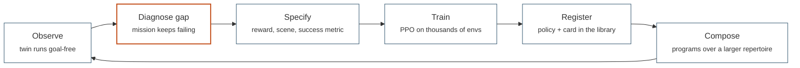

# The project

**DOMO** stands for *Developmental Orchestration of Motor-skill Onset*. A
large language model acts as a lifelong developmental supervisor for a
physical legged robot (a Unitree Go2): it watches the robot act, detects the
skills it lacks, specifies them, trains them by reinforcement learning in a
digital twin, transfers them to hardware and grows a compounding library of
skills. This page is the research frame; the code that realises it is
described in [architecture](architecture.md).

## The developmental loop

Nothing in DOMO is a one-shot pipeline. The system is a loop that closes on
itself: every skill the robot acquires enlarges the action space of the
supervisor that diagnoses the next gap.



The hard step is the orange one. Diagnosing a gap means conceding that no
composition of known skills can do the job — the opposite of retrying
forever. `examples/twin/twin_demo.py` shows the concession pattern in its
crudest form: after three consecutive failures with no recovery skill in the
library, the mission stops and names the skill it is missing.

## The research roadmap

The system is organised in eight modules. The first paper covers M1, a light
version of M2, and M3; the later modules build on the same code base.

| Module | Name | Status | What it does | Where it lives today |
|--------|------|--------|--------------|----------------------|
| **M1** | Gap detection | implemented | the supervisor observes the robot and diagnoses a missing skill | `PlanningController.plan()`; the concession pattern in `examples/twin/twin_demo.py` |
| **M2** | Specification | implemented | rewards, scenes and success criteria for the missing skill are generated | `domo/eureka/` reward generation |
| **M3** | Training | implemented | the skill is trained by PPO in the simulator | `domo/tasks/`, `domo/rl/`, `domo/eureka/` worker subprocesses |
| **M4** | Sim-to-real | partial | the policy is transferred to the robot | `domo/robot/randomization.py`, DrEureka in `domo/eureka/dr.py`, `RealControlLoop`; no hardware drivers, untested on a robot |
| **M5** | Skill library | implemented | skills are stored, described and composed | `domo/skills/`: cards, grammar, compiler, planner |
| **M6** | Human interaction | partial | people direct the robot in natural language | `domo/hri/voice.py`, a precursor that writes velocity commands, not programs |
| **M7** | Safety | partial | a filter between controllers and actuators | the seat exists — `ControlLoop.command_filter` — and nothing occupies it |
| **M8** | Lifelong loop | future | everything runs continuously on the real robot | — |

## The twin-first principle

The entry point of the system is the **World** (`domo/world.py`): a robot
spawned in a scene with its sensors and nothing else. No goal, no reward, no
episode. The robot simply exists there under whatever `Controller` governs
it, exactly as the physical robot will exist in a room.

Reinforcement learning enters the other way around. When the supervisor
decides that a skill must be *learned*, it instantiates a training task
(`domo/tasks/`), a temporary reward-bearing lens over the same scene
builders, trains it, registers the result in the skill library, and control
returns to the World. Tasks are subordinate procedures, never the entry
point.

!!! danger "Skill programs are never input parameters"

    There is no `--program` flag anywhere, and there never will be. Programs
    are authored at runtime inside
    `PlanningController.plan(state, last_outcome)`, which is the seat
    reserved for the LLM — or a hierarchical RL policy, or a researcher's
    hand-written mission. A flag that accepts a program moves the
    intelligence outside the system and makes the experiment meaningless.

## Repository layout

```
domo/          the library (see architecture.md for the layer stack)
examples/      runnable demos grouped by theme, one folder per theme
tests/         engine-free unit tests (pytest), run in seconds
docs/          this documentation
scripts/       FROZEN standalone experiments the library was distilled from
policies/      blessed checkpoints resolved by name (walk.pt, avoid.pt), git-ignored
runs/          training outputs and Eureka runs, git-ignored
main.py        CLI for the joint-space locomotion task (train / eval / resume)
```

Two rules about this layout are non-negotiable.

!!! warning "`scripts/` is frozen, and only `domo/sim/` may import an engine"

    **Nothing imports from `scripts/` and nothing in it is edited.** Each
    script has a replica in `examples/` with the same command-line
    interface, built on the library; the table in the top-level README maps
    originals to replicas. The frozen originals are the reference the
    replicas are checked against.

    **Only `domo/sim/` may import a physics engine.** Everything else codes
    against the abstract interfaces in `domo/sim/base.py`, so the engine can
    be swapped — or replaced by the real robot's drivers — without touching
    tasks, controllers or skills.

## Vocabulary

| Term | Meaning in this code base |
|------|---------------------------|
| **World** | engine + scene + robot + sensors, built and bound; goal-free |
| **Skill** | a motor primitive: state in, joint targets out, at 50 Hz; the unit the library stores |
| **Command skill** | a skill that writes velocity commands for a motor skill underneath it (`avoid`, `goto`, `slam`) |
| **Controller** | orchestration code that activates and parameterises skills, 1–10 Hz; the slot LLM-written behaviour targets |
| **PlanningController** | a controller whose behaviour is a program text produced by `plan()` and compiled by the skill library |
| **ControlLoop** | the metronome that ticks the controller, the safety filter, the actuators and time in the right order; identical for sim and real |
| **Task** (`VecTask`) | a vectorised RL environment with rewards, resets and a fixed success metric |
| **Card** | the natural-language and typed description of a skill that planners read |
| **Program** | a composition of cards written in the skill grammar, e.g. `avoid @ goto(x=2, y=1) @ walk` |

Never call a skill a controller: the distinction is the
[control hierarchy](control-hierarchy.md), and it runs the opposite way
round from most robotics stacks.
