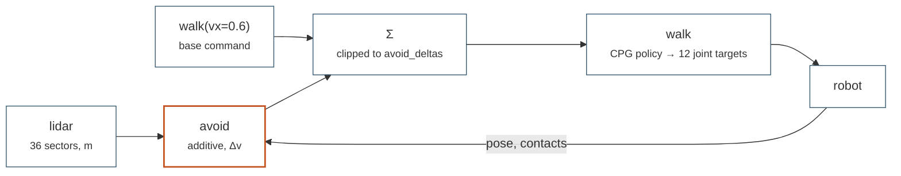

# Obstacle avoidance

A small network reads 36 lidar sectors and writes a velocity correction on top
of a frozen walk policy. Training is ordinary PPO; evaluation is not — it
spawns the goal-free world the checkpoint trained in and hands the robot to a
planner, so episodes end through skill cards rather than an RL counter.

## What it demonstrates

`examples/avoidance/go2_cpg_rl_lidar.py` is the library replica of
`scripts/house_scene/go2_cpg_rl_lidar.py`, with `--lidar`, `--lidar-azimuth`
and `--draw-lidar` added. The interesting half is the evaluation path: it
builds the `World` from the checkpoint's own task config, composes the two
checkpoints into a library and lets `AvoidanceMission` issue one program per
episode.

-   [`domo.tasks`](../api/tasks.md#go2avoidtask): `Go2AvoidTask`,
    `Go2AvoidConfig` with `scene_kind="arena"`.
-   [`domo.rl`](../api/rl.md): `PPOTrainer` and `ActorCritic`;
    `domo.checkpoints.world_from_avoid_config` rebuilds the twin.
-   [`domo.skills`](../api/skills.md): `make_go2_library`,
    `PlanningController`.
-   [`domo.robot.lidar_models`](../api/robot.md#lidar-device-models): the
    idealised sector lidar of the original script, or the Hesai XT16.

The mission's program, issued once per episode after resetting the robot and
re-scattering the obstacles:

```
(avoid @ walk(vx=0.6)).for(20)
```

`avoid` is an additive skill: it layers on `walk` and adds `Δv`, bounded by
the deltas the task trained with. That is the whole architecture.



Episodes end through the skill cards — avoid's `blocked()` abort, walk's
`tipped()` and `fallen()` aborts, and the `.for(20)` horizon — never through
an episode counter. See [the control hierarchy](../concepts/control-hierarchy.md)
for why layering lives in the grammar and not in the network.

## Run it

=== "Evaluate (CPU)"

    ```bash
    python examples/avoidance/go2_cpg_rl_lidar.py --eval policies/avoid.pt \
        --cpg-checkpoint policies/walk.pt --headless
    ```

=== "Evaluate with rays drawn"

    ```bash
    python examples/avoidance/go2_cpg_rl_lidar.py --eval policies/avoid.pt \
        --cpg-checkpoint policies/walk.pt --vx 0.6 --draw-lidar
    ```

=== "Preview on an XT16"

    ```bash
    python examples/avoidance/go2_cpg_rl_lidar.py --eval policies/avoid.pt \
        --cpg-checkpoint policies/walk.pt \
        --lidar xt16 --lidar-azimuth 360 --headless
    ```

    A net trained on the simple sensor sees a different distribution here —
    expect worse success counts.

=== "Train (GPU)"

    ```bash
    python examples/avoidance/go2_cpg_rl_lidar.py \
        --cpg-checkpoint policies/walk.pt \
        --n-envs 4096 --device cuda --headless
    ```

## How it works

-   `lidar_model_from_args(args, default_none=False)` resolves the sensor:
    `--lidar xt16` gives `hesai_xt16(n_horizontal=args.lidar_azimuth)`,
    otherwise the generic sector lidar — or `None` during evaluation when
    `--lidar` is unset, meaning "keep what the checkpoint trained with".
-   `build_configs(args)` makes a `Go2AvoidConfig` for the arena and a
    `PPOConfig` matching the script's `AvoidanceNet`: a 3 × 128 trunk, a 64
    head, `ent_coef = 0.02` and the non-finite guard.
-   `make_trainer(args, policy_fn, build_configs_fn)` builds the trainer,
    fresh or resumed, and stores the walk checkpoint path in the checkpoint's
    `extra` so evaluation can find it later. The
    [house variant](avoid-house.md) passes its own `build_configs_fn` here.
-   `evaluate(...)` rebuilds the task config from the checkpoint, applies the
    optional sensor override, builds the `World` with
    `world_from_avoid_config`, then `build_eval_library` (walk + avoid with
    the trained `avoid_deltas` and `obs_max_range`) and `run_mission`.
-   `run_mission(...)` prints a status line every 50 steps and stops when the
    mission is idle with all episodes recorded, or after
    `(n_episodes + 1) × max_episode_steps` steps.
-   `main()` dispatches: `--eval` evaluates, otherwise `--cpg-checkpoint` is
    required and the trainer runs.

## Flags

| Flag | Default | Meaning |
|------|---------|---------|
| `--cpg-checkpoint` | none | path to a trained CPG locomotion checkpoint. Required for training; during `--eval` it falls back to the path stored in the avoid checkpoint |
| `--n-envs` | `4096` | parallel environments |
| `--total-steps` | `100_000_000` | environment steps to train |
| `--rollout-steps` | `24` | steps per rollout |
| `--device` | `cuda` | one of `cpu`, `cuda`, `mps` |
| `--run-dir` | `runs/go2_avoidance` | checkpoints and logs |
| `--headless` | off | no Genesis viewer (training and evaluation) |
| `--resume` | none | checkpoint to continue training from |
| `--eval` | none | avoidance checkpoint to evaluate |
| `--vx` | `0.6` | forward command of the evaluation program (m/s) |
| `--lidar` | none | sensor model, `simple` or `xt16`. Train default: simple. Eval default: whatever the checkpoint was trained with (pass to override) |
| `--lidar-azimuth` | `180` | XT16 azimuth samples in sim (multiple of 36; 1980 = full device fidelity) |
| `--draw-lidar` | off | visualise lidar rays in the eval viewer (slow on macOS) |

## What you will see

```
  Frozen locomotion policy: policies/walk.pt
    step    50  min_lidar=1.84m  vx=+0.55  cmd=(0.60,0.00,0.12)
    ...
  Episode 1/5 | SUCCESS
      ...program trace...

  Episode 2/5 | FAILURE
      ...
  4/5 successful runs
```

`[eval] sensor override: <trained> → <override>` appears when `--lidar` is
given during evaluation, and `[eval] step budget exhausted` when the mission
did not finish inside its budget. Training writes
`<run-dir>/checkpoint_step_*.pt`, `<run-dir>/checkpoint_final.pt` and
TensorBoard logs; evaluation saves nothing.

## Runtime

| | CPU | GPU |
|---|---|---|
| Evaluation (five 20 s programs) | about 110 s including the build | seconds |
| Training | impractical | hours |

## Known limitations

!!! warning "Always pass `--cpg-checkpoint` when evaluating"

    `policies/avoid.pt` is a legacy script checkpoint, so whether it carries
    the walk path in `extra` depends on how it was trained. Without it,
    `build_eval_library` has nothing to load the gait from.

-   `--eval` picks its device with `pick_device("cuda")` and ignores
    `--device`.
-   An XT16 override on a net trained with the simple sensor is a
    distribution shift; expect worse success counts. `--lidar-azimuth` must be
    a multiple of 36 so the sectors pool evenly.
-   `--draw-lidar` only applies with the viewer, and is slow on macOS with the
    XT16 (thousands of rays per scan).

The same architecture runs inside a ReplicaCAD apartment in
[avoidance in a house](avoid-house.md). For the avoid policy's behaviour under
a goal-seeking skill, see [the LLM level designer](gemini-design-nav.md); for
the same lidar used passively instead of reactively, see
[SLAM in an apartment](slam-house.md).
