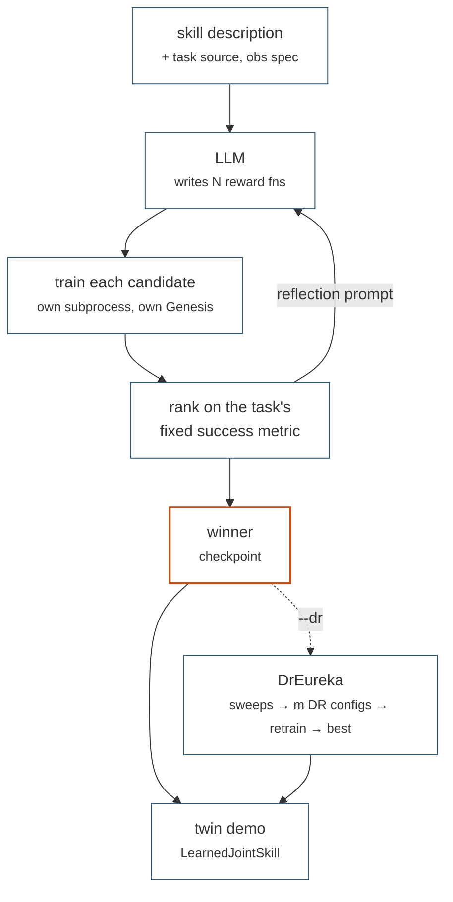

# Eureka get-up

The answer to the skill gap [the twin](twin-demo.md) reports. An LLM writes
candidate reward functions for a get-up task, each candidate trains in its own
subprocess, the candidates are ranked on a fixed success metric they cannot
game, and the winner is deployed back into the twin as a skill so you can
watch the robot right itself.

!!! tip "Run it offline first — `--llm scripted` needs no API key"

    The scripted provider replaces the LLM with an `OfflineClient` that
    returns a hand-written reward and a fixed DR proposal, so the entire
    Eureka and DrEureka loop runs with no key and no network. It is also the
    path that has been exercised end to end. Start here:

    ```bash
    python examples/eureka/eureka_getup.py --llm scripted --device cpu \
        --n-envs 8 --train-steps 2000 --samples 1 --iterations 1
    ```

## What it demonstrates

`examples/eureka/eureka_getup.py` is library-native and is mostly
configuration: `domo.eureka.learn_skill(SkillLearningRequest)` does the work.

-   [`domo.eureka`](../api/eureka.md): `learn_skill`, `EurekaConfig`,
    `DrEurekaConfig`, `SkillLearningRequest`.
-   [`domo.llm`](../api/llm-hri.md#scriptedclient-for-offline-tests):
    `ScriptedClient`, subclassed here as `OfflineClient` so it answers reward
    prompts and DR prompts differently.
-   [`domo.tasks`](../api/tasks.md#go2getuptask): `Go2GetUpTask`, whose
    success metric — upright and held for 1 s — is fixed and independent of
    whatever reward the LLM writes.
-   [`domo.world`](../api/world-and-services.md#domoworld) and
    [`domo.control`](../api/control.md#skills): `LearnedJointSkill` in a
    `SingleSkillController` for `--demo`.



The pipeline is orchestrated with LangGraph when it is installed; `--no-graph`
or a missing `langgraph` selects the imperative driver. Both produce the same
run tree.

!!! danger "A naive run costs GPU-hours"

    The defaults are a *real search*: `--iterations 3 × --samples 4` is twelve
    PPO trainings of `--train-steps 5_000_000` each, on `--n-envs 2048`, run
    **sequentially**. `--dr --dr-samples 8` adds eight more retrainings on top
    of that. On a workstation GPU one candidate is minutes, so the default
    search is an hour-scale job and DrEureka roughly doubles it; on CPU it is
    not finishable. Never type `python examples/eureka/eureka_getup.py` with
    no flags to "see what happens" — use the scripted CPU smoke command above,
    then scale deliberately with
    [the budget table](../api/eureka.md#budget-guidance).

## Run it

=== "CPU smoke (offline)"

    ```bash
    python examples/eureka/eureka_getup.py --llm scripted --device cpu \
        --n-envs 8 --train-steps 2000 --samples 1 --iterations 1
    ```

    Minutes, and trains nothing useful — it proves the plumbing, the prompts
    and the run-directory layout.

=== "Learn (GPU, Gemini)"

    ```bash
    export GEMINI_API_KEY=<key>
    python examples/eureka/eureka_getup.py \
        --samples 4 --iterations 3 --train-steps 5000000 --device cuda
    ```

=== "Local model (vLLM)"

    ```bash
    vllm serve Qwen/Qwen2.5-Coder-7B-Instruct --port 8000
    python examples/eureka/eureka_getup.py --llm vllm \
        --llm-model Qwen/Qwen2.5-Coder-7B-Instruct
    ```

=== "With DrEureka"

    ```bash
    python examples/eureka/eureka_getup.py --dr --dr-samples 8
    ```

=== "Watch the result"

    ```bash
    python examples/eureka/eureka_getup.py \
        --demo runs/eureka/getup/iter_0/train_0/checkpoint_final.pt \
        --headless --device cpu
    ```

## How it works

-   `build_request(args, device)` assembles a `SkillLearningRequest` with
    `skill_name="getup"`, `task="go2_getup"`, an `EurekaConfig` carrying
    iterations, samples, `n_envs`, `train_steps` and device, `run_dr`, a
    `DrEurekaConfig`, the run root, the provider name and `use_graph`.
    `--llm-model` and `--llm-base-url` only apply to the LangChain providers
    (`vllm`, `openai`, `gemini-lc`) and are dropped otherwise.
-   `main()` on the learning path calls `learn_skill(request, llm=...)`,
    passing an `OfflineClient` when `--llm scripted` and `None` otherwise — a
    real provider is built from `request.llm` by the routine itself. It then
    prints the `--demo` command for the winner's checkpoint.
-   `build_getup_twin(checkpoint, device, headless)` creates a flat-ground
    `World` with no lidar, restores the checkpoint's `ActorCritic`, and wraps
    it in `LearnedJointSkill(..., obs_builder=build_getup_observation,
    action_scale=0.35)` inside a `SingleSkillController`.
-   `knock_over(world, ep)` lays the robot on a random side: roll between 100°
    and 170°, alternating sign between episodes.
-   `demo(checkpoint, device, headless, episodes=3)` runs three episodes of
    400 steps (8 s). An episode counts as a success when the base rises above
    0.26 m with roll and pitch under 0.4 rad — the same criterion the task
    uses.

## Flags

| Flag | Default | Meaning |
|------|---------|---------|
| `--samples` | `4` | reward candidates per iteration |
| `--iterations` | `3` | Eureka iterations |
| `--train-steps` | `5_000_000` | environment steps per candidate |
| `--n-envs` | `2048` | parallel environments per candidate |
| `--device` | `cuda` | torch/Genesis device |
| `--llm` | `gemini` | one of `gemini`, `vllm`, `openai`, `gemini-lc`, `scripted`; `vllm` and `openai` go through LangChain |
| `--llm-model` | none | model name for `vllm`/`openai`, e.g. `Qwen/Qwen2.5-Coder-7B-Instruct` |
| `--llm-base-url` | none | endpoint for `vllm`/`openai` (vLLM default `http://localhost:8000/v1`) |
| `--no-graph` | off | use the imperative driver instead of LangGraph |
| `--dr` | off | run the DrEureka robustness stage on the winner |
| `--dr-samples` | `4` | independent DR configs to train and compare (the paper uses 16) |
| `--dr-retrain-steps` | none | steps for the DR retraining (defaults to `--train-steps`) |
| `--run-root` | `runs/eureka` | root of the run tree |
| `--demo` | none | skip learning; deploy this checkpoint in the twin |
| `--headless` | off | no Genesis viewer |

## What you will see

Learning prints the routine's progress per iteration and candidate
(`training (5,000,000 steps)...`) and ends with the command to watch the
winner:

```
To watch it in the twin:
  python examples/eureka/eureka_getup.py --demo runs/eureka/getup/iter_2/train_1/checkpoint_final.pt
```

The run tree is `<run-root>/getup/iter_<k>/`, holding the prompts and
`reflection.txt` per iteration and `train_<j>/{spec.json, results.json,
checkpoint_final.pt}` per candidate — see
[the run-directory layout](../api/eureka.md#run-directory-layout).

`--demo` prints one line per episode and saves nothing:

```
  Episode 1: got up in 1.84s, final height 0.31 m
  Episode 2: did NOT get up, final height 0.12 m
```

## Runtime

| | Learning | `--demo` |
|---|---|---|
| CPU | the scripted smoke command: minutes, and useless as a policy | about a minute |
| GPU | `iterations × samples` PPO trainings of `--train-steps` each: hours at the defaults | seconds |

## Known limitations

-   Each candidate trains in a fresh subprocess with its own Genesis, so keep
    `--n-envs` and the number of concurrent candidates within GPU memory.
    Candidates run sequentially even though the method is parallel in
    principle, which is what makes the wall-clock
    `iterations × samples × one training`.
-   `gemini` needs `google-genai` and `GEMINI_API_KEY`; the LangChain
    providers need the `langchain` extra. The scripted provider is the path
    that has been exercised end to end offline.
-   A checkpoint that does not stand in `--demo` is not a bug in the demo: the
    success test mirrors the task's own criterion. A smoke-run checkpoint will
    always fail it.

For the moment that motivates all of this — the planner running out of skills
and saying so — see [the digital twin](twin-demo.md). For the machinery
itself, including the worker protocol, ranking, reflection and the DrEureka
stage, see [`domo.eureka`](../api/eureka.md).
