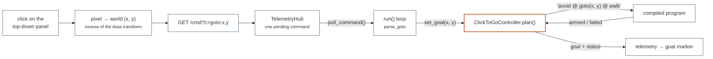

# Click to walk

The twin, driven with a mouse. Click a point on the dashboard's top-down panel
and the robot walks there, steering around what its lidar sees. Nothing is
scripted: the click arrives as a goal, and the planner *writes* the program
that goes there.

## What it demonstrates

`examples/twin/interactive_nav.py` is library-native. It closes the loop
between the browser and the [planner seat](../concepts/grammar.md#where-programs-come-from):
the page turns a click into a world `(x, y)`, posts it on the dashboard's
command channel as `goto:<x>,<y>`, and `ClickToGoController.plan()` composes
that goal into grammar text. The goal is data; the program is authorship. A
flag could not do this — it would be configuration handed in from outside,
which is exactly what [`PlanningController`](../api/skills.md#planning) exists
to avoid.

-   [`domo.world`](../api/world-and-services.md#domoworld): a goal-free
    `World(scene_kind="arena")` with a 36-sector lidar, obstacles scattered by
    `randomise_obstacles()`.
-   [`domo.policies`](../api/world-and-services.md#domopolicies):
    `stable_go2_library` resolves the blessed `walk` and `avoid` checkpoints,
    so both flags are optional.
-   [`domo.skills`](../api/skills.md#planning): `PlanningController`,
    `make_go2_library`, and the `goto` card backed by
    [`TrajectoryTrackingSkill`](../api/control.md#trajectorytrackingskill).
-   [`domo.dashboard`](../api/dashboard.md): the `goto:<x>,<y>` and `clear`
    commands, the `goal` telemetry key, and the click handler in the page —
    imported lazily and only when `--dashboard` or `--dashboard-url` is given.

Every goal produces one program:

```
avoid @ goto(x=2.5, y=2.5) @ walk        # or 'goto(...) @ walk' with --no-avoid
```

`goto` (an override command skill) authors the body-frame velocity from the
base pose, `avoid` adds its lidar correction on top, `walk` clamps the sum and
turns it into joint targets. The layer succeeds when `goto` reports arrival,
which finishes the program, which is how the controller learns it got there.



## Run it

=== "CPU (laptop)"

    ```bash
    # shell 1: the dashboard server
    python -m domo.dashboard --port 8080

    # shell 2: the twin, pushing to it
    python examples/twin/interactive_nav.py --headless --device cpu \
        --dashboard-url http://127.0.0.1:8080
    ```

    Open `http://127.0.0.1:8080` and click inside the **point cloud
    (top-down)** panel. The robot stands still until you do.

=== "In-process server"

    ```bash
    # one process; open http://127.0.0.1:8080
    python examples/twin/interactive_nav.py --headless --device cpu \
        --dashboard 8080
    ```

=== "Without the avoid layer"

    ```bash
    # plain 'goto(...) @ walk' — straight lines, no obstacle reaction
    python examples/twin/interactive_nav.py --headless --device cpu \
        --dashboard 8080 --no-avoid
    ```

=== "GPU with the viewer"

    ```bash
    python examples/twin/interactive_nav.py --dashboard 8080 --dashboard-camera
    ```

=== "Drive it with curl"

    ```bash
    # the click channel is just a GET; useful for testing without a browser
    curl "http://127.0.0.1:8080/cmd?c=goto:2.50,2.50"
    curl "http://127.0.0.1:8080/cmd?c=clear"
    curl -s http://127.0.0.1:8080/state | python -m json.tool | head
    ```

## How it works

-   `build_world(args, device)` builds the goal-free `World` with
    `scene_kind="arena"`, a sparser
    [`ObstacleArenaConfig`](../api/world-and-services.md#obstaclearenaconfig)
    (three chairs, two sofas, three pillars, **no** steps or balls) and the
    36-sector lidar the avoid net was trained on, then scatters the obstacles —
    they are parked outside the arena until `randomise_obstacles()` is called.
-   `build_library(args, world)` takes `walk` and `avoid` from the stable
    registry through `stable_go2_library` unless `--walk` / `--avoid` give
    explicit paths, and caps avoid's authority at `avoid_deltas=(0.25, 0.5,
    1.2)` (see [the limitation below](#known-limitations)). `--no-avoid` passes
    no lidar to the library, so the `avoid` card is never registered.
-   `ClickToGoController` is the whole brain. `set_goal` / `cancel` are its
    only external interface; `plan()` turns a pending goal into
    `avoid @ goto(x, y) @ walk` and returns `None` — idle, holding the stand
    pose — when there is none. `decide()` lets a fresh goal preempt the walk in
    progress, so clicking again re-targets instead of queueing.
-   `attach_dashboard(args)` returns `None`, an in-process `Dashboard` or a
    `DashboardClient`, and pushes a scene manifest with the four arena walls
    and the Go2 URDF for the 3D panel.
-   `run(args, world, loop, controller, dash)` polls the command channel every
    step: `parse_goto` turns `goto:<x>,<y>` back into floats, `clear` cancels,
    `pause` / `reset` / `stop` behave as in the other dashboard examples.
    `collect_hits` folds each scan's above-ground lidar returns into a rolling
    1500-point cloud — that is what the clickable panel draws — and `snapshot`
    publishes pose, joint angles, velocity, the cloud, the fixed `bounds` of
    the arena and the accepted `goal` about five times a second.

The page side is two dozen lines in `_DASHBOARD_HTML`, in the plain
`<script>` rather than the three.js module, so a CDN failure cannot take the
interaction down with the 3D panel: a click is converted with the exact
inverse of the transform the cloud is drawn with, `fetch`ed to `/cmd`, and
drawn as a crosshair — the sim's `goal` when it publishes one, the clicked
point until then.

## Flags

| Flag | Default | Meaning |
|------|---------|---------|
| `--walk` | stable `walk` | CPG walk checkpoint |
| `--avoid` | stable `avoid` | avoidance checkpoint |
| `--no-avoid` | off | compose plain `goto(...) @ walk`, with no avoid layer |
| `--steps` | `20000` | step budget (about 6–7 min of clicking on CPU) |
| `--dashboard PORT` | `0` | host the dashboard in-process on this port (0 = off) |
| `--dashboard-url URL` | none | push to a decoupled dashboard server, e.g. `http://127.0.0.1:8080` |
| `--dashboard-camera` | off | add the Genesis camera frame (small sim-thread cost) |
| `--headless` | off | no Genesis viewer |
| `--device` | `cuda` | torch/Genesis device |

## What you will see

```
  Frozen locomotion policy: /…/policies/walk.pt
  [dashboard] pushing telemetry to http://127.0.0.1:8080 (decoupled; …)
Click the point-cloud panel to send the robot there (programs: 'avoid @ goto(x, y) @ walk').

  step   250 | pos=(-0.01,+0.00) | idle
  ...
  [dashboard] goal (+2.50, +2.50)
  step  2750 | pos=(+0.86,+0.83) | walking to (2.50, 2.50)
  [nav] (+2.50, +2.50) → ARRIVED ('avoid @ goto(x=2.5, y=2.5) @ walk') — idling
  step  3000 | pos=(+2.67,+2.25) | idle
  [nav] re-targeted: dropping 'avoid @ goto(x=-3, y=-3) @ walk'
  [nav] goal cleared: dropping 'avoid @ goto(x=-3, y=3) @ walk'

  goals (2):
    ✓ (+2.50, +2.50)
    ✗ (-3.00, +3.00)
```

In the browser: the status badge reads `idle` or `walking to (x, y)`, the goal
sits on the top-down panel as a blue crosshair with the robot as a red dot, and
the 3D panel shows the Go2 inside the arena walls. Nothing is saved.

## Runtime

| | Build | Stepping |
|---|---|---|
| CPU | about 30 s | roughly 150–250 control steps/s |
| GPU | a few seconds | faster than real time |

A 2–3 m goal is 400–600 control steps, so a few seconds of wall clock. The
default 20000-step budget is a dozen or so goals; when it runs out the example
prints its goal history and keeps serving the final snapshot until ++ctrl+c++
or the page's stop button. With no dashboard flag at all it stands for 250
steps, says why, and exits.

## Known limitations

!!! warning "A fall ends the session"

    The library has no get-up skill, so once the robot is down every program
    fails instantly on `walk`'s `fallen(0.18)` failsafe. The example says so
    (`the robot is DOWN and the library has no get-up skill`); press **⟳
    reset** to teleport back to spawn. This is the same skill gap
    [the twin demo](twin-demo.md) concedes and
    [the Eureka example](eureka-getup.md) fills.

!!! warning "`avoid` and `goto` fight each other"

    The bundled `avoid.pt` is very conservative: it slows and retreats about a
    metre in front of an obstacle instead of skirting it, while `goto` floors
    its along-track speed at `NavGains.min_speed = 0.3` so it never stalls. The
    two can deadlock, especially for an obstacle sitting on the straight line
    to the goal. This example caps the avoid corrections at
    `avoid_deltas=(0.25, 0.5, 1.2)` — enough lateral and yaw authority to
    steer, not enough `−vx` to cancel the walk — which is what makes the pair
    usable here rather than genuinely good at weaving. It does not always
    weave: expect the occasional goal that stalls beside a sofa, and re-click
    or use `--no-avoid`. A stronger avoid policy is the real fix; the same
    finding is recorded on [the LLM level designer](gemini-design-nav.md) page.

-   **Goals are not planned around obstacles.** `goto` follows a straight line
    and `avoid` is purely reactive — there is no path planner, so a goal behind
    a sofa may not be reachable. Nothing times out either: an unreachable goal
    keeps the program running until you click elsewhere or press **clear
    goal**.
-   **The clickable extent is the whole arena** (`bounds` is fixed at
    ±4.5 m), so a click can land on an obstacle or outside the walls. The
    program still compiles; the robot simply pushes at whatever is in the way.
-   **The top-down panel shows lidar hits, not a map.** It is a rolling
    1500-point cloud of what the lidar has recently seen, not a SLAM map — the
    obstacles fade as the buffer turns over. [The SLAM demo](slam-demo.md)
    publishes a real occupancy grid into the same page.
-   **The 3D panel draws the walls and the robot only.** Arena obstacles are
    randomised cylinders, boxes and spheres whose poses are not exposed, so
    they appear in the top-down panel and in the Genesis viewer but not in the
    manifest.
-   The dashboard is **loopback with no authentication**, and anyone who can
    reach the port can steer the robot. See
    [the dashboard's routes](../api/dashboard.md#routes).
-   ++ctrl+c++ is a hard kill (Genesis defers `KeyboardInterrupt`); the page's
    **⏹ stop** button is the graceful path, as in every dashboard example.
