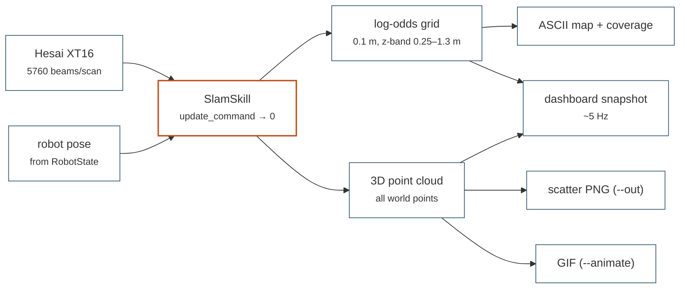

# SLAM in an arena

A perception layer that reads the lidar and the pose every tick, folds them
into an occupancy grid and a 3D point cloud, and writes zero velocity. Here it
observes a `goto` patrol around a 12 × 9 m arena whose obstacles have
deliberately different heights, so the cloud shows structure the flat map
loses.

## What it demonstrates

`examples/slam/slam_demo.py` is library-native. `SlamSkill` is a skill only in
the mechanical sense: it has the skill interface and is ticked like one, but
its velocity contribution is identically zero. The driving is done by a
separate compiled program.

-   [`domo.control`](../api/control.md#slam): `SlamSkill`, `SlamConfig`,
    `SimControlLoop`, `SingleSkillController`.
-   [`domo.robot`](../api/robot.md#lidar-device-models): a simulated Hesai
    XT16 — 16 channels × 360 azimuth samples = 5760 beams per scan — wrapped
    in `SimulatedLidar`.
-   [`domo.skills`](../api/skills.md): the `goto @ walk` patrol composition.
-   [`domo.policies`](../api/world-and-services.md#domopolicies): the stable
    `walk` policy is the default, so the checkpoint argument is optional.
-   [`domo.dashboard`](../api/dashboard.md), imported lazily and only when
    `--dashboard` or `--dashboard-url` is given.

The arena's obstacles are 0.9 m blocks and an L-shaped wall, a 1.8 m pillar,
and a 0.35 m step that sits *below* the lidar's mapped slice. The patrol
program is

```
(goto(x=11, y=0) @ walk >> goto(x=11, y=8) @ walk >>
 goto(x=0, y=8) @ walk >> goto(x=0, y=0) @ walk) | stand.for(2)
```

!!! note "Why SLAM is not composed as `slam @ goto @ walk`"

    A composition resets each layer when its node is re-entered, which would
    wipe the map at every waypoint. Mapping must persist across the whole
    mission, so SLAM is held at loop level and ticked by hand.
    `slam @ goto @ walk` still composes fine for single-leg, per-leg mapping.



## Run it

=== "CPU (laptop)"

    ```bash
    # uses the stable 'walk' policy; saves slam_cloud.png
    python examples/slam/slam_demo.py --headless --device cpu
    ```

=== "Record a GIF"

    ```bash
    python examples/slam/slam_demo.py --headless --device cpu --animate slam_cloud.gif
    ```

=== "Live plot"

    ```bash
    # a matplotlib window; Genesis stays headless
    python examples/slam/slam_demo.py --headless --device cpu --live
    ```

=== "Web dashboard"

    ```bash
    # in-process, then open http://127.0.0.1:8080
    python examples/slam/slam_demo.py --headless --device cpu \
        --dashboard 8080 --dashboard-camera

    # decoupled: start the server in another shell first
    python -m domo.dashboard --port 8080
    python examples/slam/slam_demo.py --headless --device cpu \
        --dashboard-url http://127.0.0.1:8080
    ```

=== "GPU with the viewer"

    ```bash
    python examples/slam/slam_demo.py
    ```

## How it works

-   `build_world(args, device, obstacles, start, h, w)` creates the arena
    boxes and walls, the Go2, the XT16 handle — added before `scene.build()` —
    and an optional offscreen camera for the dashboard, then wraps the handle
    in a `SimulatedLidar` pooled into 36 sectors for the 2D panel.
-   `build_brain(checkpoint, robot, lidar, device, h, w)` compiles the patrol
    into a `SingleSkillController` and builds `SlamSkill(lidar,
    SlamConfig(resolution=0.1, half_extent=8.0, origin=<arena centre>,
    z_band=(0.25, 1.3), map_max_range=12.0))`.
-   `attach_dashboard(args, obstacles, h, w)` returns `None`, an in-process
    `Dashboard(port)` or a `DashboardClient(url)`, and pushes a scene manifest
    with the arena boxes and the Go2 URDF via `slam_viz.go2_robot_manifest`.
-   `run(...)` drives the loop, calls `slam.update_command(state, dt)` every
    step, feeds the GIF recorder and the live plot, publishes a snapshot every
    10 steps (about 5 Hz) and prints every 500. It stops when the program
    finishes or the budget is spent. Dashboard buttons map to sim control:
    `pause` toggles (the sim freezes but keeps publishing), `reset` restarts
    the episode and the map, `stop` ends the run.
-   `report(slam, state, out_path)` prints ground truth, the SLAM ASCII map,
    coverage and odometry drift, then saves the point cloud to `--out`. With a
    dashboard, `hold_dashboard` keeps serving the final state until the page's
    stop button or ++ctrl+c++.

## Flags

| Flag | Default | Meaning |
|------|---------|---------|
| `checkpoint` (positional, optional) | stable `walk` | CPG locomotion checkpoint |
| `--steps` | `9000` | step budget; the patrol usually finishes earlier |
| `--azimuth` | `360` | XT16 azimuth samples (multiple of 36; try 720 for a denser cloud) |
| `--out` | `slam_cloud.png` | path for the 3D point-cloud scatter PNG |
| `--animate` | none | path for a GIF animating the cloud forming |
| `--animate-every` | `200` | capture an animation frame every N steps |
| `--live` | off | show a separate live plot while the sim runs (keep `--headless`) |
| `--live-every` | `40` | refresh the live plot every N steps |
| `--dashboard PORT` | `0` | host the dashboard in-process on this port (0 = off) |
| `--dashboard-url URL` | none | push to a decoupled dashboard server, e.g. `http://127.0.0.1:8080` |
| `--dashboard-camera` | off | add the Genesis camera frame (small sim-thread cost) |
| `--headless` | off | no Genesis viewer |
| `--device` | `cuda` | torch/Genesis device |

## What you will see

```
Ground-truth arena:
    012345678901  (x)
y=0 |R           |
...
Patrolling: (goto(x=11, y=0) @ walk >> ... ) | stand.for(2)

  step   500 | pos=(+4.80,+0.10) | coverage=12.3% | odom_drift=0.04 m
  ...

Ground truth (# = obstacle):
...
SLAM occupancy map (# occupied, . free, ' ' unknown):
...
Coverage: 61.2% of the map is confidently known.
Odometry drift over the run: 0.31 m (where a real system would fuse scan-matching to correct it).

3D point cloud: 1,234,567 accumulated world points.
  [viz] saved 3D point cloud → slam_cloud.png
```

`--animate` adds `[viz] saved animation (N frames) → <path>`. With a dashboard
the run ends with `[dashboard] still live at <url> — Ctrl+C to exit.` and the
process waits.

Saved: the scatter PNG at `--out`, and the GIF at `--animate` if requested.

## Runtime

| | Build | Full patrol |
|---|---|---|
| CPU | about 30 s | 3–4 min |
| GPU | a few seconds | seconds per lap |

The XT16's 5760 beams per scan are the main cost. `--azimuth 180` halves it.

## Known limitations

!!! warning "++ctrl+c++ is a hard kill"

    The script restores the OS default `SIGINT` handler, because Genesis
    build and step are long C calls that defer Python's
    `KeyboardInterrupt`. Nothing is flushed on interrupt — no PNG, no GIF. The
    dashboard's stop button is the graceful path.

-   `--live` needs a display and an interactive matplotlib backend; without
    one it prints a notice and continues. Do not combine it with the Genesis
    viewer — that is two GUI toolkits in one process.
-   `--dashboard-camera` only takes effect with the in-process
    `--dashboard PORT`; with `--dashboard-url` the camera is never created.
    The page has no camera panel either: the frame is served at
    `GET /frame.jpg` and can be opened in a browser tab. See
    [the dashboard](../api/dashboard.md#routes).
-   The dashboard's 3D viewer loads three.js from a CDN and the Go2 meshes
    from the local server. It needs internet access and has not been verified
    in a sandboxed browser.
-   Each obstacle casts an occlusion shadow the single loop never fills. The
    map is meant to have gaps — filling them is the frontier-exploration
    problem, and [the house version](slam-house.md) makes the point louder.

## The `slam_viz` helpers

`examples/slam/slam_viz.py` is not a command-line tool. It holds the
matplotlib and dashboard plumbing both SLAM examples share, and is kept out of
`domo/` because it imports matplotlib. It never selects a backend — the
examples do, `Agg` unless `--live` — and never imports the dashboard.

| Helper | Signature | Purpose |
|--------|-----------|---------|
| `slam_snapshot` | `slam_snapshot(step, state, slam, lidar=None, cloud_pts=500, status="running") -> dict` | a JSON-serialisable telemetry dict for the dashboard: `t`, `status`, `pose`, `base`, `dof`, `vel`, `height`, `coverage`, `lidar` (when readable), `map` (rows of `#`, `.`, space, max-pooled to about 60 rows), `cloud` (a random subset of `cloud_pts` points) and `bounds` |
| `go2_robot_manifest` | `go2_robot_manifest(spec) -> (robot_dict, root_dir)` | the `"robot"` entry of a scene manifest (`urdf` under `/assets/robot/`, `dof_names` in joint order) and the directory to register as the `robot` asset root; locates Genesis's bundled URDF when the spec path is relative |
| `save_point_cloud` | `save_point_cloud(cloud, path, title="SLAM point cloud")` | a 3D scatter PNG of the world-frame cloud, coloured by height |
| `SlamLiveView` | `SlamLiveView(every=40, max_pts=6000, title=...)`, `.update(slam, state)`, `.keep_open()` | a live top-down matplotlib window with the accumulating cloud and the robot trail; a no-op on `Agg` or without a display |
| `SlamRecorder` | `SlamRecorder(every=250, max_pts=15000)`, `.capture(slam, state)`, `.save_gif(path, fps=6, title=...)` | keeps a frame every `every` steps in memory and writes a top-down GIF with fixed axes at the end |
