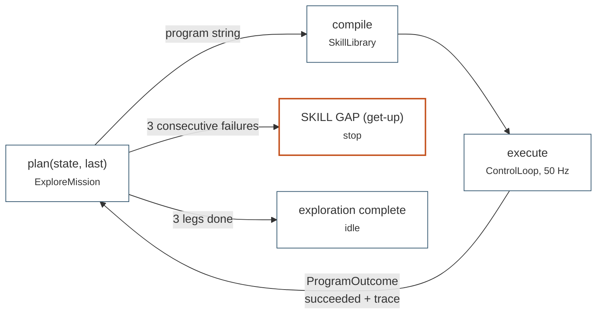

# Digital twin

The DOMO runtime with no task at all: a world, a robot, its sensors, and a
planner that writes behaviour programs at runtime, reads back what happened
and decides what to do next. Run it to see the system's central move — the
moment it stops retrying and concedes that a skill is missing.

## What it demonstrates

`examples/twin/twin_demo.py` spawns `World(WorldConfig(scene_kind="arena"))`,
which gives it the robot, an obstacle arena and a lidar with no goal attached.
`make_go2_library` turns the walk and avoid checkpoints into a skill library,
and `ExploreMission` — a `PlanningController` subclass — authors programs from
that library and the outcome history. `ExploreMission` is placeholder
intelligence for the M1 LLM supervisor: it sits in the same seat, reads the
same inputs (`library.describe()`, `ProgramOutcome` traces) and produces the
same output (grammar programs).

-   [`domo.world`](../api/world-and-services.md#domoworld): `World`,
    `WorldConfig`, `scene_kind="arena"`, `randomise_obstacles()`.
-   [`domo.skills`](../api/skills.md#planning): `make_go2_library`,
    `PlanningController`, `ProgramOutcome`.
-   [`domo.rl`](../api/rl.md#actorcritic): `ActorCritic` restored from the
    avoidance checkpoint, deterministic actions.
-   `domo.checkpoints` for both policies.

Each exploration leg is

```
(avoid @ walk(vx=1, vyaw=±0.3)).until(moved(2)) >> stand.for(1)
```

with the yaw sign alternating between legs and the obstacles re-scattered
before each one. After three successful legs the mission declares
`exploration complete`. A failed leg is followed by the recovery program
`stand.for(2)`; after three consecutive failures the mission concedes
`SKILL GAP (get-up)` and stops — the cue that
[the Eureka example](eureka-getup.md) answers.

## Run it

=== "CPU (laptop)"

    ```bash
    python examples/twin/twin_demo.py \
        --walk policies/walk.pt --avoid policies/avoid.pt \
        --headless --device cpu --steps 1000
    ```

=== "GPU with the viewer"

    ```bash
    python examples/twin/twin_demo.py \
        --walk policies/walk.pt --avoid policies/avoid.pt
    ```

=== "The planner's view"

    ```bash
    # prints library.describe() — the catalogue and grammar an LLM would see
    python examples/twin/twin_demo.py --walk policies/walk.pt --catalog
    ```

## How it works

-   `main()` builds the `World`, then the library; with `--catalog` it prints
    `library.describe()` and exits before any stepping happens.
-   `build_library(world, walk_ckpt, avoid_ckpt)` uses
    `load_locomotion_policy` for the walk and `load_avoid_policy` for avoid —
    or `zero_avoid_policy` when `--avoid` is omitted — and passes both plus
    `world.lidar` to `make_go2_library`.
-   `ExploreMission.plan(state, last)` is the whole decision logic: report the
    last outcome, count legs and failures, re-scatter the obstacles, return
    the next program string or `None` to idle.
-   `run_mission(mission, loop, steps)` steps `world.make_loop(mission)`,
    prints a position line every 250 steps and stops early once the mission is
    idle and done.
-   `print_history(mission)` lists every program the mission issued with a
    success mark.

The loop the mission sits in:



The mission never re-plans mid-leg. It only reacts to outcomes, which is why
the failure counter is the whole gap-detection mechanism.

## Flags

| Flag | Default | Meaning |
|------|---------|---------|
| `--walk` | required | CPG walk checkpoint |
| `--avoid` | none | avoidance checkpoint (omit → zero corrections) |
| `--steps` | `6000` | step budget; the run ends earlier when the mission is done |
| `--headless` | off | no Genesis viewer |
| `--device` | `cuda` | torch/Genesis device |
| `--catalog` | off | print the planner-facing catalogue and exit |

## What you will see

```
  [mission] '(avoid @ walk(vx=1, vyaw=0.3)).until(moved(2)) >> stand.for(1)' → ok
  step   250 | pos=(+1.85,+0.40) | (avoid @ walk(vx=1, vyaw=-0.3)).until(moved(2)) >> stand.for(1)
  [mission] leg failed — resting before retry
  [mission] 'stand.for(2)' → ok
  ...
  [mission] exploration complete — idling

  mission history (5 programs):
    ✓ (avoid @ walk(vx=1, vyaw=0.3)).until(moved(2)) >> stand.for(1)
    ✗ ...
```

Or, after three consecutive failures:

```
  [mission] repeated failures and no recovery skill in the library — SKILL GAP (get-up). Stopping mission.
```

Nothing is saved.

## Runtime

About 30 s to build on CPU. 1000 steps is roughly 20 s, the full 6000-step
budget a couple of minutes; the mission usually finishes its three legs well
before the budget. Seconds on a GPU.

## Known limitations

!!! warning "Without `--avoid` the robot walks blind"

    The avoid skill contributes zero corrections, so it walks into obstacles
    and a fall counts as a failed leg. That makes the skill-gap concession
    easy to trigger, but it is not the intended demonstration — pass
    `--avoid policies/avoid.pt`.

-   `--catalog` still builds the whole world (about 30 s on CPU) before
    printing, because the library needs `world.lidar`.
-   The mission never re-plans mid-leg; it only reacts to outcomes.

The skill gap it reports is answered by
[the Eureka get-up example](eureka-getup.md), which learns the missing skill
and deploys it back into this same twin.
