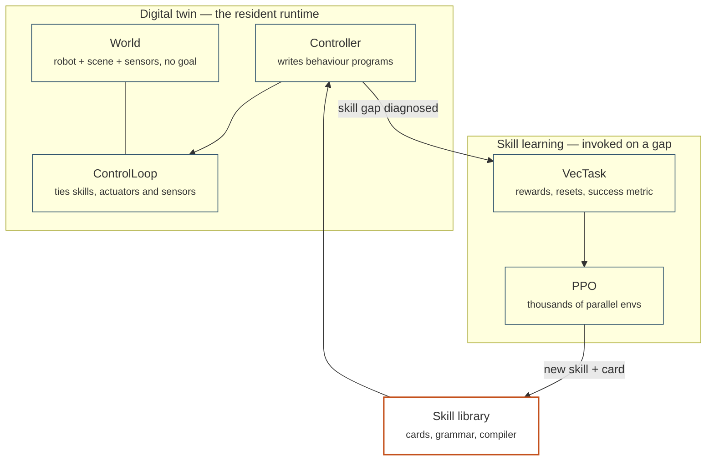

---
hide:
  - navigation
  - toc
---

Developmental Orchestration of Motor-skill Onset

# A robot that learns what it is missing

DOMO puts a language model in the seat of a lifelong developmental supervisor
for a Unitree Go2. It watches the robot act, diagnoses the skill it lacks,
specifies that skill, trains it by reinforcement learning in a digital twin,
and folds the result back into a growing library of composable behaviours.

[Install and run it](start/install.md){ .md-button .md-button--primary }
[Read the architecture](concepts/architecture.md){ .md-button }

8library layers, engine-agnostic

11runnable examples

228engine-free tests

50 Hzskill control rate

## What the system does

-   :material-eye-outline:{ .lg } __Watches, then concedes__

    ---

    The twin runs goal-free. A planning controller writes behaviour programs
    at runtime and reads back an execution trace; when a mission keeps
    failing, it declares a skill gap instead of retrying forever.

    [:octicons-arrow-right-24: The digital twin](examples/twin-demo.md)

-   :material-script-text-outline:{ .lg } __Writes its own rewards__

    ---

    Eureka turns a skill description into candidate reward functions, trains
    each in its own subprocess, and ranks them on a fixed success metric the
    generated rewards cannot game.

    [:octicons-arrow-right-24: Eureka & DrEureka](api/eureka.md)

-   :material-puzzle-outline:{ .lg } __Composes what it knows__

    ---

    Skills carry natural-language cards and a typed grammar:
    `avoid @ goto(x=2, y=1) @ walk` layers, sequences and falls back, and a
    compiled program is itself a skill.

    [:octicons-arrow-right-24: The skill grammar](concepts/grammar.md)

-   :material-swap-horizontal:{ .lg } __Keeps the engine swappable__

    ---

    One module may import a physics engine. Everything above it codes against
    abstract interfaces, so the same controller runs on the simulator today
    and on hardware drivers tomorrow.

    [:octicons-arrow-right-24: domo.sim](api/sim.md)

## Find your way

-   __Start here__

    ---

    Install the environment, verify it, and drive the robot around a square
    on your laptop in about a minute.

    [:octicons-arrow-right-24: Install](start/install.md) ·
    [First run](start/first-run.md) ·
    [Glossary](start/glossary.md)

-   __Concepts__

    ---

    How the layers fit, why skills sit below controllers, what the grammar
    means, and the conventions every module obeys.

    [:octicons-arrow-right-24: Architecture](concepts/architecture.md) ·
    [Control hierarchy](concepts/control-hierarchy.md) ·
    [Conventions](concepts/conventions.md)

-   __Guides__

    ---

    Train and evaluate policies, extend the library with a new task, skill,
    sensor or backend, and fix the errors you will actually hit.

    [:octicons-arrow-right-24: Running](guides/running.md) ·
    [Extending](guides/extending.md) ·
    [Troubleshooting](guides/troubleshooting.md)

-   __Reference__

    ---

    Every public class and function, with tensor shapes, units and the
    semantics that are easy to get wrong.

    [:octicons-arrow-right-24: API reference](api/index.md)

## The shape of the system

Reinforcement learning is a subordinate procedure here, not the entry point.
The robot exists in the world first; a training task is a temporary,
reward-bearing lens over the same scene, instantiated only when a skill has
to be learned.

!!! note "Status"

    Modules M1 (gap detection), M2 (reward and scene specification), M3
    (training) and M5 (the skill library) are implemented. Sim-to-real
    transfer (M4) has its domain-randomisation surface and a real-time
    control loop in place but no hardware drivers; the safety filter (M7)
    is a wired seat in that loop with nothing in it yet. See
    [the project](concepts/project.md) for the full roadmap.
