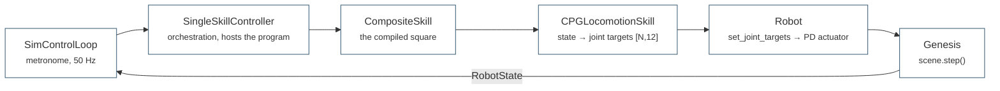

# First run

The payoff: one command puts a Unitree Go2 on flat ground and drives it with
a compiled skill program, on CPU, in about a minute. This page explains what
it builds, what it prints and which layer did what.

## Before you start

You need an installed environment ([install](install.md)) and a trained gait
at `policies/walk.pt`. Skills resolve that file by the symbolic name `walk`
through `domo.policies`, so nothing downstream depends on a path inside
`runs/`.

!!! warning "The checkpoints are not in git"

    `policies/walk.pt` and `policies/avoid.pt` are git-ignored: `policies/`
    is a curated local cache, only the registry (`domo/policies.py`) and
    `policies/README.md` are versioned. On a fresh clone, copy them from a
    training run or from a colleague:

    ```bash
    cp runs/go2_cpg/checkpoint_final_coupled.pt policies/walk.pt
    ```

    `policies/README.md` says what each name means, and
    [running](../guides/running.md#stable-policies) documents promotion.
    Without `walk.pt`, nothing in the twin walks.

## Run it

=== "CPU (laptop)"

    ```bash
    python examples/basic_examples/skill_demo.py policies/walk.pt \
        --headless --device cpu --steps 500
    ```

=== "With the viewer"

    ```bash
    python examples/basic_examples/skill_demo.py policies/walk.pt
    ```

The CPU command is the smoke test: about 30 s of Genesis build, then 500
control steps at 50 Hz — 10 s of simulated time. Drop `--headless` to open
the Genesis viewer and watch it; the default device is `cuda` and falls back
to CPU when no GPU is present, and the default `--steps 3000` is the full
60 s run.

The example builds one environment: a Genesis engine, flat ground, a single
Go2 at `(0, 0, 0.35)` with `kp = 100`, `kd = 2`, and a control step of
`dt = 0.02`. There are no sensors and no rewards. The positional argument is
the frozen CPG locomotion policy, loaded by `domo.checkpoints` and wrapped as
a motor skill.

### What it prints

```
  Frozen locomotion policy: policies/walk.pt
    obs=... act=12 params=...
Running composition: (goto(x=2, y=0) @ walk >> ... ) | stand.for(2)
  step   250 | skill=...              | pos=(+1.10,+0.02) vx=+0.48
  ...
Program trace:
    ...
Done. final pos=(+0.05,-0.03)  |dist from origin|=0.06 m
```

A progress line every 250 steps, then the final position and its distance
from the origin. The execution `trace` — the log an LLM supervisor reads
back — is printed only when the route actually completes, so run the default
`--steps 3000` rather than the 500-step smoke budget to see it, and read the
final distance as "how far from the last corner", not as a score. Nothing is
saved.

### The program it runs

```
(goto(x=2, y=0) @ walk >> goto(x=2, y=2) @ walk >>
 goto(x=0, y=2) @ walk >> goto(x=0, y=0) @ walk) | stand.for(2)
```

A 2 m square, written in the skill grammar and compiled by
`make_go2_library(policy_fn).compile(...)`. `@` layers the `goto` command
skill on the `walk` motor skill: `goto` closes the loop on the robot's pose
every tick and writes the velocity command that `walk` turns into joint
targets, so each leg is a straight line and each node terminates itself on
arrival. `>>` chains the corners. `| stand.for(2)` is the fallback that runs
if the route fails, for instance because the robot tipped. This is the shape
of program the planner emits in M5 — see
[the skill grammar](../concepts/grammar.md).

!!! tip "See the difference feedback makes"

    `--open-loop` swaps the compiled program for a hand-written
    `PatrolController` that alternates forward walking and turning on a
    clock, with no pose feedback. Its velocity error integrates uncorrected
    and the square smears; compare the printed distance from the origin.

## What just happened

The run exercises the whole control hierarchy in about a hundred lines:



Three things are worth taking away.

**Skills are lower than controllers.** A `Skill` maps `RobotState` to joint
targets at 50 Hz; a `Controller` picks and parameterises skills at 1–10 Hz.
Calling a skill a controller is a vocabulary error here, not a shade of
meaning. The rates, responsibilities and the exact tick order are in
[the control hierarchy](../concepts/control-hierarchy.md).

**A compiled program is itself a skill.** `library.compile(text)` type-checks
the composition and hands back a `CompositeSkill` that the controller drives
like any primitive, while keeping the execution trace.

**There is no environment and no reward.** The loop runs because the
controller says so, not because an episode terminates. `skill_demo.py` wires
the engine, scene and `Robot(GO2)` by hand to keep the workflow visible;
`World(WorldConfig(...))` does the same construction in one call and is what
the twin and the SLAM examples use. Why the stack is split this way is
[the architecture](../concepts/architecture.md).

## Where to go next

Three short paths, in increasing order of how much of the system they show.

**Watch the twin re-plan.** `twin_demo.py` replaces the fixed program with a
`PlanningController` that authors a new program after every leg, reads the
outcome back, and concedes a skill gap after three consecutive failures — the
cue the Eureka loop answers.
[The digital twin](../examples/twin-demo.md).

**Map a room.** `slam_demo.py` puts a simulated Hesai XT16 on the robot and
runs `SlamSkill` alongside a perimeter patrol, building an occupancy grid and
a point cloud; add `--dashboard 8080` for the live web view.
[SLAM in an arena](../examples/slam-demo.md).

**Train your own gait.** The CPG walk everything else runs on is trained with
PPO on thousands of parallel environments, which needs a CUDA GPU; the same
scripts do CPU smoke runs of a few thousand steps to check the pipeline.
[Running and training](../guides/running.md).
